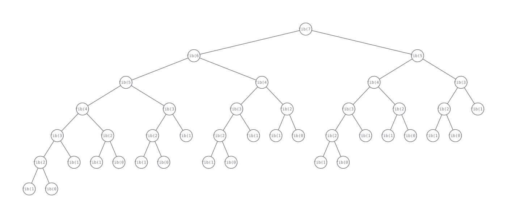
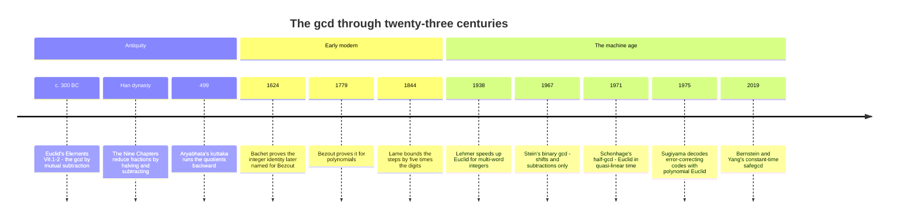

[Route map](index.md) · [Stop 2 — The Unfolding Road →](02-unfolding-road.md)

# Stop 1 — The Depot

> Before the bus can roll, we visit the garage where the oldest algorithm still turns over: Euclid's method for the greatest common divisor.

## Overview

Every tour needs a depot — the place the vehicles are built and where the
engine that powers everything gets its first turn. Ours is **Euclid's
algorithm**, written down around 300 BC in Book VII of the *Elements* and
arguably the oldest algorithm still in everyday use. It is also the seed of
everything on this tour: continued fractions are Euclid's algorithm run on real
numbers, and continued fractions are how we will meet recursion in its purest
form.

The problem is to find the **greatest common divisor** `gcd(a, b)` of two
non-negative integers — the largest integer dividing both. The algorithm rests
on a single self-referential observation:

- `gcd(a, 0) = a` (the base case), and
- `gcd(a, b) = gcd(b, a mod b)` (the recursive step).

The second rule is true because any common divisor of `a` and `b` also divides
`a − qb = a mod b`, and vice versa, so the *set* of common divisors — and hence
its maximum — is unchanged when we replace the pair `(a, b)` by the smaller pair
`(b, a mod b)`. Because the second coordinate strictly decreases and stays
non-negative, the recursion must terminate: it cannot descend below zero
forever. When it hits `0`, the other coordinate is the answer. This is
recursion with a guaranteed base case, the template for every well-founded
recursion we will meet later.

Concretely, we repeatedly divide with remainder. To compute `gcd(1071, 462)`:

```
1071 = 2 × 462 + 147
 462 = 3 × 147 +  21
 147 = 7 ×  21 +   0   ← remainder 0, so gcd = 21
```

The **quotients** `2, 3, 7` are worth keeping. They are exactly the partial
quotients of the continued fraction of `1071/462`, which is how the depot
connects to Stop 2. Euclid throws the quotients away and keeps the last nonzero
remainder; continued fractions throw the remainder away and keep the quotients.
Same machine, two products.

### Bézout and the extended algorithm

Euclid's algorithm does more than report a number. **Bézout's identity** says
that for any integers `a, b` there exist integers `x, y` with

```
a·x + b·y = gcd(a, b).
```

The *extended* Euclidean algorithm finds `x` and `y` by carrying the
coefficients backward through the same division steps (or forward, as a
recurrence on the quotients). This is the workhorse behind modular inverses:
when `gcd(a, m) = 1`, the coefficient `x` is precisely `a⁻¹ mod m`, the
computation that makes RSA decryption — and, at Stop 14, RSA *breaking* —
possible.

### How fast? Lamé's theorem

How many division steps can the algorithm take? The answer, proved by **Gabriel
Lamé in 1844** in what is often called the first theorem of computational
complexity, is strikingly tidy:

> The number of division steps needed to compute `gcd(a, b)` with `a > b` is at
> most **five times the number of decimal digits of `b`**.

So the running time is linear in the number of digits — the algorithm is fast
precisely because each step shrinks the numbers geometrically. The worst case,
the inputs that force the most steps for their size, are **consecutive
Fibonacci numbers**. The smallest pair requiring `n` division steps is
`(F₍ₙ₊₂₎, F₍ₙ₊₁₎)`. Fibonacci numbers are the slowest to reduce because at every
step the quotient is as small as it can be — exactly `1` — so the algorithm
peels off the least possible each time. That is not a coincidence: the golden
ratio `φ` at Stop 4 is `[1; 1, 1, …]`, the continued fraction whose every
quotient is `1`, and it is the "most irrational" number for the very same
reason. The depot and the golden milestone are two views of one fact.



The Fibonacci link also explains the constant `5`: since `F₍ₙ₊₁₎ ≈ φⁿ/√5` and
`log₁₀ φ ≈ 0.208 ≈ 1/4.785`, the digit count grows like `n/4.785`, giving the
factor just under five.

## Worked examples

Trace the algorithm on `1071` and `462`. The tool prints each division and then
the continued fraction assembled from the quotients:

```
$ python -m tourbus demo euclid 1071 462
  1071 = 2 x 462 + 147
  462 = 3 x 147 + 21
  147 = 7 x 21 + 0
  continued fraction = [2; 3, 7]
```

Now feed it Lamé's worst case, two consecutive Fibonacci numbers,
`F₁₀ = 55` and `F₉ = 34`. Every quotient collapses to `1` (until the last),
so the algorithm grinds through the maximum number of steps for numbers this
small:

```
$ python -m tourbus demo euclid 55 34
  55 = 1 x 34 + 21
  34 = 1 x 21 + 13
  21 = 1 x 13 + 8
  13 = 1 x 8 + 5
  8 = 1 x 5 + 3
  5 = 1 x 3 + 2
  3 = 1 x 2 + 1
  2 = 2 x 1 + 0
  continued fraction = [1; 1, 1, 1, 1, 1, 1, 2]
```

Push it further to `F₂₀ = 6765` and `F₁₉ = 4181` and you get seventeen steps of
nothing but `1`s — the signature of the slowest possible reduction:

```
$ python -m tourbus demo euclid 6765 4181
  6765 = 1 x 4181 + 2584
  4181 = 1 x 2584 + 1597
  2584 = 1 x 1597 + 987
  1597 = 1 x 987 + 610
  987 = 1 x 610 + 377
  610 = 1 x 377 + 233
  377 = 1 x 233 + 144
  233 = 1 x 144 + 89
  144 = 1 x 89 + 55
  89 = 1 x 55 + 34
  55 = 1 x 34 + 21
  34 = 1 x 21 + 13
  21 = 1 x 13 + 8
  13 = 1 x 8 + 5
  8 = 1 x 5 + 3
  5 = 1 x 3 + 2
  3 = 1 x 2 + 1
  2 = 2 x 1 + 0
  continued fraction = [1; 1, 1, 1, 1, 1, 1, 1, 1, 1, 1, 1, 1, 1, 1, 1, 1, 2]
```

## Then, now, next

### Then — the oldest algorithm still running



"We might call Euclid's method the granddaddy of all algorithms," wrote Donald
Knuth, "because it is the oldest nontrivial algorithm that has survived to the
present day." Euclid recorded it around 300 BC, but it was probably older still
([Heritage stop H1](appendix-h-history.md#h1-c-300-bc-the-ladder-of-euclid)). The
Chinese *Nine Chapters on the Mathematical Art*, compiled under the Han, reduce
fractions with the instruction "if halving is possible, take half; otherwise
subtract the smaller from the greater" — halving plus subtraction, the heart of
the *binary* gcd that computers use today. In 499 Āryabhaṭa ran the quotients
backward to solve linear equations in integers (the *kuṭṭaka*, or
"pulverizer"); Bachet proved the identity now named for Bézout in 1624; and
Lamé's 1844 bound — the first theorem about the running time of an algorithm,
and often called the first practical use of the Fibonacci numbers — closed the
classical story.

### Now — the gcd inside every secure connection

- **Keys and inverses.** Making an RSA key means computing a private exponent
  `d = e⁻¹ mod φ(N)`; every elliptic-curve signature needs an inverse modulo
  the group order. The extended Euclidean algorithm does both, and it is built
  into Python (3.8 and later) as `pow(e, -1, m)`.
- **Constant time.** A classical gcd leaks its quotient sequence through
  timing, and timing leaks keys. Daniel Bernstein and Bo-Yin Yang's *safegcd*
  (2019) replaces the data-dependent divisions with a fixed schedule of
  branch-free "division steps"; a version of it has computed the modular
  inverses in the `libsecp256k1` library behind Bitcoin Core since 2021.
- **Error correction.** Run Euclid on *polynomials* and it decodes
  Reed–Solomon codes (Sugiyama and colleagues, 1975) — the codes that let a
  scratched disc play, a smudged QR code scan, and deep-space probes send
  pictures home.
- **Big numbers.** Lehmer's 1938 trick runs Euclid on the leading digits only,
  and Schönhage's 1971 *half-gcd* multiplies the `2×2` quotient matrices of
  [Stop 3](03-engine-room.md#the-engine-as-a-product-of-matrices) divide and
  conquer. Big-integer libraries such as GMP combine both.
- **Lattices.** Euclid on *vectors* is lattice reduction: Gauss reduced
  two-dimensional lattices by the same subtract-the-multiple move, and the LLL
  algorithm (1982) does it in any dimension. Lattice reduction is the main tool
  for breaking weak cryptosystems — and the yardstick for the new lattice-based
  standards ML-KEM and ML-DSA that NIST published in 2024 to resist quantum
  computers.

> [!TIP]
> In plain Python, `pow(17, -1, 3120)` returns `2753` — the private
> exponent of the textbook RSA key with `e = 17` and `φ(N) = 3120`, found by the
> extended Euclidean algorithm. [Stop 14](14-souvenir-shop.md) shows what
> happens when `d` is chosen too small.

### Next — questions the depot still cannot answer

- **Can gcd be parallelised?** Integer gcd is not known to be efficiently
  parallelisable (in the complexity class NC), and not known to be inherently
  sequential (P-complete) either. It is one of the classic open problems of
  parallel computation.
- **Is gcd as fast as multiplication?** The half-gcd costs a logarithmic
  factor more than multiplying two numbers of the same size. Whether that
  factor is necessary is not known.
- **How short can lattice vectors get?** The security margins of post-quantum
  cryptography rest on how well lattice reduction — Euclid in hundreds of
  dimensions — can be pushed. Every improvement moves the key sizes of the new
  standards.

## Exercises

1. **(★)** Run `demo euclid 1071 462` and confirm by hand that
   `2·? + 3·? + …` reconstructs the fractions. What is `gcd(1071, 462)`, and
   what is `1071/462` in lowest terms?
   <details><summary>Hint</summary>The gcd is the last nonzero remainder, 21.
   Divide numerator and denominator by it.</details>

2. **(★)** The pair `(55, 34)` took 8 steps. Predict how many steps `(89, 55)`
   will take, then check with the demo.
   <details><summary>Hint</summary>`89 = F₁₁` and `55 = F₁₀`. Lamé's worst case
   for `n` steps is `(F₍ₙ₊₂₎, F₍ₙ₊₁₎)`.</details>

3. **(★★)** Using Bézout's identity, find integers `x, y` with
   `1071·x + 462·y = 21`. Verify your answer.
   <details><summary>Hint</summary>Work the three division rows backward,
   substituting each remainder in terms of the previous two.</details>

4. **(★★)** Prove that `gcd(F₍ₙ₊₁₎, Fₙ) = 1` for all `n ≥ 1` directly from the
   algorithm.
   <details><summary>Hint</summary>`F₍ₙ₊₁₎ mod Fₙ = F₍ₙ₋₁₎`, so the algorithm
   walks straight down the Fibonacci sequence to `gcd(F₂, F₁) = gcd(1, 1)`.</details>

5. **(★★★)** Show that for `a > b ≥ 1`, the number of division steps is at most
   `log_φ(b√5)`, and deduce Lamé's factor of five.
   <details><summary>Hint</summary>If the algorithm takes `k` steps then
   `b ≥ F₍ₖ₊₁₎ ≈ φᵏ/√5`. Take logs base 10 and use
   `log₁₀ φ ≈ 0.209`.</details>

## See it move

The **CF Expansion Machine** (W1) opens the
[live exposition](../site/index.html#stop-1-depot). Type a fraction such as
`1071/462` (or a decimal, or tap a preset) and press **Step**: each press adds
one line to the Euclid ledger — floor, subtract, reciprocate — with the
quotient highlighted, a row to the convergents table, and a point to the
log–log error plot, so the continued fraction assembles itself in front of you.

## Further reading

- Euclid, *Elements*, Book VII, Propositions 1–2 (the original). See
  Appendix C.
- Hardy & Wright, *An Introduction to the Theory of Numbers*, §§4.1–4.2 on the
  algorithm and its convergence.
- Knuth, *The Art of Computer Programming*, Vol. 2, §4.5.3 for Lamé's theorem
  and the Fibonacci worst case in full.
- D. E. Knuth's account of Lamé (1844) as the birth of algorithmic complexity;
  Appendix C.
- Knuth, *The Art of Computer Programming*, Vol. 2, §4.5.2 — the binary gcd,
  its ancient Chinese roots, and Stein's 1967 algorithm.
- J. Shallit, "Origins of the analysis of the Euclidean algorithm," *Historia
  Mathematica* 21 (1994) — Lamé's forerunners.
- D. J. Bernstein & B.-Y. Yang, "Fast constant-time gcd computation and modular
  inversion," *IACR Transactions on Cryptographic Hardware and Embedded Systems*
  2019(3) — safegcd.

[Route map](index.md) · [Stop 2 — The Unfolding Road →](02-unfolding-road.md)
