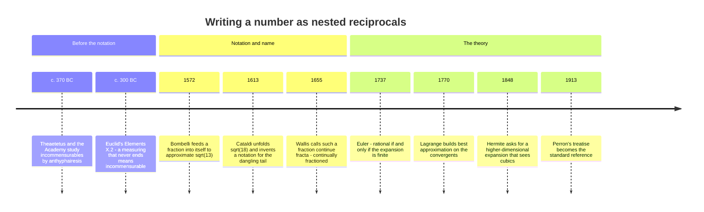

[← Stop 1 — The Depot](01-depot.md) · [Route map](index.md) · [Stop 3 — The Engine Room →](03-engine-room.md)

# Stop 2 — The Unfolding Road

> The road ahead is a fraction that never quite closes: the continued fraction, Euclid's algorithm let loose on the real numbers.

## Overview

Leaving the depot, the algorithm we just watched reduce two integers now runs
on a single real number, and the quotients it produces unfold into a road
called a **continued fraction**. Where an ordinary decimal writes a number as a
sum of tenths, hundredths, and thousandths — a base chosen by our ten fingers —
a continued fraction writes it as a tower of nested reciprocals, a
representation the number chooses for itself.

### Notation

A **simple continued fraction** is written

```
[a₀; a₁, a₂, a₃, …] = a₀ + 1/(a₁ + 1/(a₂ + 1/(a₃ + …))).
```

The numbers `aₙ` are the **partial quotients**. By convention `a₀` is an integer
(possibly negative or zero), and every later `aₙ` is a positive integer,
`aₙ ≥ 1`. The semicolon after `a₀` marks the boundary between the integer part
and the fractional tail; the commas separate the rest. This tour writes finite
expansions as `[a₀; a₁, …, aₙ]` and periodic ones — coming at Stop 6 — with a
parenthesised repeating block, as in `[1; (2)]` for `√2`.

### How the road is paved

To expand any real `x`, take its floor and invert the leftover:

1. Set `a₀ = ⌊x⌋`. If `x = a₀`, stop.
2. Otherwise let `x₁ = 1/(x − a₀)` (a number greater than 1) and repeat with
   `x₁`.

This is Euclid's algorithm again. If `x = p/q` is rational, then `a₀ = ⌊p/q⌋` is
Euclid's first quotient, `x − a₀ = (p mod q)/q`, and inverting gives
`q/(p mod q)` — exactly the next division Euclid would perform. **The partial
quotients of a rational `p/q` are precisely the quotients Euclid produces while
computing `gcd(p, q).`** That is why Stop 1 kept the quotients: they were the
road all along.

### Rational if and only if finite

Because Euclid's algorithm terminates on integers, **a number is rational
exactly when its continued fraction is finite**, and irrational exactly when it
is infinite. A finite expansion halts when some `x − aₙ` hits zero; an
irrational never gives a zero remainder, so the road runs forever. This is a
cleaner rational/irrational test than decimals offer: `1/3 = 0.333…` looks
infinite in base ten but is just `[0; 3]`, while `√2` is genuinely unending in
both.

### The two faces of a rational

There is one small ambiguity. Every rational has **exactly two** finite
continued-fraction representations, related by splitting off the last term:

```
[a₀; a₁, …, aₙ]  with aₙ ≥ 2   equals   [a₀; a₁, …, aₙ − 1, 1].
```

For example `[4; 2, 6, 7] = [4; 2, 6, 6, 1]`, because `7 = 6 + 1/1`. To make
the expansion unique we adopt the standard convention that the last partial
quotient is at least `2` (equivalently, an expansion of length greater than one
never ends in `1`). This tie has real consequences at Stop 8, where the two
forms are the two ways to walk the last step of the Stern–Brocot tree, and at
Stop 3, where they explain why convergents come in over-and-under pairs.

### Why bother?

Decimals are convenient for arithmetic but terrible at revealing a number's
approximation-theoretic character. Continued fractions are the opposite:
awkward to add (Stop 11 is entirely about fixing that) but supreme at answering
"what is the best simple fraction close to `x`?" Truncating a decimal gives you
the best fraction with a *power-of-ten* denominator; truncating a continued
fraction gives you the best fraction with *any* denominator that small — the
**convergents** of Stop 3. The road is unfolding toward the best possible
rational approximations, and it does so with denominators far smaller than
decimals would demand.

## Worked examples

Expand the rational `415/93`. The partial quotients are `4, 2, 6, 7` — and if
you run `demo euclid 415 93` you will see those same four numbers fall out of
the division ladder:

```
$ python -m tourbus demo cf 415/93
continued fraction of 415/93:
  [4; 2, 6, 7]

 n  a_n  p/q            value      error
 -  ---  ------  ------------  ---------
 0    4  4/1     4.0000000000  +4.62e-01
 1    2  9/2     4.5000000000  -3.76e-02
 2    6  58/13   4.4615384615  +8.27e-04
 3    7  415/93  4.4623655914  +0.00e+00
```

The final convergent equals `415/93` exactly and the error hits zero — the
hallmark of a rational's finite road. Compare Euclid on the same pair, whose
quotients match term for term:

```
$ python -m tourbus demo euclid 415 93
  415 = 4 x 93 + 43
  93 = 2 x 43 + 7
  43 = 6 x 7 + 1
  7 = 7 x 1 + 0
  continued fraction = [4; 2, 6, 7]
```

The tool always reduces to lowest terms first, so an unreduced fraction and its
reduced form share a road. Feeding it `1071/462`, which reduces to `51/22`,
gives the depot's quotients back again:

```
$ python -m tourbus demo cf 1071/462
continued fraction of 51/22:
  [2; 3, 7]

 n  a_n  p/q           value      error
 -  ---  -----  ------------  ---------
 0    2  2/1    2.0000000000  +3.18e-01
 1    3  7/3    2.3333333333  -1.52e-02
 2    7  51/22  2.3181818182  +0.00e+00
```

## Then, now, next

### Then — a road older than its name



The road was walked long before anyone paved it. Greek geometers compared two
lengths by *anthyphairesis* — "subtracting in turn": take the shorter from the
longer as often as it fits, swap, repeat. The sequence of "how many times"
counts is exactly the list of partial quotients, and Book X of Euclid's
*Elements* turns it into a test: if the measuring never stops, the two lengths
have no common unit. Historians such as David Fowler have argued that this is
how Plato's circle — Theaetetus in particular — first handled irrational
ratios like the side and diagonal of a square, long before anyone could write
`√2` as a number (see [Heritage stop H1](appendix-h-history.md#h1-c-300-bc-the-ladder-of-euclid)).

The written notation arrived two thousand years later. Bombelli (1572) and
Cataldi (1613) fed fractions into themselves to approximate square roots;
Wallis gave the object its name; and Euler's 1737 dissertation made the
characterisation on this page — rational exactly when finite — into a
theorem. Everything since has been refinement of one question: *what does the
sequence of quotients know about the number?*

### Now — the fraction behind the float

The unfolding road runs quietly inside modern software whenever a computer has
to turn a number back into a fraction.

- **"What fraction is this?"** Python's `Fraction.limit_denominator` answers by
  walking the continued fraction of its argument and returning the best
  convergent or semiconvergent under a denominator cap. It is how a tool can
  print `0.30000000000000004` back as `3/10`, or `π` as `355/113`.
- **Rational reconstruction.** Computer-algebra systems often work modulo a
  large prime to keep numbers small, then must recover an exact answer like
  `-17/42` from its residue. Running the extended Euclidean algorithm on the
  modulus and the residue, and stopping halfway down the road, recovers the
  fraction (P. S. Wang, 1981). The halting point is Legendre's criterion from
  [Stop 5](05-scenic-overlook.md) in disguise.
- **Recognising constants.** The continued fraction finds an integer relation
  `a·x − b = 0` between a number and `1`. Integer-relation algorithms such as
  PSLQ (Ferguson and Bailey, 1990s) generalise the same idea to many numbers at
  once, and are how experimental mathematicians turn a 100-digit decimal into a
  closed-form formula.

> [!TIP]
> In plain Python, `Fraction(math.pi).limit_denominator(1000)` returns
> `Fraction(355, 113)`, and raising the cap to `16603` still returns it. The
> first better fraction, `52163/16604`, needs a denominator more than a hundred
> times larger.

### Next — the unfolding road in higher dimensions

A single real number has one canonical expansion. Two numbers approximated
*simultaneously* have none, and that gap is one of the oldest open roads in
the subject. In an 1848 letter to Jacobi, Charles Hermite asked for an
algorithm that represents real numbers so that the cubic irrationals show up
as periodic, just as quadratic irrationals do at [Stop 6](06-loop-road.md).
Jacobi's own attempt, later developed by Perron into the Jacobi–Perron
algorithm, and many successors (Brun, Selmer, and others) are still studied
for their convergence and ergodic behaviour. In 2022 Oleg Karpenkov settled
the *totally real* cubic case with a new "sin²" algorithm. The general problem
— cubic fields with complex roots — remains open after more than 175 years.

## Exercises

1. **(★)** Expand `[3; 4, 12, 4]` back into an ordinary fraction by hand, then
   check with `demo cf` on your answer.
   <details><summary>Hint</summary>Work inside-out: `12 + 1/4 = 49/4`, then
   `4 + 4/49 = 200/49`, and so on.</details>

2. **(★)** Write both continued-fraction representations of `9/7`.
   <details><summary>Hint</summary>One ends in a term ≥ 2; split that last term
   into `(term − 1) + 1/1`.</details>

3. **(★★)** Show that `[0; a₁, a₂, …]` is the reciprocal of `[a₁; a₂, …]`
   whenever the latter exceeds 1. What does this say about `demo cf 93/415`?
   <details><summary>Hint</summary>Prepending a `0` and inverting are the same
   operation; the road of `93/415` is `415/93`'s road with a `0` bolted on the
   front.</details>

4. **(★★)** Explain why no continued fraction has a partial quotient of `0`
   after the first term.
   <details><summary>Hint</summary>At each step `x − aₙ` lies in `[0, 1)`, so
   its reciprocal is `> 1`, forcing the next floor to be at least 1.</details>

5. **(★★★)** Prove that the continued fraction of a rational is finite by
   arguing that the sequence of remainders is strictly decreasing in the
   integers.
   <details><summary>Hint</summary>Each `xₙ = 1/(xₙ₋₁ − aₙ₋₁)` has a denominator
   that is a strictly smaller positive integer than the previous one; a
   decreasing sequence of positive integers cannot be infinite.</details>

## See it move

The Unfolding Road's section of the [live exposition](../site/index.html#stop-2-road)
sends you back to the **CF Expansion Machine** (widget W1) at the Depot, which
drives both kinds of road. Type `415/93` and its Euclid ledger stops after four
rows; press **π** and it keeps going, each partial quotient certified from a
60-digit seed before it is shown.

## Further reading

- Khinchin, *Continued Fractions*, §§1–3 for the definition and the
  rational/irrational dichotomy. See Appendix C.
- Hardy & Wright, *An Introduction to the Theory of Numbers*, Chapter X, §§10.1–10.5.
- C. D. Olds, *Continued Fractions* (MAA New Mathematical Library), an
  approachable book-length introduction; Appendix C.
- D. Fowler, *The Mathematics of Plato's Academy* (2nd ed., 1999) — the case
  that Greek ratio theory was built on anthyphairesis.
- C. Brezinski, *History of Continued Fractions and Padé Approximants*
  (Springer, 1991) — the standard history, from Bombelli to the twentieth century.
- O. Karpenkov, *Acta Arithmetica* 203 (2022) — the sin² algorithm and the
  totally real case of Hermite's problem.

[← Stop 1 — The Depot](01-depot.md) · [Route map](index.md) · [Stop 3 — The Engine Room →](03-engine-room.md)
