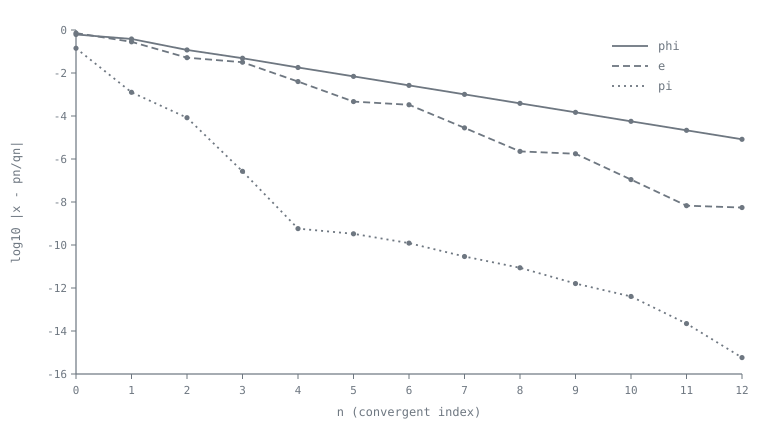

[← Stop 2 — The Unfolding Road](02-unfolding-road.md) · [Route map](index.md) · [Stop 4 — The Golden Milestone →](04-golden.md)

# Stop 3 — The Engine Room

> Down among the pistons: the convergent recurrence that turns a list of partial quotients into a sequence of ever-better fractions.

## Overview

The unfolding road gives us a list of partial quotients, but a list is not yet
an approximation. In the engine room we meet the machine that turns
`[a₀; a₁, a₂, …]` into a sequence of fractions `pₙ/qₙ`, the **convergents**,
each the best rational approximation of its size. The engine is a pair of
coupled recurrences, and almost every theorem on the rest of the tour is bolted
to it.

### The fundamental recurrence

Define numerators `pₙ` and denominators `qₙ` by the *same* recurrence, differing
only in their seeds:

```
pₙ = aₙ·pₙ₋₁ + pₙ₋₂,      p₋₁ = 1,  p₋₂ = 0,
qₙ = aₙ·qₙ₋₁ + qₙ₋₂,      q₋₁ = 0,  q₋₂ = 1.
```

Then `pₙ/qₙ = [a₀; a₁, …, aₙ]`, the truncation of the road after `n+1` terms.
The proof is a clean induction (Appendix A): replacing the tail `aₙ` by the real
value `aₙ + 1/xₙ₊₁` in these formulas recovers `x` exactly, so the recurrence is
just bookkeeping for the nested reciprocals of Stop 2. The important point is
that it uses **only integer additions and multiplications** — no division, no
rounding. This is why the `tourbus` engine can compute convergents *exactly*
with Python's arbitrary-precision integers, and why every worked example on this
tour is reproducible to the last digit.

### The determinant identity

The two sequences are locked together by a beautiful relation:

```
pₙ·qₙ₋₁ − pₙ₋₁·qₙ = (−1)ⁿ⁻¹.
```

Read as a `2×2` determinant, it says the matrix `[[pₙ, pₙ₋₁], [qₙ, qₙ₋₁]]` has
determinant `±1` — the convergents form a chain of **unimodular** matrices.
Three consequences follow immediately:

- Every convergent `pₙ/qₙ` is **already in lowest terms**: any common factor of
  `pₙ` and `qₙ` would have to divide `±1`. The engine never needs to reduce.
- Successive convergents differ by exactly `pₙ/qₙ − pₙ₋₁/qₙ₋₁ = (−1)ⁿ⁻¹/(qₙ qₙ₋₁)`,
  a fraction whose size is controlled purely by the denominators.
- Because the sign alternates, the convergents **straddle** the true value:
  even-indexed ones sit below `x`, odd-indexed ones above, each pair squeezing
  tighter. You can watch the `error` column flip sign row by row in every `cf`
  demo.

Appendix A proves the identity by a one-line induction on the recurrence.

### How good, and how fast

Combining the straddle with the recurrence gives the headline error bound:

```
|x − pₙ/qₙ| < 1/(qₙ · qₙ₊₁) ≤ 1/qₙ².
```

An approximation whose error is smaller than one over the *square* of its
denominator is extraordinary — a random fraction `p/q` is only within about
`1/q` of a target. Convergents are quadratically good, and the size of the next
partial quotient `aₙ₊₁` tells you *how* good: since `qₙ₊₁ = aₙ₊₁ qₙ + qₙ₋₁`, a
large `aₙ₊₁` means an unusually accurate `pₙ/qₙ`. That is the secret behind
`355/113` for `π`, which we will exploit at Stop 5.

How fast do the denominators grow? Since every `aₙ ≥ 1`, the recurrence
`qₙ = aₙ qₙ₋₁ + qₙ₋₂ ≥ qₙ₋₁ + qₙ₋₂` dominates the Fibonacci recurrence, so

```
qₙ ≥ F₍ₙ₊₁₎.
```

Denominators grow **at least exponentially** (like `φⁿ`), which is why a handful
of convergents already pins a number down to many decimal places — and why the
slowest-growing case, all `aₙ = 1`, is the golden ratio waiting at Stop 4.



### Where the engine came from

The engine is younger than the fractions it drives. The general rule for
forming the numerators and denominators of convergents was in print by John
Wallis's *Opera Mathematica* (1695) — the same book that coined the name
"continued fraction" — and Cataldi (1613) already held equivalent relations;
it was Euler's *De fractionibus continuis* (presented 1737) that turned the
rule into the systematic theory the tour runs on. What you just watched is,
nearly symbol for symbol, their machine; for the whole story, ride the
Heritage Line (Appendix H).

## Worked examples

Watch the engine turn on `π`. The convergents `3, 22/7, 333/106, 355/113`
appear in order, denominators leaping ahead, and the error column halving its
exponent every row or two:

```
$ python -m tourbus demo cf pi
continued fraction of pi:
  [3; 7, 15, 1, 292, 1, 1, 1, 2, 1, 3, 1, 14, 2, 1, 1, 2, 2, 2, 2, ...]

 n  a_n  p/q                  value      error
 -  ---  ------------  ------------  ---------
 0    3  3/1           3.0000000000  +1.42e-01
 1    7  22/7          3.1428571429  -1.26e-03
 2   15  333/106       3.1415094340  +8.32e-05
 3    1  355/113       3.1415929204  -2.67e-07
 4  292  103993/33102  3.1415926530  +5.78e-10
 5    1  104348/33215  3.1415926539  -3.32e-10
 6    1  208341/66317  3.1415926535  +1.22e-10
 7    1  312689/99532  3.1415926536  -2.91e-11
```

Two features to notice. First, the error signs alternate — `+, −, +, −, …` —
the determinant identity's straddle made visible. Second, the jump in accuracy
from row 3 to row 4 (from `2.67e-07` to `5.78e-10`, a factor of nearly 500) is
caused by the enormous partial quotient `a₄ = 292`: `355/113` is so good
*because* the next term is so large. We come back to this at Stop 5.

For contrast, a rational road terminates and the error falls straight to zero:

```
$ python -m tourbus demo cf 415/93
continued fraction of 415/93:
  [4; 2, 6, 7]

 n  a_n  p/q            value      error
 -  ---  ------  ------------  ---------
 0    4  4/1     4.0000000000  +4.62e-01
 1    2  9/2     4.5000000000  -3.76e-02
 2    6  58/13   4.4615384615  +8.27e-04
 3    7  415/93  4.4623655914  +0.00e+00
```

## Exercises

1. **(★)** From the `π` table, verify the determinant identity for the pair
   `333/106` and `355/113`: compute `355·106 − 333·113`.
   <details><summary>Hint</summary>You should get `±1`. Here `n = 3`, so the
   sign is `(−1)² = +1`.</details>

2. **(★)** Using only the recurrence and `a = [3; 7, 15, 1]`, reconstruct the
   convergent `355/113` from `333/106` and `22/7`.
   <details><summary>Hint</summary>`p₃ = 1·333 + 22`, `q₃ = 1·106 + 7`.</details>

3. **(★★)** Show that the error bound `1/(qₙ qₙ₊₁)` predicts the row-3 error of
   `π` to within an order of magnitude. (`q₃ = 113`, `q₄ = 33102`.)
   <details><summary>Hint</summary>`1/(113·33102) ≈ 2.7e-7`, matching the
   `2.67e-07` in the table almost exactly.</details>

4. **(★★)** Prove `qₙ ≥ F₍ₙ₊₁₎` for all `n ≥ 0` by induction on the
   denominator recurrence.
   <details><summary>Hint</summary>Base cases `q₀ = 1 = F₁`, `q₁ = a₁ ≥ 1 = F₂`;
   then `qₙ ≥ qₙ₋₁ + qₙ₋₂`.</details>

5. **(★★★)** Deduce from the determinant identity that consecutive convergents
   `pₙ₋₁/qₙ₋₁` and `pₙ/qₙ` are *Farey neighbours* — that is,
   `pₙ qₙ₋₁ − pₙ₋₁ qₙ = ±1`. Why does this foreshadow Stop 8?
   <details><summary>Hint</summary>That unit determinant is exactly the
   neighbour condition in the Stern–Brocot tree; convergents are the tree's
   turning points.</details>

## See it move

Open the **Engine Room** widget:
[`site/index.html#stop-3-engine`](../site/index.html#stop-3-engine). Step the
recurrence forward one term at a time and see `pₙ, qₙ`, the running error, and
the alternating straddle bracket the target from above and below.

## Further reading

- Khinchin, *Continued Fractions*, §§1–2 for the recurrence and the error
  bounds. See Appendix C.
- Hardy & Wright, Chapter X, §§10.3–10.7 (convergents, the determinant
  identity, and approximation).
- Appendix A of this tour, for the induction proofs of the recurrence, the
  determinant identity, and the error bound.

[← Stop 2 — The Unfolding Road](02-unfolding-road.md) · [Route map](index.md) · [Stop 4 — The Golden Milestone →](04-golden.md)
