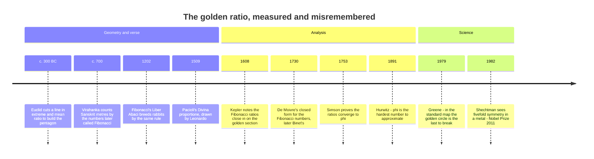

[← Stop 3 — The Engine Room](03-engine-room.md) · [Route map](index.md) · [Stop 5 — Scenic Overlook →](05-scenic-overlook.md)

# Stop 4 — The Golden Milestone

> The simplest possible road — all ones — leads to the golden ratio, the number that resists rational approximation harder than any other.

## Overview

Every partial quotient on this road must be at least `1`. What number do you get
if you make every one of them *exactly* `1` — the simplest, slowest, most
stubborn continued fraction there is? The answer is the **golden ratio**, and it
turns out to be, in a precise sense, the number hardest to approximate by
fractions. The simplest road leads to the most irrational milestone.

### φ = [1; 1, 1, 1, …]

Let `φ = [1; 1, 1, 1, …]`. Because the road repeats itself immediately, `φ`
satisfies its own defining equation: the tail after the first term is again `φ`,
so

```
φ = 1 + 1/φ,   hence   φ² − φ − 1 = 0,   giving   φ = (1 + √5)/2 ≈ 1.6180339887…
```

This self-reference — a number equal to a function of itself — is the first
appearance of a **fixed point** on the tour, an idea we return to at Stop 6
(periodic surds) and Stop 13 (fractal attractors). The continued fraction is not
just a description of `φ`; it *is* the fixed-point equation, unrolled.

### Convergents are Fibonacci ratios

Run the engine-room recurrence with every `aₙ = 1` and the numerators and
denominators are both the Fibonacci sequence:

```
qₙ = 1·qₙ₋₁ + qₙ₋₂ = Fibonacci,   pₙ = Fibonacci shifted by one.
```

So the convergents of `φ` are exactly the ratios of consecutive Fibonacci
numbers:

```
p_n/q_n = F₍ₙ₊₂₎/F₍ₙ₊₁₎  →  1/1, 2/1, 3/2, 5/3, 8/5, 13/8, 21/13, …  →  φ.
```

That the Fibonacci ratios converge to `φ` is **Binet's formula** in disguise.
Binet gives the closed form `Fₙ = (φⁿ − ψⁿ)/√5`, where `ψ = (1 − √5)/2 ≈ −0.618`
is the conjugate root. Since `|ψ| < 1`, the `ψⁿ` term vanishes, so
`F₍ₙ₊₁₎/Fₙ → φ` and the error shrinks like `|ψ|ⁿ` — the slowest exponential
decay any continued fraction can manage, because `q` grows as slowly as the
recurrence allows. Appendix A walks through this limit.

### The most irrational number

Here is the payoff. At Stop 3 we saw every convergent beats `|x − p/q| < 1/q²`.
How much better can you do — what constant `c` makes `|x − p/q| < 1/(c q²)`
solvable for infinitely many fractions? **Hurwitz's theorem (1891)** gives the
sharp answer:

> For every irrational `x` there are infinitely many rationals `p/q` with
> `|x − p/q| < 1/(√5·q²)`, and the constant `√5` is **best possible**: for any
> larger constant the statement fails for some `x`.

The number that fails — the one for which `√5` cannot be improved even a little
— is the golden ratio (and numbers equivalent to it under the modular group).
Its convergents approach it as *slowly* as the `1/q²` law permits, hovering
right at the `1/(√5 q²)` boundary. For this reason `φ` is often called **the
most irrational number**: the fraction with all-`1` partial quotients is the one
that fractions can least easily catch.

Why all ones? A large partial quotient `aₙ₊₁` makes the preceding convergent
*unusually good* (recall Stop 3: `355/113` owes its accuracy to the `292` that
follows). To be as *hard* to approximate as possible, a number must never offer
a large partial quotient — it must be all `1`s. That is `φ`. The depot's worst
case for Euclid, the Fibonacci pairs of Stop 1, and Hurwitz's extremal number
here are three faces of the same all-ones road.

The golden ratio's stubbornness is not just a curiosity: it is why sunflower
seeds and pinecone scales are spaced at the **golden angle** of `360°/φ² ≈ 137.5°`.
Packing points around a circle so that no two ever line up — so the
arrangement is maximally "irrational" — is exactly the problem Hurwitz answered,
and nature's solution is `φ`.


## Worked examples

Expand `φ` and watch the all-ones road produce Fibonacci convergents. The
`tourbus` engine prints the repeating block compactly as `[(1)]`, then unrolls
it:

```
$ python -m tourbus demo cf phi
continued fraction of phi:
  [(1)]

 n  a_n  p/q           value      error
 -  ---  -----  ------------  ---------
 0    1  1/1    1.0000000000  +6.18e-01
 1    1  2/1    2.0000000000  -3.82e-01
 2    1  3/2    1.5000000000  +1.18e-01
 3    1  5/3    1.6666666667  -4.86e-02
 4    1  8/5    1.6000000000  +1.80e-02
 5    1  13/8   1.6250000000  -6.97e-03
 6    1  21/13  1.6153846154  +2.65e-03
 7    1  34/21  1.6190476190  -1.01e-03
```

Every numerator and denominator is a Fibonacci number, and the error column
tells the whole story: compare it against `π` at Stop 3, where seven steps
reached an error of `10⁻¹¹`. Here seven steps of `φ` have only reached `10⁻³`.
The convergents are converging as slowly as convergents ever can — the visible
signature of the most irrational number. Notice, too, that each error is very
nearly `1/(√5 q²)`: at `n = 7`, `1/(√5·21²) ≈ 1.01e-3`, matching the table's
`-1.01e-03` to the digit.

## Then, now, next

### Then — the extreme and mean ratio



Euclid needed the golden ratio to build regular pentagons and the
icosahedron, and called it simply the division of a line in "extreme and mean
ratio" (*Elements* VI, Definition 3). Its all-ones continued fraction was
hiding in plain sight in a different tradition: Indian prosodists from Virahanka
(c. 700) to Hemachandra (c. 1150) counted poetic metres of long and short
syllables and found the numbers `1, 2, 3, 5, 8, 13, …` centuries before
Fibonacci's rabbits of 1202. The adjective "golden" appeared in German
textbooks in the eighteenth century and was popularised by Martin Ohm in 1835;
the letter `φ` was suggested by the American engineer Mark Barr around 1909.
The precise sense in which `φ` is extreme — Hurwitz's theorem on this page —
arrived only in 1891.

> [!WARNING]
> Many popular claims — that the Parthenon, the Great Pyramid, the *Mona Lisa*,
> or the "most beautiful" rectangle are built on `φ` — do not survive careful
> measurement (G. Markowsky, "Misconceptions about the golden ratio," 1992).
> The mathematics of this stop gives `φ` a better reputation: it is the number
> that rational approximation reaches most slowly.

### Now — the golden ratio at work

- **Hashing.** Knuth's *Fibonacci hashing* multiplies a key by `⌊2⁶⁴/φ⌋`,
  written `0x9E3779B97F4A7C15` in hexadecimal, and keeps the top bits. Because
  multiples of `1/φ` spread around a circle more evenly than multiples of any
  other number (the three-distance theorem of
  [Express stop E5](appendix-d-frontier.md#e5-the-three-distance-theorem)),
  consecutive keys land far apart. The same constant seeds widely used hash
  functions and random-number generators.
- **Search and sampling.** Golden-section search (Kiefer, 1953) finds the
  minimum of a one-humped function with the fewest evaluations; Fibonacci heaps
  (Fredman and Tarjan, 1987) owe their name and their speed to Fibonacci growth;
  and "golden" point sets — `n·φ` modulo 1, or the Fibonacci lattice on a
  sphere — are standard tools for spreading samples evenly in graphics and
  numerical integration.
- **Plants and materials.** Sunflower seeds follow the golden angle because
  that is what a growing tip produces when each new primordium appears where
  there is most room: Hellmut Vogel's 1979 model reproduced the pattern, and in
  1992 Stéphane Douady and Yves Couder made it happen with droplets of
  ferrofluid in a magnetic field. In 1982 Dan Shechtman found a metal alloy with
  fivefold, golden-ratio symmetry that crystallography said was impossible —
  the *quasicrystals* of [Appendix F](appendix-f-cross-domain.md) — and won the
  2011 Nobel Prize in Chemistry.

### Next — golden computers and golden orbits

- **Fibonacci anyons.** In the leading theory of *topological* quantum
  computing, quasiparticles called Fibonacci anyons have "quantum dimension"
  exactly `φ`, and braiding them around one another can perform any quantum
  computation (Freedman, Larsen, and Wang, 2002). In 2024 researchers braided
  Fibonacci anyons simulated on a superconducting quantum processor; building
  hardware where they occur naturally is an open engineering challenge.
- **The last circle to break.** In Hamiltonian dynamics, the orbits with
  golden rotation number are the most robust against perturbation — John
  Greene's 1979 calculations found the golden invariant circle of the standard
  map to be the last one to break, at a coupling of about `0.9716`. It is
  overwhelming numerical evidence; a proof is still missing. The story continues
  in [Appendix E](appendix-e-web-of-ideas.md#3-irrationality-as-a-physical-quantity).

## Exercises

1. **(★)** From the table, check that `8/5` and `13/8` satisfy the determinant
   identity `13·5 − 8·8 = ±1`.
   <details><summary>Hint</summary>`65 − 64 = 1`, and since `n = 5` the sign is
   `(−1)⁴ = +1`.</details>

2. **(★)** Confirm the fixed-point equation numerically: take `φ ≈ 1.618034` and
   check that `1 + 1/φ` returns the same value.
   <details><summary>Hint</summary>`1/1.618034 ≈ 0.618034`, and
   `1 + 0.618034 = 1.618034`.</details>

3. **(★★)** Using Binet's formula, show that `F₍ₙ₊₁₎/Fₙ − φ = O(|ψ|²ⁿ)`, so the
   Fibonacci ratios converge geometrically with ratio `ψ² ≈ 0.382`.
   <details><summary>Hint</summary>Write both `F₍ₙ₊₁₎` and `Fₙ` with Binet and
   divide; the `ψ` terms are order `|ψ|ⁿ` relative to the `φ` terms, and their
   effect on the *ratio* is order `|ψ|²ⁿ` since `φψ = −1`.</details>

4. **(★★)** The "silver ratio" is `[2; 2, 2, …] = 1 + √2`. Compute its value and
   its first four convergents, and check they are `Pell`-related (Stop 7).
   <details><summary>Hint</summary>Self-reference gives `s = 2 + 1/s`, so
   `s² − 2s − 1 = 0`. The convergents' denominators are the Pell numbers
   `1, 2, 5, 12, 29, …`.</details>

5. **(★★★)** Prove that if `x` has all partial quotients equal to `1` from some
   point on, then `x` is "noble" — equivalent to `φ` under a modular
   transformation `(ax+b)/(cx+d)` with `ad − bc = ±1` — and hence realises
   Hurwitz's bound.
   <details><summary>Hint</summary>A shared infinite tail means the two numbers
   differ by finitely many partial quotients, which is exactly a unimodular
   Möbius change of variable.</details>

## See it move

Two widgets wait at the Golden Milestone in the
[live exposition](../site/index.html#stop-4-golden). The **Golden Spiral Lab**
(W3) draws the spiral of squares at any depth, for `φ` or any ratio you type,
so you can watch a non-golden spiral drift out of true. The **Irrationality
Racer** (W4) plots `qₙ²·|x − pₙ/qₙ|` along the convergents of `φ`, `e`, and `π`:
the lower a curve dips, the easier its number is to approximate, and `φ`'s
hugs Hurwitz's floor `1/√5 ≈ 0.447` from the first term to the last.

**Try it live:** the spiral preset to [depth 9 at ratio φ](../site/index.html#w3?d=9&r=phi).

## Further reading

- Hurwitz, "Ueber die angenäherte Darstellung der Irrationalzahlen durch
  rationale Brüche" (1891) — the original theorem; discussed in Appendix C.
- Hardy & Wright, §11.8, for a full proof of Hurwitz's theorem.
- M. Livio, *The Golden Ratio* — a readable cultural and mathematical history.
- Appendix A of this tour for the Fibonacci-ratio limit and Binet's formula.
- G. Markowsky, "Misconceptions about the golden ratio," *College Mathematics
  Journal* 23 (1992) — the myths, measured.
- D. E. Knuth, *The Art of Computer Programming*, Vol. 3, §6.4 — multiplicative
  (Fibonacci) hashing.
- S. Douady & Y. Couder, "Phyllotaxis as a physical self-organized growth
  process," *Physical Review Letters* 68 (1992).

[← Stop 3 — The Engine Room](03-engine-room.md) · [Route map](index.md) · [Stop 5 — Scenic Overlook →](05-scenic-overlook.md)
