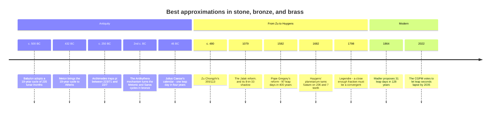

[← Stop 4 — The Golden Milestone](04-golden.md) · [Route map](index.md) · [Stop 6 — The Loop Road →](06-loop-road.md)

# Stop 5 — Scenic Overlook

> A place to stop and admire the view: continued fractions give the best rational approximations there are, and calendars, clockwork, and π all lean on them.

## Overview

We pause at the overlook to appreciate what the engine of Stop 3 has been
building. Convergents are not merely *good* approximations — they are, in a
precise sense, the *best* ones. This is why a Persian astronomer, a Dutch
clockmaker, and a Chinese mathematician all independently rediscovered the same
fractions. Continued fractions are the mathematics of "close enough with the
smallest possible parts."

### Best approximation of the second kind

Call `p/q` a **best rational approximation of the second kind** if every other
fraction with a denominator `q′ ≤ q` is strictly farther from `x`:
`|q′x − p′| > |qx − p|` for all such `p′/q′`. **Lagrange's theorem** identifies
these exactly:

> The best rational approximations of the second kind to a real number are
> precisely its continued-fraction convergents.

No fraction with a denominator up to `qₙ` beats `pₙ/qₙ`. Truncating a decimal
only gives you the best fraction with a *power-of-ten* denominator; truncating
the continued fraction gives you the best fraction, full stop. (There are also
best approximations "of the first kind," which minimise `|x − p/q|` directly;
those include the convergents plus certain *semiconvergents* — the intermediate
fractions you get by using a partial quotient `1 ≤ k < aₙ` in the recurrence.
See Appendix B.)

### Legendre's converse

Lagrange tells us convergents are good; **Legendre's criterion (1798)** gives a
practical converse:

> If `|x − p/q| < 1/(2q²)`, then `p/q` is a convergent of `x`.

So being *unusually* close — closer than half the inverse square of your
denominator — is a *certificate* of being a convergent. This is not idle: at
Stop 14, Wiener's attack on RSA works precisely by manufacturing a fraction that
satisfies Legendre's bound, forcing it to appear among the convergents where the
attacker can find it.

### Calendars: fitting the year to the day

The tropical year is about **365.2422 days** — not a whole number, which is the
entire problem of calendar design. We need a leap-year rule: a fraction
`L/Y` of years that are leap years, approximating `0.2422`. The convergents of
`0.2422` are exactly the historical answers:

- `1/4` — one leap year every four years, the **Julian calendar** (46 BC).
  Slightly too many; the year drifts by about 11 minutes annually.
- `7/29` and then `8/33` — eight leap years every 33 years, the cycle long
  associated with the **Jalali calendar** of **1079**, whose reform committee
  included Omar Khayyam. (The Jalali calendar itself followed the observed
  spring equinox; the 33-year cycle is its arithmetic shadow, and an
  astonishingly accurate one.)
- `31/128` — thirty-one leap years per 128 years, more accurate still, and
  proposed as a reform by the astronomer Johann Heinrich Mädler in 1864.

The familiar **Gregorian** rule (`97/400` — drop three leap days every four
centuries) is *not* a convergent. It is a deliberate administrative compromise:
`97/400 = 0.2425` is less accurate than `8/33 = 0.242424…`, but base-100
century boundaries are far easier to teach and remember than a 33-year cycle. It
is a rare case where humanity knowingly chose a *worse* approximation for the
sake of usability — the exception that proves how strong the convergents' pull
normally is. (The comparison is a little kinder to Pope Gregory than it looks:
his 1582 reform aimed to hold the *spring equinox* near 21 March, and the
equinox-to-equinox year, about `365.2424` days, sits closer to `97/400` than the
mean tropical year does.)

### Clockwork and gears

The same problem appears whenever two rotations must be linked by a gear train:
the ratio of teeth must approximate an irrational or awkward ratio. **Christiaan
Huygens**, building a mechanical planetarium in 1682, needed a gear ratio for
Saturn's period, which his data put at `77708431/2640858 ≈ 29.4254` years. He
used a continued-fraction convergent, `206/7`, cutting gears of 206 and 7 teeth
instead of tens of millions. The convergent is the best ratio achievable with a
gear you can actually machine.

### π and the race for 355/113

For `π = [3; 7, 15, 1, 292, …]` the convergents are `3, 22/7, 333/106, 355/113`.
Two are legendary:

- `22/7 ≈ 3.142857`, **Archimedes'** bound (c. 250 BC), accurate to two decimals.
- `355/113 ≈ 3.14159292`, found by **Zu Chongzhi** around **480 AD**, accurate
  to *six* decimals. It is so good because the next partial quotient, `292`, is
  huge (Stop 3): `355/113` is the best rational approximation to `π` with a
  denominator below **16604** (the first better fraction is `52163/16604`), and
  it stood as the world's most accurate value of `π` for nearly a thousand
  years.

## Worked examples

The `calendar` demo lists the convergents of `0.2422` with their leap-year
meaning. Every row but the reform proposals is a real calendar somebody used:

```
$ python -m tourbus demo calendar
Leap-year rules from the convergents of 0.2422:
 rule    value     meaning                      
 ------  --------  -----------------------------
 1/4     0.250000  1 leap year every 4 years    
 7/29    0.241379  7 leap years every 29 years  
 8/33    0.242424  8 leap years every 33 years  
 31/128  0.242188  31 leap years every 128 years
```

Notice the values straddle `0.2422` in the alternating pattern the determinant
identity guarantees: `0.25` (over), `0.2414` (under), `0.2424` (over),
`0.2422` (under). Each is the best leap-year rule with a cycle no longer than
its denominator — and `8/33`, the 900-year-old Jalali cycle, is more accurate
than the Gregorian calendar the world actually uses.

The `π` convergents underlie the whole story of approximating the circle. Run
`demo cf pi` and read off `22/7` and `355/113` in the `p/q` column, with the
telltale `292` marking why `355/113` is so extraordinarily good:

```
$ python -m tourbus demo cf pi
continued fraction of pi:
  [3; 7, 15, 1, 292, 1, 1, 1, 2, 1, 3, 1, 14, 2, 1, 1, 2, 2, 2, 2, ...]

 n  a_n  p/q                  value      error
 -  ---  ------------  ------------  ---------
 0    3  3/1           3.0000000000  +1.42e-01
 1    7  22/7          3.1428571429  -1.26e-03
 2   15  333/106       3.1415094340  +8.32e-05
 3    1  355/113       3.1415929204  -2.67e-07
 4  292  103993/33102  3.1415926530  +5.78e-10
 5    1  104348/33215  3.1415926539  -3.32e-10
 6    1  208341/66317  3.1415926535  +1.22e-10
 7    1  312689/99532  3.1415926536  -2.91e-11
```

## Then, now, next

### Then — the sky's cycles, caught in fractions



Calendars were the first great customer of best approximation. A lunisolar
calendar must fit whole months into whole years, and the ratio of the tropical
year to the lunar month has its own continued fraction — which the engine will
unfold for you:

```
$ python -m tourbus demo cf 12.368266
continued fraction of 12.368266:
  [12; 2, 1, 2, 1, 1, 17, 3, 2, 25, 1, 7]

 n  a_n  p/q                 value      error
 -  ---  ----------  -------------  ---------
 0   12  12/1        12.0000000000  +3.68e-01
 1    2  25/2        12.5000000000  -1.32e-01
 2    1  37/3        12.3333333333  +3.49e-02
 3    2  99/8        12.3750000000  -6.73e-03
 4    1  136/11      12.3636363636  +4.63e-03
 5    1  235/19      12.3684210526  -1.55e-04
 6   17  4131/334    12.3682634731  +2.53e-06
 7    3  12628/1021  12.3682664055  -4.05e-07
```

Two rows are ancient institutions. `99/8` is the Greek *octaeteris*, 99 months
in 8 years; `235/19` is the **Metonic cycle**, 235 months in 19 years, used in
Babylon from about 500 BC, brought to Athens by Meton in 432 BC, and still
running today: it fixes the Hebrew calendar, and the Christian computus for the
date of Easter labels each year by its place in the cycle, its *golden number*.
The `17` that follows it is why the cycle was good enough to last 2,500 years.
Around the second century BC a Greek workshop even cut the Metonic and
223-month Saros eclipse cycles into the bronze gear trains of the
**Antikythera mechanism**, the oldest known geared computer.

### Now — best approximation in software and standards

- **Your language already does it.** Python's `Fraction.limit_denominator`
  (see [Stop 2](02-unfolding-road.md#then-now-next)) walks convergents and
  semiconvergents to return the best fraction under a denominator cap — the
  theorem of this stop as a library call.
- **Clocks and frequencies.** Whenever hardware must turn one frequency into
  another with integer dividers — a phase-locked loop, a fractional clock
  divider, a sample-rate converter, a gear train in a mechanical watch — the
  engineer is choosing a good rational approximation with small parts.
- **Leap seconds.** Earth's rotation is irregular and slowly braking, so no
  fixed rule can keep atomic time aligned with the sun; since 1972 leap seconds
  have been inserted by observation. In 2022 the General Conference on Weights
  and Measures decided to let the difference grow larger by 2035 — in effect
  retiring the leap second.

> [!TIP]
> The Gregorian rule drifts by about one day in 3,200 years against the mean
> tropical year. Try `python -m tourbus demo cf 0.24219` to see which leap-year
> rules a mathematician would have chosen instead.

### Next — a moving target

The target of this stop is not fixed. The tropical year shortens by about half
a second per century, and the day lengthens as tides slow the Earth, so the
"best" leap-year rule of the year 5000 will differ from today's; John Herschel's
1849 suggestion of dropping one more leap day every 4,000 years and Mädler's
`31/128` are both answers to a question whose answer drifts. More broadly,
best approximation in *several* numbers at once — simultaneous Diophantine
approximation — is where Littlewood's conjecture and Hermite's problem live
([Stop 15](15-terminus.md), [Stop 2](02-unfolding-road.md#then-now-next)).

## Exercises

1. **(★)** The Gregorian rule is `97/400 = 0.2425`. Is it closer to `0.2422`
   than `8/33 = 0.242424…`? Which would a mathematician prefer, and why did
   civil society choose otherwise?
   <details><summary>Hint</summary>Compare `|0.2425 − 0.2422|` with
   `|0.242424 − 0.2422|`. The Jalali rule wins on accuracy; the Gregorian wins
   on a memorable century-based rule.</details>

2. **(★)** Using the `π` table, verify that `355/113` satisfies Legendre's
   criterion `|π − p/q| < 1/(2q²)`.
   <details><summary>Hint</summary>`1/(2·113²) ≈ 3.9e-5`, and the actual error
   is `2.67e-7`, comfortably smaller — so `355/113` *must* be a convergent.</details>

3. **(★★)** Find the best rational approximation to `√2` with denominator at
   most 100, using `demo cf sqrt2`, and confirm no fraction `p/q` with `q ≤ 70`
   does better than `99/70`.
   <details><summary>Hint</summary>Read the convergents off the table; `99/70`
   is the last with `q ≤ 100`, and Lagrange guarantees its optimality.</details>

4. **(★★)** A gear train must realise the ratio `√2 : 1` with each gear under
   50 teeth. Which convergent should the machinist cut?
   <details><summary>Hint</summary>`17/12` and `41/29` are the candidates with
   both parts under 50; `41/29` is more accurate.</details>

5. **(★★★)** Prove Legendre's criterion: if `|x − p/q| < 1/(2q²)` with `p/q` in
   lowest terms, then `p/q` is a convergent.
   <details><summary>Hint</summary>Expand `x` as a continued fraction whose
   final term is chosen so that `p/q` is the last convergent, and show the tail
   value exceeds 1 exactly when the `1/(2q²)` bound holds. See Appendix A's
   discussion for the Wiener application.</details>

## See it move

The **Calendar Designer** (W9) in the
[live exposition](../site/index.html#stop-5-overlook) steps through the
convergents of the tropical year's leftover `0.242190` days as leap-year rules
— the Julian `1/4`, the Jalali `8/33`, Mädler's `31/128`, and beyond — showing
each rule's drift in days per millennium beside the Gregorian `97/400`, which is
*not* a convergent. Set a drift budget with the slider and it picks the simplest
rule that meets it, then charts the cumulative drift over 3,000 years.

**Try it live:** the calendar preset to [a tolerance of 2.5 days per millennium](../site/index.html#w9?b=2.5).

## Further reading

- Khinchin, *Continued Fractions*, §6 (best approximations, Legendre's
  criterion). See Appendix C.
- Hardy & Wright, §§10.15–10.16 on the theory of best approximation.
- E. G. Richards, *Mapping Time: The Calendar and its History* (Oxford, 1998) —
  the Metonic, Julian, Jalali, and Gregorian calendars in full.
- J. Dutka, "On the Gregorian revision of the Julian calendar," *Mathematical
  Intelligencer* 10 (1988).
- T. Freeth et al., "Decoding the ancient Greek astronomical calculator known as
  the Antikythera Mechanism," *Nature* 444 (2006).
- Appendix A of this tour for the approximation bounds behind Legendre's
  criterion.

[← Stop 4 — The Golden Milestone](04-golden.md) · [Route map](index.md) · [Stop 6 — The Loop Road →](06-loop-road.md)
