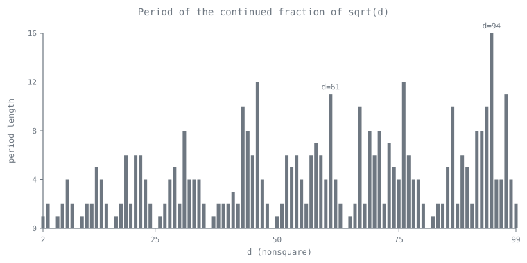
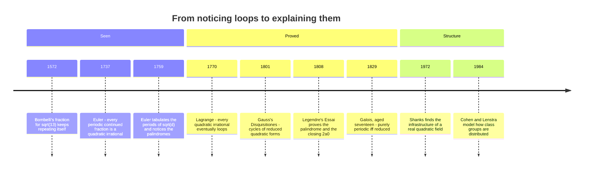

[← Stop 5 — Scenic Overlook](05-scenic-overlook.md) · [Route map](index.md) · [Stop 7 — The Cattle Crossing →](07-cattle-crossing.md)

# Stop 6 — The Loop Road

> Some roads circle back: a continued fraction repeats forever exactly when the number is the root of a quadratic.

## Overview

So far our infinite roads have wandered without pattern (`π`) or marched in a
trivial cycle (`φ`'s endless `1`s). At this stop we characterise *exactly* which
numbers ride a looping road — a continued fraction that eventually repeats a
fixed block forever. The answer is one of the most elegant theorems in the
subject, and it ties the geometry of the road to the algebra of the number.

### Lagrange's theorem

A **quadratic irrational** (or *quadratic surd*) is an irrational root of a
quadratic `ax² + bx + c = 0` with integer coefficients — a number of the form
`(P + √d)/Q` with `d` a non-square positive integer. Euler noticed in **1737**
that any eventually periodic continued fraction is such a number; **Lagrange
proved the converse in 1770**, giving the complete characterisation:

> A continued fraction is **eventually periodic** if and only if its value is a
> **quadratic irrational**.

We write the repeating block in parentheses: `√2 = [1; (2)]` means
`[1; 2, 2, 2, …]`, and `√7 = [2; (1, 1, 1, 4)]` means
`[2; 1, 1, 1, 4, 1, 1, 1, 4, …]`. The "if" direction is the fixed-point argument
of Stop 4 generalised: a purely periodic tail `y = [(a₁, …, aₖ)]` satisfies
`y = (some integer combination of y)`, a *quadratic* in `y`. The "only if"
direction — that every quadratic surd loops — is the deeper half, and rests on a
finiteness argument sketched below and proved in Appendix A.

### Why quadratic surds must loop

Run the expansion of `x₀ = (P₀ + √d)/Q₀` and each remainder stays of the same
form `xₙ = (Pₙ + √d)/Qₙ` with **integer** `Pₙ, Qₙ`. The recurrences are

```
aₙ = ⌊xₙ⌋,   Pₙ₊₁ = aₙ Qₙ − Pₙ,   Qₙ₊₁ = (d − Pₙ₊₁²)/Qₙ,
```

and one can show the pairs `(Pₙ, Qₙ)` stay **bounded** — they are confined to a
finite range determined by `d`. A sequence drawn forever from a finite set must
repeat a value, and once `(Pₙ, Qₙ)` recurs the whole future of the expansion
recurs with it. The state space is finite, so the road *must* close into a loop.
This is exactly the pigeonhole structure behind Stop 12's totality arguments and
Stop 13's fractal fixed points: a bounded recursion on a finite state cannot
avoid cycling.

### The shape of the loop

The periods of square roots have beautiful structure:

- **√2 = [1; (2)]**, period 1. **√3 = [1; (1, 2)]**, period 2.
  **√7 = [2; (1, 1, 1, 4)]**, period 4.
- The repeating block of `√d` is a **palindrome followed by a single term equal
  to `2⌊√d⌋`**. In `√7 = [2; (1, 1, 1, 4)]` the block is the palindrome `1,1,1`
  capped by `4 = 2·⌊√7⌋ = 2·2`. This palindromic law — spotted by Euler in his
  tables of square roots, proved by Legendre, and explained in one line by
  Galois's 1829 theorem below — is not decoration; the palindrome is what makes
  the Pell-equation machinery of Stop 7 work, and its position determines the
  sign in `x² − d y² = ±1`.



### Galois and purely periodic surds

When does the road loop *from the very start*, with no lead-in `a₀`? **Galois**
answered this too. A quadratic surd `x` is **reduced** if `x > 1` and its
conjugate `x̄` (the other root of its quadratic, obtained by flipping the sign of
`√d`) lies strictly in `(−1, 0)`. Then:

> The continued fraction of `x` is **purely periodic** if and only if `x` is a
> reduced surd.

Moreover the reversed period expands `−1/x̄`. `√7` itself is not reduced (its
conjugate `−√7 ≈ −2.65` is outside `(−1, 0)`), which is why it has the lead-in
`2` before the loop; but `2 + √7 ≈ 4.65` is reduced — its conjugate
`2 − √7 ≈ −0.65` lies in `(−1, 0)` — and indeed `2 + √7 = [(4, 1, 1, 1)]` loops
from the very first term. Apply the reversal rule to `⌊√d⌋ + √d` in general and
the palindrome of the period of `√d` drops out at once.

### Metallic means

The all-`n` roads `[n; (n)] = [n; n, n, …]` satisfy `x = n + 1/x`, i.e.
`x² − nx − 1 = 0`, giving `x = (n + √(n²+4))/2` — the **metallic means**.
`n = 1` is the golden ratio `φ` (Stop 4); `n = 2` is the silver ratio `1 + √2`;
`n = 3` the bronze ratio. Each is the simplest periodic surd with period 1, and
each is the "most irrational" number of its own family.

## Worked examples

Expand `√7`. The road settles into the four-term loop `(1, 1, 1, 4)`, printed by
`tourbus` in parentheses, and the convergents alternately over- and
under-shoot:

```
$ python -m tourbus demo cf sqrt7
continued fraction of sqrt(7):
  [2; (1, 1, 1, 4)]

 n  a_n  p/q            value      error
 -  ---  ------  ------------  ---------
 0    2  2/1     2.0000000000  +6.46e-01
 1    1  3/1     3.0000000000  -3.54e-01
 2    1  5/2     2.5000000000  +1.46e-01
 3    1  8/3     2.6666666667  -2.09e-02
 4    4  37/14   2.6428571429  +2.89e-03
 5    1  45/17   2.6470588235  -1.31e-03
 6    1  82/31   2.6451612903  +5.90e-04
 7    1  127/48  2.6458333333  -8.20e-05
```

The block ends in `4 = 2·⌊√7⌋`, and the three terms before it — `1, 1, 1` — form
a palindrome, exactly as Galois' law predicts.

Two more square roots show the pattern in miniature. `√2` has period 1, the
shortest possible; `√3` has period 2 and its block `(1, 2)` again ends in
`2·⌊√3⌋ = 2`:

```
$ python -m tourbus demo cf sqrt2
continued fraction of sqrt(2):
  [1; (2)]

 n  a_n  p/q             value      error
 -  ---  -------  ------------  ---------
 0    1  1/1      1.0000000000  +4.14e-01
 1    2  3/2      1.5000000000  -8.58e-02
 2    2  7/5      1.4000000000  +1.42e-02
 3    2  17/12    1.4166666667  -2.45e-03
 4    2  41/29    1.4137931034  +4.20e-04
 5    2  99/70    1.4142857143  -7.22e-05
 6    2  239/169  1.4142011834  +1.24e-05
 7    2  577/408  1.4142156863  -2.12e-06
```

```
$ python -m tourbus demo cf sqrt3
continued fraction of sqrt(3):
  [1; (1, 2)]

 n  a_n  p/q           value      error
 -  ---  -----  ------------  ---------
 0    1  1/1    1.0000000000  +7.32e-01
 1    1  2/1    2.0000000000  -2.68e-01
 2    2  5/3    1.6666666667  +6.54e-02
 3    1  7/4    1.7500000000  -1.79e-02
 4    2  19/11  1.7272727273  +4.78e-03
 5    1  26/15  1.7333333333  -1.28e-03
 6    2  71/41  1.7317073171  +3.43e-04
 7    1  97/56  1.7321428571  -9.20e-05
```

## Then, now, next

### Then — loops seen, loops proved



Periodicity was noticed long before it was understood: Bombelli's square-root
fraction of 1572 visibly repeats, and Euler, filling tables of `√d` for `d` up
to 120, saw both the loops and their mirror symmetry. Lagrange's 1770 proof
that *every* quadratic irrational loops was the first deep theorem of the
subject; Gauss, in the *Disquisitiones Arithmeticae* of 1801, found the same
cycles among reduced quadratic forms; and the seventeen-year-old Galois — whose
first published paper, in April 1829, was on exactly this — showed which loops
start at once, and why every period of `√d` reads the same backwards.

### Now — loops as the skeleton of number fields

- **Class numbers and regulators.** In the field `ℚ(√d)`, the loop of `√d` is
  a cycle of reduced ideals. Walking it computes the *regulator* (how big the
  field's fundamental unit is — [Stop 7](07-cattle-crossing.md)) and helps count
  the *class number* (how badly unique factorisation fails). Daniel Shanks's
  1972 discovery that this cycle has an "infrastructure" — a notion of distance
  that lets you take giant steps along it — is used in computer-algebra systems
  such as PARI/GP and Magma, and inspired key-exchange proposals based on real
  quadratic fields (Buchmann and Williams, 1989).
- **Geometry.** Each loop is also a *closed geodesic* on the modular surface,
  the hyperbolic surface that the modular group carves out of the upper half
  plane (Artin, 1924; Series, 1985). Counting loops is counting geodesics, and
  Peter Sarnak's 1982 thesis used the prime geodesic theorem to count class
  numbers of indefinite forms on average.

### Next — the loops nobody can predict

- **Gauss's class-number-one problem.** Gauss conjectured that infinitely many
  real quadratic fields have unique factorisation (class number `1`). The
  Cohen–Lenstra heuristics even predict the proportion — about **75.4%** of
  fields `ℚ(√p)` with prime `p ≡ 1 (mod 4)` — and computations up to `2·10¹¹`
  agree. Yet no one can prove there are infinitely many.
- **How long is the loop?** The period of `√d` is at most a small multiple of
  `√d · log d`, and it wanders erratically in between (the period wheel above).
  How its length is distributed as `d` varies — the quantity that decides
  whether Pell's equation is easy or brutal — is not understood.
- **Beyond quadratics.** No known algorithm makes the *cubic* irrationals loop;
  that is Hermite's problem, the open road at the end of
  [Stop 2](02-unfolding-road.md#then-now-next).

## Exercises

1. **(★)** Identify the period and its palindromic core for `√2`, `√3`, and
   `√7` from the demos above. What is the last term of each block, in terms of
   `⌊√d⌋`?
   <details><summary>Hint</summary>Each block ends in `2⌊√d⌋`: `2` for `√2` and
   `√3`, `4` for `√7`.</details>

2. **(★)** The golden ratio `[1; (1)]` and silver ratio `[2; (2)]` are metallic
   means. Write the quadratic each satisfies and solve it.
   <details><summary>Hint</summary>`[n; (n)]` gives `x = n + 1/x`, so
   `x² − nx − 1 = 0`.</details>

3. **(★★)** Verify the state recurrence for `√7`: starting from
   `(P₀, Q₀) = (0, 1)`, compute `(P₁, Q₁)` and `(P₂, Q₂)` and check they stay
   integers.
   <details><summary>Hint</summary>`a₀ = ⌊√7⌋ = 2`; then `P₁ = 2·1 − 0 = 2`,
   `Q₁ = (7 − 4)/1 = 3`, and `a₁ = ⌊(2+√7)/3⌋ = 1`.</details>

4. **(★★)** Show that `(1 + √5)/2 = φ` is a reduced surd (Galois) and hence its
   continued fraction is purely periodic.
   <details><summary>Hint</summary>`φ ≈ 1.618 > 1`, and its conjugate
   `(1 − √5)/2 ≈ −0.618` lies in `(−1, 0)`.</details>

5. **(★★★)** Prove that the `(Pₙ, Qₙ)` state pairs for `√d` are bounded, and
   conclude Lagrange's theorem.
   <details><summary>Hint</summary>Show `0 < Qₙ < 2√d` and `|Pₙ| < √d` once the
   expansion is past its lead-in; a finite state set must cycle. See
   Appendix A.</details>

## See it move

The Loop Road's section of the [live exposition](../site/index.html#stop-6-loop)
has a `√d` dial. Type any `d` — or tap `√2`, `√3`, `√7`, `√13`, `√61` — and it
prints the expansion with the repeating block overlined, the period length, and
the closing term `2a₀`, so you can check the palindrome by eye. Try `√61`, whose
eleven-term loop is the reason Fermat chose it (Stop 7).

## Further reading

- Khinchin, *Continued Fractions*, §§10–13 (quadratic irrationals and
  periodicity). See Appendix C.
- Hardy & Wright, §§10.9–10.12 for Lagrange's and Galois' theorems.
- Rockett & Szüsz, *Continued Fractions*, Chapter III, for the palindrome law
  and reduced surds; Appendix C.
- Appendix A of this tour for the finiteness proof of periodicity.
- H. Davenport, *The Higher Arithmetic* (8th ed., 2008), Chapter IV — periodic
  continued fractions and Pell's equation, told with unusual clarity.
- É. Galois, "Démonstration d'un théorème sur les fractions continues
  périodiques," *Annales de Gergonne* 19 (1829) — his first paper, published at
  seventeen.
- H. Cohen, *A Course in Computational Algebraic Number Theory* (1993),
  Chapter 5 — real quadratic fields, regulators, and Shanks's infrastructure.

[← Stop 5 — Scenic Overlook](05-scenic-overlook.md) · [Route map](index.md) · [Stop 7 — The Cattle Crossing →](07-cattle-crossing.md)
