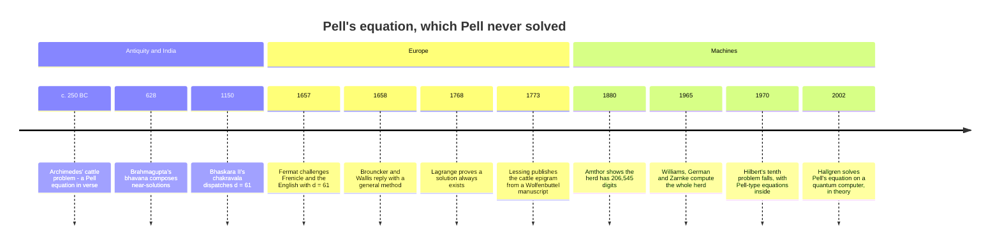

[← Stop 6 — The Loop Road](06-loop-road.md) · [Route map](index.md) · [Stop 8 — The Family Tree →](08-family-tree.md)

# Stop 7 — The Cattle Crossing

> A herd blocks the road, and the toll is an ancient equation: x² − d·y² = 1, whose solutions fall straight out of the loop we just drove.

## Overview

The looping road of Stop 6 was not just pretty; it is a solution machine. The
period of `√d` hands us, for free, the smallest solution of **Pell's equation**

```
x² − d·y² = ±1,
```

for any non-square positive integer `d`. This equation is one of the oldest in
number theory — studied in India by Brahmagupta (7th century) and Bhāskara II
(12th century), rediscovered by Fermat, and misnamed after John Pell by Euler in
a footnote that stuck. It is also, thanks to Archimedes, the reason there is a
cattle crossing at this stop at all.

### Convergents solve Pell

Here is the connection. Suppose `√d` has period length `ℓ`, so
`√d = [a₀; (a₁, …, aℓ)]`. Let `p/q = p₍ℓ₋₁₎/q₍ℓ₋₁₎` be the convergent taken at
the **end of the first period**. Then `(x, y) = (p, q)` is the **fundamental
solution** — the smallest positive solution — of Pell's equation. Which sign it
solves depends on the **parity of the period**:

- If `ℓ` is **even**, then `p² − d q² = +1`. The equation `x² − d y² = −1` has
  **no solution** at all.
- If `ℓ` is **odd**, then `p² − d q² = −1`. Squaring this *unit* — that is,
  taking `(p + q√d)²` — produces the fundamental solution of the `+1` equation.

The reason is the palindrome of Stop 6: the convergent at the period boundary
satisfies `pₙ² − d qₙ² = (−1)ⁿ` by the determinant identity of Stop 3, evaluated
right where the road closes its loop. All larger solutions are powers of the
fundamental one: if `x₁ + y₁√d` is fundamental, then
`xₖ + yₖ√d = (x₁ + y₁√d)ᵏ` runs through *all* positive solutions. One convergent
unlocks infinitely many.

### The wild growth of solutions

Small `d` can hide enormous fundamental solutions. For `d = 2` the answer is a
gentle `(3, 2)`: `3² − 2·2² = 9 − 8 = 1`. For `d = 13` it is already
`(649, 180)`. And `d = 61` — the case **Fermat posed as a challenge in 1657** to
the English mathematicians, knowing full well how brutal it is — has fundamental
solution

```
x = 1766319049,   y = 226153980,
```

a ten-digit `x` for a two-digit `d`. There is no smooth relationship between the
size of `d` and the size of its smallest solution; it depends entirely on the
length of the period of `√d`, which behaves erratically. This is what makes
Pell's equation a genuine test of method rather than patience — brute-force
search over `y` would never reach `226153980`, but the continued fraction walks
straight to it.

### The chakravala comes first

Bhāskara II did not merely study `d = 61` — he solved it, around 1150, by the
**chakravala** ("cyclic") method: compose trial solutions of `x² − d·y² = k`
using Brahmagupta's 628 CE **bhāvanā** identity, and turn the wheel until `k`
lands on `1`. Fermat's 1657 challenge was, unknowingly, a rerun of a
five-hundred-year-old exercise. The chakravala never mentions a continued
fraction, yet it arrives at exactly the convergents of `√61` — two roads, one
summit. Watch it run at Heritage stop H2 (Appendix H).

### Archimedes' cattle

The most famous Pell equation is disguised as a poem. **Archimedes' cattle
problem** (c. 250 BC) asks for the number of bulls and cows of the Sun god's
herd, in four colours, subject to a list of ratio and square/triangular
constraints. Reduced, it becomes the Pell equation `x² − 4729494·y² = 1`, with
one extra condition: `y` must be divisible by `2·4657 = 9314`. The fundamental
solution already has a 45-digit `x` (the engine finds it instantly — see the
worked examples), but the divisibility condition first holds at its **2329th
power**, and the resulting herd — about `7.76 × 10²⁰⁶⁵⁴⁴` cattle — is a number
with **206,545 digits** that would fill a book. Archimedes almost certainly
could not have computed it: Amthor counted its digits in 1880, Williams, German,
and Zarnke first computed it in full on a computer in 1965, and Harry Nelson
printed all 47 pages of it in 1981. But the fact that the problem is
*well-posed* and has a definite, finite, astronomically large answer is itself a
triumph of the continued-fraction method. The herd exists; it just does not fit
in the universe.

### Units in quadratic fields

For the algebraically inclined: solving `x² − d y² = ±1` is the same as finding
the **units** of the ring `ℤ[√d]` — the elements with a multiplicative inverse.
The fundamental solution is the *fundamental unit*, and Dirichlet's unit theorem
guarantees exactly this infinite cyclic structure. Pell's equation is the
first place the continued fraction reaches out of arithmetic and into the
algebra of number fields, a thread that runs through much of modern number
theory.

## Worked examples

Solve Fermat's challenge case, `d = 61`, and watch a two-digit input produce a
ten-digit answer — the fundamental solution the continued fraction of `√61`
delivers at the end of its (odd) period, then squared to reach `+1`:

```
$ python -m tourbus demo pell 61
x^2 - 61 y^2 = 1  fundamental solution:
  x = 1766319049
  y = 226153980
  verifies: True
```

Check it by hand if you dare: `1766319049² − 61·226153980² = 1`, exactly. For
contrast, the gentle cases `d = 2` and `d = 13` show how wildly the difficulty
swings with `d`:

```
$ python -m tourbus demo pell 2
x^2 - 2 y^2 = 1  fundamental solution:
  x = 3
  y = 2
  verifies: True
```

```
$ python -m tourbus demo pell 13
x^2 - 13 y^2 = 1  fundamental solution:
  x = 649
  y = 180
  verifies: True
```

`d = 2` (period 1, `√2 = [1; (2)]`) gives `(3, 2)` from the very first
convergent; `d = 13` needs a longer period and lands on `(649, 180)`; `d = 61`
explodes. The size of the answer is the length of the loop road, nothing else.

Finally, Archimedes' own equation. The period of `√4729494` is 92 terms long,
and the fundamental solution waiting at its end is a 45-digit number — found in
a blink:

```
$ python -m tourbus demo pell 4729494
x^2 - 4729494 y^2 = 1  fundamental solution:
  x = 109931986732829734979866232821433543901088049
  y = 50549485234315033074477819735540408986340
  verifies: True
```

Raise `x + y√4729494` to the 2329th power and the `y` becomes divisible by
`9314`, as the poem demands; that power is the 206,545-digit herd.

## Then, now, next

### Then — two thousand years at the crossing



The equation is named for John Pell only because Euler, reading Wallis,
misattributed Brouncker's method to him; Pell's own contribution was
incidental. The mathematics is far older. Brahmagupta's *bhāvanā* (628) and
Bhāskara II's *chakravala* (1150) solved it centuries before Europe asked
([Heritage stop H2](appendix-h-history.md#h2-628-1150-the-cyclic-method)),
and Fermat's 1657 challenge to "the English mathematicians" was, unknowingly,
a rerun of a Sanskrit classic. Lagrange proved in 1768 that every non-square
`d` has a solution, and the continued fraction of `√d` became the standard
way to find it. The cattle problem, meanwhile, waited: the epigram was
rediscovered by Gotthold Lessing in a manuscript in the ducal library at
Wolfenbüttel and published in 1773, and its answer was not written out in full
until computers could do it.

### Now — Pell's equation at the edge of computation

- **Undecidability.** Hilbert's tenth problem (1900) asked for an algorithm to
  decide whether any polynomial equation has integer solutions. Julia Robinson
  showed in the 1950s how Pell-type equations, whose solutions grow
  exponentially, could encode exponentiation; Yuri Matiyasevich completed the
  proof in 1970 (his decisive step used Fibonacci numbers, the golden ratio's
  sequence), and the standard modern proof runs through
  `x² − (a² − 1)·y² = 1`. The answer is *no* — there is no such algorithm — a
  result that ties this stop to the recursion theory of [Stop 12](12-tower.md).
- **A quantum speed-up.** Solutions of Pell's equation can have exponentially
  many digits, so algorithms compute the *regulator* `log(x₁ + y₁√d)` instead.
  The best classical methods take subexponential time; in 2002 Sean Hallgren
  gave a polynomial-time *quantum* algorithm — one of the few exponential
  quantum speed-ups known besides Shor's factoring algorithm of
  [Stop 14](14-souvenir-shop.md#then-now-next).
- **Compact answers.** Because the solutions are so large, computer-algebra
  systems store them as products of small factors ("compact representations")
  rather than as digits — the only way the cattle herd fits in memory.

### Next — the negative equation

When is `x² − d·y² = −1` solvable? By this stop's theory, exactly when the
period of `√d` is odd — but *how often* that happens as `d` varies was an open
question for decades. Peter Stevenhagen conjectured a precise answer in 1993:
among the squarefree `d` for which it could possibly work (those with no prime
factor `≡ 3 mod 4`), the proportion tends to about **58.1%**. Étienne Fouvry and Jürgen Klüners
bounded it between two constants in 2010, and in 2022 Peter Koymans and Carlo
Pagano announced a proof of the conjecture. Meanwhile, whether Pell's equation
can be solved in polynomial time on a *classical* computer remains unknown.

## Exercises

1. **(★)** Verify the `d = 2` solution by hand, and find the *next* solution
   after `(3, 2)` by computing `(3 + 2√2)²`.
   <details><summary>Hint</summary>`(3 + 2√2)² = 17 + 12√2`, so the next
   solution is `(17, 12)`; check `17² − 2·12² = 1`.</details>

2. **(★)** From `demo cf sqrt2`, read off the convergent at the end of the first
   period and confirm it is the Pell solution `(3, 2)`.
   <details><summary>Hint</summary>The period of `√2` has length 1, so the
   fundamental solution is the convergent `p₁/q₁ = 3/2`.</details>

3. **(★★)** The period of `√13` is odd. Predict whether `x² − 13 y² = −1` has a
   solution, and find the smallest one.
   <details><summary>Hint</summary>Odd period means `−1` *is* solvable;
   `18² − 13·5² = 324 − 325 = −1`, so `(18, 5)` works, and its square gives
   `(649, 180)`.</details>

4. **(★★)** Explain why `x² − 4 y² = 1` has no interesting solutions, connecting
   to Stop 6.
   <details><summary>Hint</summary>`4` is a perfect square, so `√4 = 2` is
   rational and its continued fraction does not loop — there is no period to
   read a solution from.</details>

5. **(★★★)** Show that if `(x₁, y₁)` is the fundamental solution of `+1`, then
   every positive solution is `(xₖ, yₖ)` with `xₖ + yₖ√d = (x₁ + y₁√d)ᵏ`.
   <details><summary>Hint</summary>The solutions form a group under
   multiplication in `ℤ[√d]`; a fundamental unit generates the whole positive
   cone. See Appendix A / C on units.</details>

## See it move

Open the **Pell Playground** (W7) in the
[live exposition](../site/index.html#stop-7-cattle). Enter a `d` and watch the
convergents of `√d` scroll by until the one at the period boundary lights up as
the Pell solution, with a running check of `x² − d y²`; the **D = 61** button
replays Fermat's 1657 challenge.

**Try it live:** the Pell Playground preset to [Fermat's d = 61](../site/index.html#w7?d=61).

## Further reading

- H. W. Lenstra, "Solving the Pell Equation," *Notices of the AMS* (2002) — a
  superb modern survey; Appendix C.
- Hardy & Wright, §§10.11–10.12 on Pell's equation via continued fractions.
- I. Vardi, "Archimedes' Cattle Problem," *American Mathematical Monthly* (1998).
- Appendix A of this tour for the parity-of-period argument.
- M. Davis, "Hilbert's Tenth Problem is Unsolvable," *American Mathematical
  Monthly* 80 (1973) — the whole proof, Pell equation and all.
- S. Hallgren, "Polynomial-time quantum algorithms for Pell's equation and the
  principal ideal problem," *Journal of the ACM* 54 (2007).
- P. Koymans & C. Pagano, "On Stevenhagen's conjecture" (2022) — how often the
  negative Pell equation is solvable.

[← Stop 6 — The Loop Road](06-loop-road.md) · [Route map](index.md) · [Stop 8 — The Family Tree →](08-family-tree.md)
