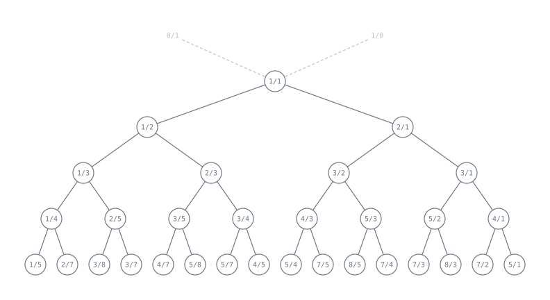
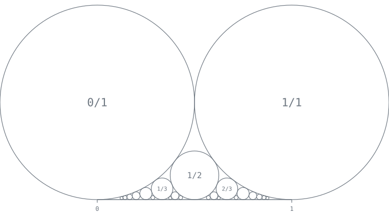
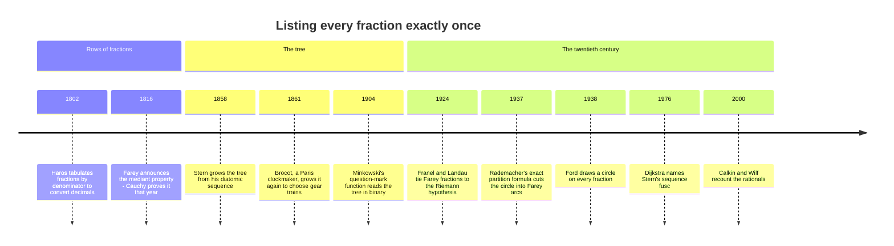

[← Stop 7 — The Cattle Crossing](07-cattle-crossing.md) · [Route map](index.md) · [Stop 9 — Celebrity Sightings →](09-celebrity.md)

# Stop 8 — The Family Tree

> Every positive fraction has exactly one address in a single infinite tree — and the directions to it are its continued fraction.

## Overview

We have been treating rationals one at a time. Now we organise *all* of them into
a single structure that contains each positive rational exactly once, in lowest
terms, with no repeats and no gaps: the **Stern–Brocot tree**. It was found
independently by the German number theorist **Moritz Stern (1858)** and the
French **clockmaker Achille Brocot (1861)**, who needed good gear ratios (Stop 5
again) and wanted a systematic way to list them. The tree turns out to be the
continued fraction wearing a different hat.

### The mediant

The engine of the tree is the **mediant** of two fractions:

```
mediant(a/b, c/d) = (a + c)/(b + d).
```

This is the "wrong" way to add fractions that every schoolchild is warned
against — and it is exactly right here. If `a/b < c/d` are neighbours, their
mediant lies strictly between them: `a/b < (a+c)/(b+d) < c/d`. Start with the two
"boundary" fractions `0/1` and `1/0` (the latter a formal `+∞`). Repeatedly
insert mediants between adjacent pairs, and you generate a binary tree whose
nodes are:

```
                1/1
          ┌──────┴──────┐
         1/2           2/1
       ┌──┴──┐       ┌──┴──┐
      1/3   2/3     3/2   3/1
```

**Every positive rational appears exactly once, already in lowest terms.** No
fraction is missing, and none is duplicated — a complete, non-redundant
enumeration of the rationals, which is remarkable given how easy it is to
double-count them.



### Address = continued fraction

Each node has an address: the string of **L**eft and **R**ight turns from the
root `1/1`. And here is the punchline that unifies this stop with all the
earlier ones:

> The run-lengths of the L/R address are the partial quotients of the node's
> continued fraction (with the final run one short).

Reading `355/113 = [3; 7, 16]`, the path is 3 rights, then 7 lefts, then 15
rights — run-lengths `3, 7, 15`, the last being `16 − 1`. The off-by-one in the
last run is precisely the two-representations ambiguity of Stop 2: `[…, aₙ]` and
`[…, aₙ − 1, 1]` are the two ways to finish the walk. Descending the tree *is*
running the continued-fraction expansion; the convergents of Stop 3 are the
fractions where the path changes direction.

### Farey neighbours

Take all fractions in `[0, 1]` with denominator at most `n`, in order: that is
the **Farey sequence** `Fₙ`. Its defining property is that adjacent fractions
`a/b < c/d` satisfy

```
b·c − a·d = 1
```

— the same unit-determinant "neighbour" condition we met for consecutive
convergents at Stop 3. The Stern–Brocot tree and the Farey sequences are two
cross-sections of one structure: neighbours in a Farey sequence are exactly
parent-and-child (or the two fractions flanking a mediant) in the tree. The
mediant of two Farey neighbours is the next fraction to appear between them as
`n` grows.



### fusc, and the Calkin–Wilf enumeration

There is a slicker enumeration still. **Stern's diatomic sequence** — Dijkstra
affectionately called its function `fusc` — is defined by `fusc(0) = 0`,
`fusc(1) = 1`, `fusc(2n) = fusc(n)`, `fusc(2n+1) = fusc(n) + fusc(n+1)`.
The consecutive ratios `fusc(n)/fusc(n+1)` list **every** positive rational
exactly once, with no need to check for lowest terms — the **Calkin–Wilf**
enumeration (2000). It is the breadth-first reading of a cousin of the
Stern–Brocot tree, and it gives an explicit bijection between the naturals and
the positive rationals that a computer can walk with two integers and a bit of
recursion.

### Minkowski's question mark

Finally, a bridge to Stop 6. **Minkowski's question-mark function** `?(x)` reads
a number's continued fraction and re-emits it as a binary expansion of the
tree address:

```
?([0; a₁, a₂, a₃, …]) = 2·(2⁻ᵃ¹ − 2⁻⁽ᵃ¹⁺ᵃ²⁾ + 2⁻⁽ᵃ¹⁺ᵃ²⁺ᵃ³⁾ − …).
```

It is a strictly increasing, continuous function on `[0, 1]` that maps the
**quadratic irrationals** (the periodic surds of Stop 6) exactly onto the
**rationals** — it "rationalises" the loop-road numbers. For example
`?(1/3) = 1/4` and `?(1/φ) = 2/3`. Its graph is the famous *slippery devil's
staircase*: continuous and increasing yet with zero derivative almost
everywhere. It is the analytic incarnation of the fact that the Stern–Brocot
address is the continued fraction.

## Worked examples

Find the tree address of the π-convergent `355/113`. The path is three rights,
seven lefts, fifteen rights — run-lengths that are the continued fraction
`[3; 7, 16]` with the last term reduced by one:

```
$ python -m tourbus demo stern-brocot 355/113
Stern-Brocot address of 355/113:
  RRRLLLLLLLRRRRRRRRRRRRRRR
  round-trips to 355/113
```

Count the letters: `RRR` (3), `LLLLLLL` (7), then fifteen `R`s. Against
`355/113 = [3; 7, 16]`, the run-lengths `3, 7, 15` recover the partial
quotients with the final `16` split as `15 + 1`. The `round-trips` line confirms
the address decodes back to the original fraction — the bijection is exact.

A smaller example makes the run-length rule easy to check by eye. The fraction
`3/8 = [0; 2, 1, 2]` sits at address `LLRL`:

```
$ python -m tourbus demo stern-brocot 3/8
Stern-Brocot address of 3/8:
  LLRL
  round-trips to 3/8
```

The runs are `LL` (2), `R` (1), `L` (1). Reading `[0; 2, 1, 2]`: the leading `0`
means we start by turning left, the runs `2, 1` match the middle quotients, and
the final quotient `2` shows up as `1 + 1` across the last two runs.

## Then, now, next

### Then — a clockmaker, a geologist, and a number theorist



The family tree has a tangled genealogy. The sequences called *Farey* were
tabulated first by the French engineer Charles Haros in 1802, who needed to
convert the new metric decimals back into common fractions; John Farey, a
geologist, noticed the mediant property in a short 1816 note without a proof,
and Cauchy supplied one within months — and gave the discovery Farey's name.
The tree itself was found twice in four years: by Moritz Stern in Göttingen,
as a piece of pure number theory, and by Achille Brocot in Paris, who used it
to design clock gear trains and published his tables for fellow horologists. Both
stories are replayed live at [Heritage stop H7](appendix-h-history.md#h7-1858-1861-the-tree-in-the-workshop).

### Now — fractions as a data structure

- **Search and simplification.** Descending the tree is binary search over
  the rationals: it finds the *simplest* fraction in any interval (the one with
  the smallest denominator), which is what you want when turning a measured
  ratio — a frame rate, a gear ratio, a probability — into a clean fraction.
- **Digital geometry.** A straight line drawn in pixels is a sequence of short
  and long runs — a *Christoffel word* — whose slope is a fraction on this tree;
  image-analysis algorithms that recognise digital straight segments walk the
  Stern–Brocot tree to do it (the same words reappear as the cutting sequences
  of [Appendix I, B5](appendix-i-branches.md#b5-cutting-sequences-ostrowski-sturmian-words-and-the-three-distances)).
- **The circle method.** Hardy and Ramanujan's asymptotic formula for the
  partition function `p(n)` became, in Hans Rademacher's hands (1937), an
  *exact* convergent series, obtained by cutting the unit circle into arcs at
  the Farey fractions; his 1943 simplification used Ford's circles. The same
  "Rademacher expansions" returned in string theory as the famous *black hole
  Farey tail* (Dijkgraaf, Maldacena, Moore, and Verlinde, 2000), where a sum
  over Farey fractions counts the microscopic states of a black hole.

### Next — the Riemann hypothesis, written in fractions

- **Farey fractions and the zeta zeros.** In 1924 Jérôme Franel and Edmund
  Landau proved that the Riemann hypothesis is *equivalent* to a statement about
  this stop's sequences: the Farey fractions of order `N` are spread evenly
  along `[0, 1]`, their total displacement from perfectly equal spacing growing
  no faster than `N^(1/2 + ε)`. Proving that the fractions of this stop are that
  well behaved would settle the most famous open problem in mathematics.
- **The question mark's derivative.** Where Minkowski's `?(x)` has a
  derivative, it is `0` or `∞` — and which one is decided by the *average size*
  of the partial quotients of `x`. Pinning down the exact thresholds is an
  active line of research.
- **Markov's uniqueness conjecture.** The Markov numbers of the Express Line
  ([E1](appendix-d-frontier.md#e1-the-markov-spectrum-the-numbers-after-the-golden-ratio))
  grow on a tree built from this one, and Frobenius asked in 1913 whether each
  Markov number sits atop exactly one Markov triple. The question is still open.

## Exercises

1. **(★)** Compute the mediant of `1/2` and `2/3`, and confirm it lies between
   them and is in lowest terms.
   <details><summary>Hint</summary>`(1+2)/(2+3) = 3/5`, and
   `1/2 < 3/5 < 2/3`.</details>

2. **(★)** Use `demo stern-brocot 8/5` and match the address `RLRL` to the
   continued fraction of `8/5`.
   <details><summary>Hint</summary>`8/5 = [1; 1, 1, 1, 1]`; the alternating
   single-letter runs are the string of `1`s.</details>

3. **(★★)** Verify the Farey-neighbour condition `bc − ad = 1` for the adjacent
   pair `2/5` and `3/7` in `F₇`.
   <details><summary>Hint</summary>`5·3 − 2·7 = 15 − 14 = 1`.</details>

4. **(★★)** Compute `fusc(0)` through `fusc(8)` and list the Calkin–Wilf
   fractions `fusc(n)/fusc(n+1)` for `n = 1, …, 7`. Confirm none repeats.
   <details><summary>Hint</summary>The sequence is `0,1,1,2,1,3,2,3,1,…`; the
   ratios are `1/1, 1/2, 2/1, 1/3, 3/2, 2/3, 3/1, …`.</details>

5. **(★★★)** Show `?(1/φ) = 2/3` directly from the series, using
   `1/φ = [0; 1, 1, 1, …]`.
   <details><summary>Hint</summary>All `aₖ = 1`, so the partial sums are
   `2⁻¹`; the series is `2·(2⁻¹ − 2⁻² + 2⁻³ − …) = 2·(1/3) = 2/3`.</details>

## See it move

Open the **Stern–Brocot Explorer** (W2) in the
[live exposition](../site/index.html#stop-8-family). Press **L** and **R** (or
the arrow keys, or click a child node) to descend the tree one mediant at a
time, with **Undo** to climb back; or type a fraction and press **Find** to watch
its address light up, run by run, as its continued fraction.

**Try it live:** descend straight to [355/113](../site/index.html#w2?f=355/113).

## Further reading

- Graham, Knuth & Patashnik, *Concrete Mathematics*, §4.5 — the definitive
  account of the Stern–Brocot tree and `fusc`. See Appendix C.
- Calkin & Wilf, "Recounting the Rationals," *American Mathematical Monthly*
  (2000).
- Hardy & Wright, §3.1–3.7 on Farey sequences.
- A. Denjoy / H. Minkowski on the question-mark function; see Appendix C.
- L. R. Ford, "Fractions," *American Mathematical Monthly* 45 (1938) — the
  circles, and a beautiful proof of the Farey properties.
- A. Hatcher, *Topology of Numbers* (AMS, 2022) — the Farey diagram, continued
  fractions, and Conway's topograph as one picture.
- R. Dijkgraaf, J. Maldacena, G. Moore & E. Verlinde, "A Black Hole Farey Tail"
  (2000) — Farey sums in quantum gravity.

[← Stop 7 — The Cattle Crossing](07-cattle-crossing.md) · [Route map](index.md) · [Stop 9 — Celebrity Sightings →](09-celebrity.md)
