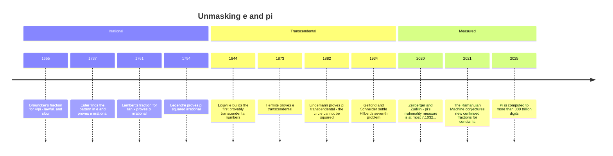

[← Stop 8 — The Family Tree](08-family-tree.md) · [Route map](index.md) · [Stop 10 — The Casino →](10-casino.md)

# Stop 9 — Celebrity Sightings

> Two famous constants ride this road: e, whose continued fraction hides a perfect pattern, and π, whose continued fraction hides nothing we can see.

## Overview

The tour now meets its celebrities. The quadratic surds of Stop 6 loop; the
rationals of Stop 2 terminate. But the two most famous transcendental numbers,
`e` and `π`, do neither — and the *contrast* between them is the lesson of this
stop. One wears its structure openly; the other guards it so well that basic
questions about it remain unanswered to this day.

### e: order in plain sight

Euler computed the continued fraction of `e` in **1737** and found a startlingly
regular pattern:

```
e = [2; 1, 2, 1, 1, 4, 1, 1, 6, 1, 1, 8, 1, 1, 10, …].
```

After the initial `2`, the terms come in blocks of three: `1, 2k, 1` for
`k = 1, 2, 3, …`. Every third partial quotient is an even number `2, 4, 6, 8, …`
climbing without bound; the rest are `1`s. This is not a coincidence but a
theorem — the expansion can be derived from the continued fraction of the
function `tanh` or from properties of the exponential integral.

The pattern does real mathematical work: **it proves that `e` is irrational.**
A continued fraction is finite exactly when its number is rational (Stop 2).
Since Euler's pattern manifestly never terminates — the even entries grow
forever — `e` cannot be rational. This is arguably the cleanest irrationality
proof in mathematics: exhibit the infinite continued fraction and you are done.
(A closely related expansion, `(e−1)/(e+1) = [0; 2, 6, 10, 14, …]`, is even
simpler and gives the same conclusion.)

### π: structure we cannot find

Now `π`:

```
π = [3; 7, 15, 1, 292, 1, 1, 1, 2, 1, 3, 1, 14, 2, 1, 1, 2, 2, 2, 2, …].
```

There is **no known pattern**. The terms wander — mostly small, but with the
occasional giant like `292` (which, recall from Stop 5, is why `355/113` is so
good). Worse, some of the most basic questions are *open problems*:

- Is the sequence of partial quotients of `π` **bounded**, or do arbitrarily
  large terms keep appearing? Unknown.
- Do the partial quotients follow the Gauss–Kuzmin statistics of a "random"
  number (Stop 10)? Believed yes, unproven.

Hundreds of billions of terms have now been computed and they *look* random,
but "looks random" is not a theorem. The regular continued fraction of `π`,
unlike `e`'s, has never revealed a usable structure — a humbling fact given how
much we know about `π` in every other respect. This gap is the seed of Stop 15's open-problems chapter.

### Generalized continued fractions: order restored

If the *regular* continued fraction of `π` is chaos, we can recover order by
relaxing the rules. A **generalized continued fraction** allows numerators other
than `1`:

```
b₀ + a₁/(b₁ + a₂/(b₂ + a₃/(b₃ + …))).
```

Give up the requirement that numerators be `1`, and `π` becomes beautifully
patterned. **Lord Brouncker (1655)**, the first president of the Royal Society,
found

```
4/π = 1 + 1²/(2 + 3²/(2 + 5²/(2 + 7²/(2 + …)))),
```

with the odd squares `1², 3², 5², …` marching up the numerators. It is
beautiful, and a little deceptive. Euler later showed that any series can be
rewritten as a continued fraction with the *same* partial sums, and Brouncker's
convergents are exactly the partial sums of Leibniz's
`π/4 = 1 − 1/3 + 1/5 − …` — so they crawl just as slowly: ten terms still get
only the leading `3` right. Other generalized fractions sprint. The one hiding
inside the arctangent,

```
π = 4/(1 + 1²/(3 + 2²/(5 + 3²/(7 + …)))),
```

gains about three correct digits for every four terms; twenty terms already
pin `π` down to fifteen decimal places.

The deepest of these is **Lambert's continued fraction for the tangent** (1761):

```
tan(x) = x / (1 − x²/(3 − x²/(5 − x²/(7 − …)))).
```

From it, Johann Lambert gave the **first proof that `π` is irrational**: he
showed `tan(x)` is irrational whenever `x ≠ 0` is rational, and since
`tan(π/4) = 1` is rational, `π/4` — and hence `π` — cannot be. The regular
continued fraction hides `π`'s nature; the generalized one exposes it. The two
faces of the continued fraction — the self-organising `e` and the inscrutable
`π` — are why this stop is called "celebrity sightings": you can see the stars,
but only one of them will tell you how it works.

## Worked examples

Expand `e` and watch Euler's `1, 2k, 1` blocks emerge. The `tourbus` engine
prints enough terms to see the pattern lock in — `2; 1, 2, 1, 1, 4, 1, 1, 6, …`:

```
$ python -m tourbus demo cf e
continued fraction of e:
  [2; 1, 2, 1, 1, 4, 1, 1, 6, 1, 1, 8, 1, 1, 10, 1, 1, 12, 1, 1, ...]

 n  a_n  p/q            value      error
 -  ---  ------  ------------  ---------
 0    2  2/1     2.0000000000  +7.18e-01
 1    1  3/1     3.0000000000  -2.82e-01
 2    2  8/3     2.6666666667  +5.16e-02
 3    1  11/4    2.7500000000  -3.17e-02
 4    1  19/7    2.7142857143  +4.00e-03
 5    4  87/32   2.7187500000  -4.68e-04
 6    1  106/39  2.7179487179  +3.33e-04
 7    1  193/71  2.7183098592  -2.80e-05
```

The even terms `2, 4, 6, …` appear at positions `2, 5, 8, …` — every third slot —
exactly Euler's pattern, and each one (being larger than 1) marks a convergent
of above-average accuracy, which is why the error drops sharply right after
`a₅ = 4`.

Now the contrast. Expand `π` and there is no such regularity — small terms,
then a sudden `292`, then no discernible law:

```
$ python -m tourbus demo cf pi
continued fraction of pi:
  [3; 7, 15, 1, 292, 1, 1, 1, 2, 1, 3, 1, 14, 2, 1, 1, 2, 2, 2, 2, ...]

 n  a_n  p/q                  value      error
 -  ---  ------------  ------------  ---------
 0    3  3/1           3.0000000000  +1.42e-01
 1    7  22/7          3.1428571429  -1.26e-03
 2   15  333/106       3.1415094340  +8.32e-05
 3    1  355/113       3.1415929204  -2.67e-07
 4  292  103993/33102  3.1415926530  +5.78e-10
 5    1  104348/33215  3.1415926539  -3.32e-10
 6    1  208341/66317  3.1415926535  +1.22e-10
 7    1  312689/99532  3.1415926536  -2.91e-11
```

Put the two tables side by side: `e`'s terms are a machine you can predict; `π`'s
are, for all anyone can prove, a coin toss.

## Then, now, next

### Then — from irrational to transcendental



Continued fractions carried the celebrities through their first two trials.
Euler's pattern made `e` irrational in 1737, and Lambert's tangent fraction did
the same for `π` in 1761 ([Heritage stop H5](appendix-h-history.md#h5-1761-lambert-puts-on-trial)).
The next question — is either number the root of *any* polynomial with integer
coefficients? — needed new tools. Liouville showed in 1844 that numbers
approximated *too* well by fractions cannot be algebraic
([H6](appendix-h-history.md#h6-1844-the-skyscraper-of-liouville)); Hermite proved
`e` transcendental in 1873, and Lindemann extended his method to `π` in 1882,
ending the 2,000-year-old quest to square the circle with ruler and compass.

### Now — measuring how irrational a number is

- **The irrationality measure.** How closely can fractions crowd a number?
  The *irrationality measure* `μ(x)` is the largest exponent for which
  `|x − p/q| < 1/q^μ` has infinitely many solutions. Every irrational has
  `μ ≥ 2` (Stop 3), and almost every number has exactly `μ = 2`. Euler's
  pattern lets us compute `μ(e) = 2` exactly: its partial quotients grow too
  slowly to make any convergent unusually good. For `π` the best bound, due to
  Doron Zeilberger and Wadim Zudilin (2020), is `μ(π) ≤ 7.1032…`. Everyone
  expects the truth to be `2`; the gap is a measure of our ignorance.
- **Digits as a benchmark.** `π` has been computed to more than 300 trillion
  digits (2025), work that now serves mainly to stress-test hardware and
  multiplication algorithms. For contrast, NASA's interplanetary navigation uses
  fifteen decimal places.
- **Machines that conjecture.** The *Ramanujan Machine* project (published in
  *Nature*, 2021) searches algorithmically for generalized continued fractions
  that match famous constants to hundreds of digits, then hands the surviving
  conjectures to humans (and increasingly to other programs) to prove.

### Next — questions a child can ask

- **Is `π + e` irrational? Is `π·e`?** Nobody knows. It is known that *at least
  one* of them is transcendental — both would be algebraic only if `π` and `e`
  were — but not which one. The same ignorance covers `π^e`, `e^e`, and `π^π`.
- **Does `π` have a pattern after all?** Its regular continued fraction could,
  for all anyone can prove, have bounded partial quotients, or fail Khinchin's
  law ([Stop 10](10-casino.md)). The terminus ([Stop 15](15-terminus.md)) takes
  these questions up in full.
- **From conjecture to proof, automatically.** Machine-found formulas raise a
  new question for the coming decade: which of them come with machine-checkable
  proofs, and what new constants they will let us classify.

## Exercises

1. **(★)** From the `e` demo, write down partial quotients `a₈` through `a₁₄`
   predicted by Euler's pattern, then check them against the printed head of the
   expansion.
   <details><summary>Hint</summary>The blocks continue `6, 1, 1, 8, 1, 1, 10,
   …`; the even terms are `6` at position 8, `8` at position 11, and `10` at
   position 14.</details>

2. **(★)** Explain, in one sentence, why Euler's pattern proves `e` is
   irrational.
   <details><summary>Hint</summary>The expansion never terminates, and only
   rationals have terminating continued fractions.</details>

3. **(★★)** Compute the first four convergents of Brouncker's formula for `4/π`
   and compare their accuracy to the regular convergents `22/7` and `355/113`.
   <details><summary>Hint</summary>Generalized CFs of `π` converge much more
   slowly than the regular one; that is exactly why the *regular* expansion is
   the powerful tool for approximation.</details>

4. **(★★)** Using Lambert's `tan(x)` continued fraction, evaluate the first two
   convergents at `x = π/4` and see them approach `tan(π/4) = 1`.
   <details><summary>Hint</summary>The first convergent is `x`; the second is
   `x/(1 − x²/3) = 3x/(3 − x²)`.</details>

5. **(★★★)** Sketch Lambert's argument that `tan(x)` is irrational for nonzero
   rational `x`, and hence that `π` is irrational.
   <details><summary>Hint</summary>Assume `x = p/q` rational and derive a
   contradiction from the infinitely-descending integer structure of the
   continued fraction's remainders; the irrationality of `tan(1)` is the crux.
   See Appendix C.</details>

## See it move

The Celebrity Sightings section of the
[live exposition](../site/index.html#stop-9-celebrity) mounts a second **CF
Expansion Machine** (W1), preloaded with `e`. Step it and Euler's `1, 2k, 1`
blocks click into place one certified term at a time; tap **π** on the same
machine and the pattern vanishes, while the convergents table and error plot
show `355/113` owing its accuracy to the `292` that follows it.

## Further reading

- Euler, *De fractionibus continuis dissertatio* (1737) — the original
  computation of `e`'s continued fraction; Appendix C.
- Lambert (1761), the first irrationality proof of `π`; see the modern account
  in Appendix C.
- Hardy & Wright, §§11.6–11.7, on the continued fractions of `e` and `π`.
- C. D. Olds, "The Simple Continued Fraction Expansion of e," *Amer. Math.
  Monthly* (1970).
- A. Baker, *Transcendental Number Theory* (1975) — Hermite, Lindemann, and
  Gelfond–Schneider in one slim volume.
- D. Zeilberger & W. Zudilin, "The irrationality measure of π is at most
  7.103205334137…," *Moscow J. Combinatorics and Number Theory* 9 (2020).
- G. Raayoni et al., "Generating conjectures on fundamental constants with the
  Ramanujan Machine," *Nature* 590 (2021).

[← Stop 8 — The Family Tree](08-family-tree.md) · [Route map](index.md) · [Stop 10 — The Casino →](10-casino.md)
