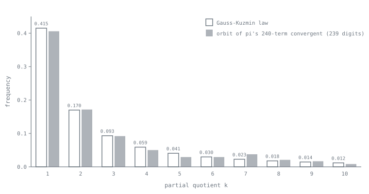
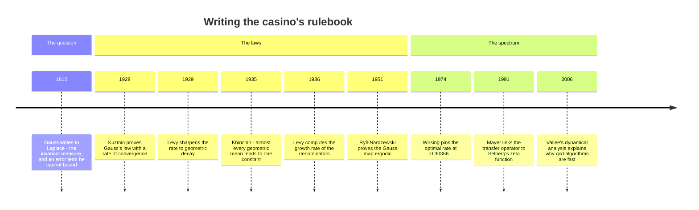

[← Stop 9 — Celebrity Sightings](09-celebrity.md) · [Route map](index.md) · [Stop 11 — The Infinite Assembly Line →](11-assembly-line.md)

# Stop 10 — The Casino

> The partial quotients of a "typical" number are not patternless — they obey iron statistical laws, and the house always wins by the same constant.

## Overview

At Stop 9 the partial quotients of `π` *looked* random. This stop makes that
precise. If you pick a real number at random, its continued fraction is
unpredictable term by term — but *in aggregate* it obeys laws as rigid as a
casino's odds. Three constants govern the tables here: the Gauss–Kuzmin
distribution, Khinchin's constant, and Lévy's constant. Almost every number
pays out the same, and the exceptions (rationals, quadratic surds, and a few
famous constants like `e`) are a measure-zero set of lucky gamblers.

### The Gauss map

The dealer is the **Gauss map**:

```
T(x) = {1/x} = 1/x − ⌊1/x⌋,    for x ∈ (0, 1),
```

the fractional part of the reciprocal. Applied to `x = [0; a₁, a₂, a₃, …]` it
strips off the first partial quotient and shifts the rest forward:
`T(x) = [0; a₂, a₃, …]`. So iterating `T` deals out the partial quotients one at
a time — `a₁ = ⌊1/x⌋`, then `a₂ = ⌊1/T(x)⌋`, and so on. Studying the statistics
of continued fractions is studying the **dynamics** of this one map, which is
why this branch of the subject is called the *ergodic theory* of continued
fractions.

Gauss found (in an 1812 letter to Laplace) that `T` preserves a special
probability distribution, the **Gauss measure**

```
dμ = (1/ln 2) · 1/(1 + x) dx    on [0, 1].
```

The map spreads points out according to this density and never disturbs it — it
is the invariant "house edge." Because `T` is also *ergodic*, time averages
along one number's orbit equal space averages over all numbers: what one typical
continued fraction does over the long run is what almost every number does.

### Gauss–Kuzmin: the odds on each digit

From the invariant measure comes the distribution of the partial quotients
themselves. The **Gauss–Kuzmin theorem** (Gauss conjectured it; Kuzmin proved a
rate in 1928) states that for almost every `x`, the fraction of partial
quotients equal to `k` tends to

```
P(aₙ = k) → log₂(1 + 1/(k(k+2))).
```

The odds decay fast. A partial quotient is `1` about `log₂(4/3) ≈ 41.5%` of the
time, `2` about `17.0%`, `3` about `9.3%`, and so on. So a "typical" continued
fraction is dominated by small terms, with `1` alone accounting for over
two-fifths of them — which is why numbers like `φ` (all `1`s) and the Fibonacci
worst case of Stop 1 sit at the boundary of typical behaviour.



### Khinchin's constant

Here is the theorem that makes this a casino. **Khinchin proved in 1935** that
for almost every real `x`, the **geometric mean** of the first `n` partial
quotients converges to a single universal constant, *independent of `x`*:

```
(a₁ · a₂ · … · aₙ)^{1/n} → K₀ = 2.6854520010…
```

Read that again: the *same* number `K₀` for almost every `x`. Your number and
mine, chosen at random, produce partial quotients that multiply out to the same
average in the limit. Khinchin's constant is defined by the product
`K₀ = ∏_{k≥1} (1 + 1/(k(k+2)))^{log₂ k}`. The measure-zero exceptions are the
usual suspects — rationals (finite), quadratic surds (periodic, so their
geometric mean is the mean of one period), and, curiously, `e`, whose growing
even terms drag its geometric mean to infinity. Whether famous constants like
`π` actually hit `K₀` is, like so much of Stop 9, unknown.

### Lévy's constant

A companion law governs the *denominators*. **Lévy's constant** (Khinchin and
Lévy, 1930s) says the convergent denominators grow at a universal exponential
rate for almost every `x`:

```
qₙ^{1/n} → e^{π²/(12 ln 2)} = 3.2758229187…
```

This ties back to the error bound of Stop 3: since `|x − pₙ/qₙ| ≈ 1/qₙ²`, the
approximation error of a typical number shrinks like `e^{−π²n/(6 ln 2)}` — a
fixed exponential rate, the same for almost everybody. The house edge is a
constant, and it is spelled `π²/(12 ln 2)`.

## Worked examples

Estimate Khinchin's constant by sampling random numbers, expanding each, and
taking the geometric mean of all their partial quotients. With several thousand
terms the estimate is already close to `K₀ = 2.68545…` (convergence is famously
slow, so it will not be exact):

```
$ python -m tourbus demo khinchin
geometric mean of 11849 partial quotients:
  2.65801   (Khinchin's constant = 2.68545...)
```

The estimate `2.65801` lands within about 1% of the true value from a few
thousand terms — remarkable, given that these partial quotients came from
*unrelated* random numbers yet conspire to the same mean, exactly as Khinchin's
theorem demands.

Now the digit distribution. The `gauss` demo tallies how often each partial
quotient value appears across many random expansions and compares it to the
Gauss–Kuzmin prediction:

```
$ python -m tourbus demo gauss
Gauss-Kuzmin digit frequencies (observed vs predicted):
   1 ██████████████████████████████ 0.5094   (predict 0.4150)
   2 █████████████ 0.2124   (predict 0.1699)
   3 ███████ 0.1164   (predict 0.0931)
   4 ████ 0.0721   (predict 0.0589)
   5 ███ 0.0514   (predict 0.0406)
   6 ██ 0.0383   (predict 0.0297)
```

The *shape* is unmistakable — a steep decay with `1` the most common value by
far, each successive value roughly halving — and it tracks the Gauss–Kuzmin law
across the board. (The observed frequencies here sit a little above the
predictions because the sample draws finite truncations of dyadic rationals, a
mild bias; with longer, less structured expansions the two columns converge.)
The dealer's odds are visible even in a rough sample.

## Then, now, next

### Then — a question Gauss could not answer



In a letter to Laplace of 30 January 1812, Gauss stated that after many turns
of the map the chance that the remainder falls below `t` tends to
`log₂(1 + t)` — the law from which the digit odds above follow — admitted that he
could not bound the error, and asked whether Laplace could. Nobody could for
more than a century. Rodion Kuzmin's 1928 proof, and Paul Lévy's sharper one a
year later, founded what is now called the *metric theory* of numbers. Aleksandr
Khinchin's slim 1935 book *Continued Fractions* — still the best introduction —
made the constants of this stop famous; Czesław Ryll-Nardzewski's 1951 proof
that the Gauss map is ergodic explained why they exist; and Eduard Wirsing's
1974 analysis of the transfer operator found the exact speed at which the
casino converges (the constant computed from scratch at
[Express stop E6](appendix-d-frontier.md#e6-the-gauss-kuzmin-wirsing-constant-from-scratch)).

### Now — the casino's odds, working for a living

- **Why gcd is fast on average.** Lamé's theorem ([Stop 1](01-depot.md)) bounds
  the *worst* case of Euclid's algorithm. The *typical* case is a Gauss-map
  question: Heilbronn (1969) and Porter (1975) showed that, over all `m < n`
  coprime to `n`, Euclid's algorithm on `(n, m)` takes on average
  `(12 ln 2/π²) ln n + 0.467…` division steps, counted as `demo euclid` counts
  them. For `n = 999983` that is about 12.1 steps, while the worst pair below a
  million — Lamé's Fibonacci pair `(832040, 514229)` — takes 28. The constant `12 ln 2/π² ≈ 0.843` is the reciprocal of `π²/(12 ln 2)`, the
  exponent in Lévy's constant above — the depot and the casino are one machine. Brigitte Vallée's *dynamical analysis*
  (1990s–2000s) extends this to the binary, Lehmer, and other gcd algorithms
  used in computer-algebra systems.
- **At the edge of the Big Bang.** In the BKL scenario for a generic
  cosmological singularity, the universe near `t = 0` oscillates chaotically
  between Kasner epochs, and the rule that selects each new era is the Gauss
  map; the statistics of the eras follow the Gauss measure of this stop
  (Barrow, 1982; Khalatnikov, Lifshitz, Khanin, Shchur, and Sinai, 1985).
- **A window on quantum chaos.** Dieter Mayer showed in 1991 that the Gauss
  map's transfer operator — the operator of E6 — computes the Selberg zeta
  function of the modular surface, tying the casino to the spectral theory of
  hyperbolic geometry.
- **The newest law.** Khinchin's 1924 theorem says when `|x − p/q| < ψ(q)/q`
  has infinitely many solutions for almost every `x`. In 1941 Duffin and
  Schaeffer conjectured the definitive version for fractions in lowest terms;
  Dimitris Koukoulopoulos and James Maynard proved it in 2019, a breakthrough
  that was part of Maynard's 2022 Fields Medal citation.

### Next — is anyone we know actually typical?

Almost every number obeys the laws of this stop, yet no *specific* number that
anyone can name has been proved to. Is `π` typical? Is `K₀` itself irrational?
Is there a closed form for Wirsing's constant `−0.3036630028…`? The questions
are catalogued at [Stop 15](15-terminus.md#is-normal-in-its-continued-fraction);
each would be a landmark.

## Exercises

1. **(★)** Compute the Gauss–Kuzmin probabilities for `k = 1, 2, 3` by hand and
   confirm they match the `predict` column above.
   <details><summary>Hint</summary>`log₂(1 + 1/(1·3)) = log₂(4/3) ≈ 0.415`;
   `log₂(1 + 1/(2·4)) = log₂(9/8) ≈ 0.170`.</details>

2. **(★)** Apply the Gauss map to `x = 1/√2 ≈ 0.7071` twice by hand and read off
   the first two partial quotients.
   <details><summary>Hint</summary>`1/x ≈ 1.414`, so `a₁ = 1` and
   `T(x) = 0.414…`; then `1/0.414 ≈ 2.414`, so `a₂ = 2`.</details>

3. **(★★)** Why is `e` an exception to Khinchin's theorem? Estimate the
   geometric mean of `e`'s first nine partial quotients and note the trend.
   <details><summary>Hint</summary>The even terms `2, 4, 6, …` grow without
   bound, so the geometric mean diverges to infinity rather than to `K₀`.</details>

4. **(★★)** Run `demo khinchin` a few times (the sample is seeded) and note how
   close the estimate stays to `2.685`. Why is convergence so slow?
   <details><summary>Hint</summary>The geometric mean is dominated by rare large
   partial quotients, whose contribution has heavy-tailed variance — the sum
   `Σ log aₙ` converges slowly.</details>

5. **(★★★)** Derive that `T` preserves the Gauss measure: show that the density
   `1/(1+x)` satisfies the transfer-operator fixed-point equation
   `ρ(x) = Σ_{k≥1} ρ(1/(x+k)) · 1/(x+k)²`.
   <details><summary>Hint</summary>Substitute `ρ(x) = 1/(1+x)` and telescope the
   sum `Σ_k [1/(x+k) − 1/(x+k+1)]`.</details>

## See it move

Two tables are open in the Casino's section of the
[live exposition](../site/index.html#stop-10-casino). The **Gauss-Map Cobweb**
(W5) iterates `T(x) = {1/x}` from any seed you type, dealing one partial
quotient per bounce of the cobweb. The **Khinchin Lab** (W6) samples a thousand
random reals per click, charting the running geometric mean of their partial
quotients against `K₀` and the observed digit frequencies against the
Gauss–Kuzmin prediction.

**Try it live:** the Gauss-map cobweb [seeded at 0.415926](../site/index.html#w5?x=0.415926).

## Further reading

- Khinchin, *Continued Fractions*, §§14–16 — the source, including the proof of
  Khinchin's theorem. See Appendix C.
- Rockett & Szüsz, *Continued Fractions*, Chapters IV–V, on the Gauss map and
  ergodic theory; Appendix C.
- D. H. Bailey, J. M. Borwein & R. Crandall, "On the Khintchine Constant,"
  *Math. Comp.* (1997), for high-precision computation of `K₀`.
- P. Lévy, *Théorie de l'addition des variables aléatoires* (1937), for Lévy's
  constant.
- D. E. Knuth, *The Art of Computer Programming*, Vol. 2, §4.5.3 — the
  Heilbronn–Porter average for Euclid's algorithm, derived from the Gauss map.
- B. Vallée, "Euclidean dynamics," *Discrete and Continuous Dynamical Systems*
  15 (2006) — the analysis of gcd algorithms as dynamical systems.
- D. Koukoulopoulos & J. Maynard, "On the Duffin–Schaeffer conjecture,"
  *Annals of Mathematics* 192 (2020).

[← Stop 9 — Celebrity Sightings](09-celebrity.md) · [Route map](index.md) · [Stop 11 — The Infinite Assembly Line →](11-assembly-line.md)
