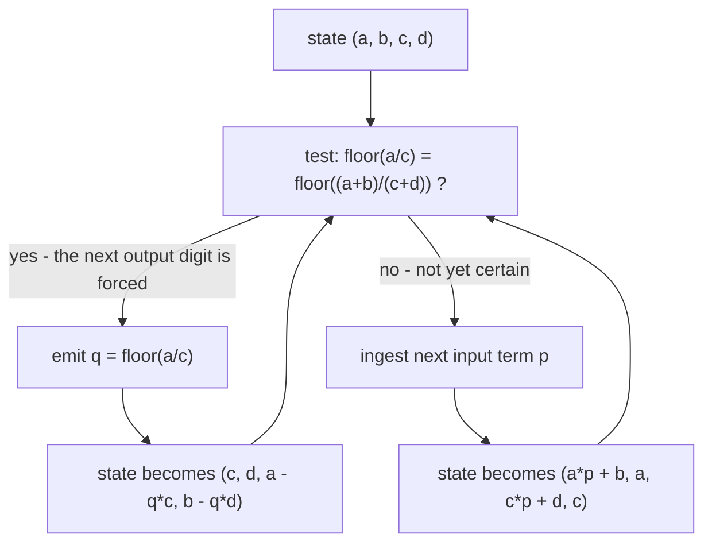
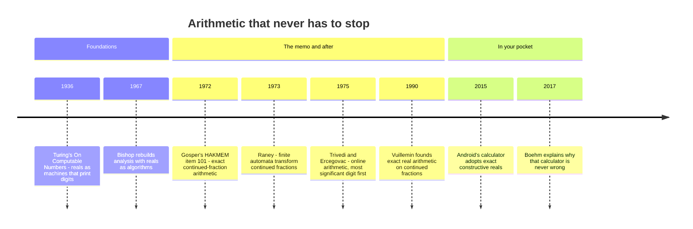

[← Stop 10 — The Casino](10-casino.md) · [Route map](index.md) · [Stop 12 — The Tower →](12-tower.md)

# Stop 11 — The Infinite Assembly Line

> Continued fractions are miserable to add — unless you build a machine that consumes and produces them one term at a time, forever.

## Overview

Continued fractions are the best tool for *approximating* numbers (Stop 5) but a
notoriously bad tool for *computing* with them. There is no simple rule for the
continued fraction of `x + y` in terms of the continued fractions of `x` and `y`.
For two centuries this was the subject's embarrassing weakness. Then in **1972**
**Bill Gosper**, in the legendary MIT memo **HAKMEM (item 101)**, showed how to
do exact arithmetic on continued fractions directly — and in doing so gave one
of the purest examples of **corecursion**: a program that does not consume a
finite input and halt, but *produces* an infinite stream on demand, forever.

### Homographic functions

The building block is the **homographic** (or Möbius) function of one variable

```
z(x) = (a·x + b)/(c·x + d),
```

with integer state `(a, b, c, d)`. This single form is remarkably expressive:
`x + n` is `(x + n)/1`, `n·x` is `(n·x)/1`, `1/x` is `(0·x + 1)/(1·x + 0)`, and
the identity is `(x)/(1)`. Gosper's insight is that we can compute the continued
fraction of `z(x)` while reading the continued fraction of `x`, using two moves:

- **Ingest** the next partial quotient `p` of `x`. Substituting
  `x ← p + 1/x′` transforms the state by
  `(a, b, c, d) ← (a·p + b, a, c·p + d, c)`. This folds one input term into the
  machine.
- **Emit** a partial quotient `q` of the output. This is allowed *only when the
  machine is sure*: when the floor of `z` agrees at both ends of the remaining
  input range — i.e. `⌊a/c⌋ = ⌊(a+b)/(c+d)⌋`. Then output `q = ⌊a/c⌋` and
  transform the state by `(a, b, c, d) ← (c, d, a − q·c, b − q·d)` (subtract `q`,
  then invert).

The machine alternates: emit whenever it can prove the next output digit,
otherwise ingest another input digit to narrow the uncertainty. It never rounds
and never approximates — every emitted term is exact.

The whole assembly line is one loop — test, then emit if the digit is forced,
ingest if it is not, and come back around forever:



### Bihomographic: two inputs at once

To add or multiply *two* continued fractions we need the **bihomographic** form

```
z(x, y) = (a·x·y + b·x + c·y + d)/(e·x·y + f·x + g·y + h),
```

with an eight-integer state. Addition is `(x·y·0 + x + y + 0)/(1)`, i.e.
`(b, c) = (1, 1)` and denominator `1`; multiplication is `(x·y)/(1)`, i.e.
`a = 1`; and so on for subtraction and division. The machine now has *three*
moves — ingest from `x`, ingest from `y`, or emit — and a rule for choosing
which input to read (whichever is contributing more uncertainty). Everything
else is the same alternation of ingest and provably-safe emit. This is exactly
the engine behind `tourbus.cf.gosper` and the `demo gosper` command.

### Corecursion, and a limit

Note what kind of program this is. Ordinary recursion (the rest of the tour)
breaks a problem into smaller pieces and bottoms out at a base case. Gosper's
algorithm has **no base case** — its inputs are infinite streams and its output
is an infinite stream. It is **corecursion**: defined not by how it terminates
but by how it *keeps going*, producing one more term whenever asked. The
correctness condition is not "it halts" but "each emitted term is forced." This
is the same shift in viewpoint that separates the fixed points of Stop 6 from the
descending recursions of Stop 1.

Corecursion has a famous limitation: **stream equality is undecidable**.
Consider `√2 · √2`, which equals exactly `2`. The machine would love to emit the
finite continued fraction `[2]` and stop — but to *prove* the output is exactly
`2` it would have to rule out an infinitesimally small fractional part, which
requires reading infinitely many input terms. It never gains enough certainty to
emit, so it **stalls forever**, ingesting term after term of `√2` without ever
producing output. `tourbus` guards against this with a safety cutoff and reports
the stall honestly. This is not a bug; it is a shadow of the halting problem
falling across arithmetic itself. A machine that produces exact answers cannot,
in general, *know* when its answer has become rational.

### From memo to method

HAKMEM itself deserves a footnote: AI Memo 239 (February 1972) was a stapled
grab-bag of tricks from the MIT AI Lab — number theory next to circuit hacks
next to screen-drawing lore — and item 101 sat inside it, never published as a
paper, passed around for decades as hacker folklore. Jean Vuillemin's 1990
IEEE paper finally gave the algorithm formal foundations as exact real
arithmetic. [Heritage stop H9](appendix-h-history.md#h9-1972-item-101) places
the memo in the long line that starts at Euclid.

## Worked examples

Add `√2` and `√3` as continued fractions — no decimal ever computed, just term
in and term out. The result is the continued fraction of `√2 + √3 ≈ 3.1463`,
produced twelve terms deep by the bihomographic machine:

```
$ python -m tourbus demo gosper --op add sqrt2 sqrt3
sqrt2 add sqrt3 (as a continued fraction):
  [3, 6, 1, 5, 7, 1, 1, 4, 1, 38, 43, 1]
```

Multiply the same two and something tidier appears — `√2 · √3 = √6`, a quadratic
surd, so by Stop 6 its continued fraction must be periodic. The machine
discovers the period `[2; (2, 4)]` without ever being told the answer is `√6`:

```
$ python -m tourbus demo gosper --op mul sqrt2 sqrt3
sqrt2 mul sqrt3 (as a continued fraction):
  [2, 2, 4, 2, 4, 2, 4, 2, 4, 2, 4, 2]
```

Now the cautionary tale. Multiply `√2` by *itself*. The true answer is exactly
`2`, but the machine cannot ever prove the fractional part has vanished, so it
ingests forever and `tourbus` trips its safety cutoff rather than loop
endlessly:

```
$ python -m tourbus demo gosper --op mul sqrt2 sqrt2
sqrt2 mul sqrt2 (as a continued fraction):
demo error: bihomographic ingested too long without emitting (the exact result is likely rational)
```

That error message *is* the theorem: exact stream arithmetic cannot decide, in
finite time, that its output has become rational. The assembly line runs
forever, and sometimes forever is the honest answer.

## Then, now, next

### Then — from computable numbers to streaming arithmetic



The problem Gosper solved is as old as computing itself. Alan Turing's
famous 1936 paper is titled *On Computable Numbers*: a real number is
computable if a machine can print its digits one after another forever — a
stream, exactly like the ones on this stop. What was missing for decades was
practical *arithmetic* on such streams. Gosper's memo showed how to do it for
continued fractions with a handful of integers of state, George Raney proved
in 1973 that the one-input machine is a finite automaton, and Jean Vuillemin's
1990 paper turned the idea into a theory of exact real arithmetic. In parallel,
computer architects invented *online arithmetic* (Kishor Trivedi and Miloš
Ercegovac, 1975), which emits the most significant digits of a result before
the inputs have finished arriving.

### Now — exact answers in everyday software

- **A calculator that is never wrong.** Since Android 6.0 (2015), the
  calculator app that ships with Android evaluates expressions with
  *constructive reals*: every number is a program that can produce more digits
  on demand, and the display shows only digits it has certified — Gosper's
  "emit only when sure" rule, in hundreds of millions of pockets (Hans Boehm,
  *Communications of the ACM*, 2017).
- **Streams everywhere.** Corecursion is now ordinary programming: Python
  generators (the engine behind every continued fraction in `tourbus`),
  Haskell's lazy lists, and reactive stream libraries all describe infinite
  data by how to produce the next item.
- **Digits first, in hardware.** Most-significant-digit-first arithmetic is
  still studied for FPGA designs, where one operation can begin consuming the
  leading digits of the previous one before it has finished — an assembly line
  in silicon.
- **The table-maker's dilemma.** Libraries that promise *correctly rounded*
  results for functions like `exp` and `sin` face Gosper's stall in miniature:
  when a value lies extremely close to a rounding boundary, more and more digits
  are needed to decide which way to round. Projects such as CORE-MATH bound how
  many are ever needed.

### Next — the stall that cannot be engineered away

The `√2 · √2` stall is not a bug to be fixed; it is a theorem. Daniel
Richardson proved in 1968 that for expressions built from ordinary functions
(`π`, `exp`, `sin`, absolute value, and a variable), deciding whether a value is
*exactly* zero is undecidable. For narrower classes the question is decidable
only if deep conjectures hold — for the exponential and logarithm, Schanuel's
conjecture would suffice. Exact real arithmetic therefore lives, permanently,
with the same honest uncertainty as the stall on this page. The research
frontier is in *certified* systems — libraries whose every digit comes with a
proof, some now checked inside proof assistants — and in finding practical
classes of numbers for which equality *can* be decided.

## Exercises

1. **(★)** Verify numerically that the `add` result is right: evaluate the
   continued fraction `[3, 6, 1, 5]` and compare to `√2 + √3 ≈ 3.14626`.
   <details><summary>Hint</summary>Use the engine-room recurrence; the fourth
   convergent already agrees to several places.</details>

2. **(★)** Confirm `√2 · √3 = √6` is a quadratic surd and predict, from Stop 6,
   that its continued fraction is periodic. What is the period?
   <details><summary>Hint</summary>`√6 = [2; (2, 4)]`; the block ends in
   `2·⌊√6⌋ = 4`.</details>

3. **(★★)** Write the homographic state `(a, b, c, d)` for the function
   `z(x) = (2x + 1)/(x + 3)` and perform one ingest of the partial quotient
   `p = 3`.
   <details><summary>Hint</summary>Start `(2, 1, 1, 3)`; ingesting `p = 3` gives
   `(2·3+1, 2, 1·3+3, 1) = (7, 2, 6, 1)`.</details>

4. **(★★)** Explain precisely why `demo gosper --op mul sqrt2 sqrt2` stalls,
   while `--op mul sqrt2 sqrt3` does not.
   <details><summary>Hint</summary>The first output is rational (`2`, a finite
   CF) and the machine cannot prove finiteness; the second is an irrational surd,
   whose infinite output it can keep emitting.</details>

5. **(★★★)** Give the emit condition `⌊a/c⌋ = ⌊(a+b)/(c+d)⌋` a geometric reading:
   why does agreement of the floor at the two ends of the input interval
   certify the next output digit?
   <details><summary>Hint</summary>A homographic map is monotone on the input
   range `[1, ∞)`, so if the floor of `z` agrees at both endpoints it is constant
   across the whole interval — the output digit is determined regardless of the
   unread input.</details>

## See it move

The Assembly Line's section of the
[live exposition](../site/index.html#stop-11-assembly) streams the continued
fraction of `√2 + √3` — a root of `x⁴ − 10x² + 1`, so its expansion never
repeats — one certified term at a time: press **Emit term** to pull a single
partial quotient off the line, or **Stream** to let it run. The eight-integer
Gosper machine itself, and its honest stall on `√2 · √2`, run in the terminal
with the demos above.

## Further reading

- R. W. Gosper, "Continued Fraction Arithmetic," HAKMEM item 101 (1972) — the
  original algorithm. See Appendix C.
- M. Beeler, R. W. Gosper & R. Schroeppel, *HAKMEM*, MIT AI Memo 239.
- J. Vuillemin, "Exact Real Computer Arithmetic with Continued Fractions,"
  *IEEE Trans. Computers* (1990).
- Appendix B of this tour for the definitions of *homographic*, *bihomographic*,
  and *corecursion*.
- G. N. Raney, "On continued fractions and finite automata," *Mathematische
  Annalen* 206 (1973).
- H.-J. Boehm, "Small-data computing: correct calculator arithmetic,"
  *Communications of the ACM* 60(8) (2017) — exact real arithmetic in a phone.
- D. Richardson, "Some undecidable problems involving elementary functions of a
  real variable," *Journal of Symbolic Logic* 33 (1968).

[← Stop 10 — The Casino](10-casino.md) · [Route map](index.md) · [Stop 12 — The Tower →](12-tower.md)
