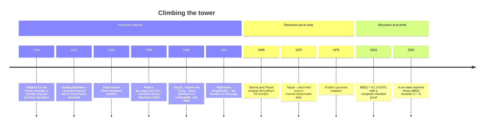

[← Stop 11 — The Infinite Assembly Line](11-assembly-line.md) · [Route map](index.md) · [Stop 13 — The Hall of Mirrors →](13-hall-of-mirrors.md)

# Stop 12 — The Tower

> A recursion so powerful it outruns every loop you could ever write: the Ackermann function, and the combinator that conjures recursion from nothing.

## Overview

Every recursion on the tour so far has been *tame*: Euclid descends to a base
case, convergents build up term by term, Gosper's machine emits on demand. This
stop climbs a tower of recursions so steep that ordinary iteration cannot keep
up — and then asks the vertiginous question of where recursion itself comes
from. It is the most computer-science-flavoured stop, and the least about
continued fractions, but it is where "recursive continuance" is pushed to its
logical extreme.

### Hyperoperations

Start with a ladder of operations, each defined by iterating the one below:

```
addition:        a + n   = a + 1 + 1 + … + 1   (n times)
multiplication:  a · n   = a + a + … + a       (n times)
exponentiation:  aⁿ      = a · a · … · a        (n times)
tetration:       ⁿa      = a^(a^(a^…))          (n times, a tower of a's)
```

and onward. **Knuth's up-arrow notation** names them: `a↑n = aⁿ`,
`a↑↑n` is tetration, `a↑↑↑n` the next rung. Each level is defined by recursion
over the previous, and the values explode: `3↑↑3 = 3^27 ≈ 7.6 trillion`, while
`3↑↑↑3` is a tower of threes `3↑↑3 ≈ 7.6 trillion` levels high — a number with
no meaningful decimal representation.

### The Ackermann–Péter function

The **Ackermann function** packages this whole ladder into one two-argument
recursion. In the tidy two-argument form of Rózsa Péter and Raphael Robinson:

```
A(0, n)     = n + 1
A(m+1, 0)   = A(m, 1)
A(m+1, n+1) = A(m, A(m+1, n)).
```

The `m` coordinate selects the rung of the hyperoperation ladder:
`A(1, n) = n + 2`, `A(2, n) = 2n + 3`, `A(3, n) = 2ⁿ⁺³ − 3`, and
`A(4, n) = 2↑↑(n+3) − 3` is tetrational. The function is **total** (it halts for
every input) and **computable** (the definition above is a program), yet it is
**not primitive recursive** — it grows faster than any function you can build
from bounded `for`-loops alone. Ackermann's 1928 function (anticipated a year
earlier by his fellow Hilbert student Gabriel Sudan) was among the first
concrete proofs that the total computable functions strictly *contain* the
primitive recursive ones: some things are computable only with unbounded
recursion (`while`), not mere iteration.

The double recursion in the third line is the whole story: to compute
`A(m+1, n+1)` you must first compute `A(m+1, n)` and feed the result *back in as
an argument* to `A(m, ·)`. That inner-value-as-outer-argument nesting is what
makes it outrun the primitive recursive functions. It also makes it explode:
`A(4, 2) = 2↑↑5 − 3 = 2^65536 − 3`, a number with **19,729 decimal digits** —
which is why the `tourbus` demo politely refuses to print it in full.

The function has a purpose as well as a punchline: Wilhelm Ackermann was David
Hilbert's student, and the 1928 paper ("Zum Hilbertschen Aufbau der reellen
Zahlen") served Hilbert's program of building analysis from finitary
recursions — the function was evidence about what recursion *is*. Ackermann's
original had three arguments; Rózsa Péter (1935) reduced it to two, and her
work made recursion theory a discipline of its own; Raphael Robinson (1948)
simplified her version slightly to the exact form used here. The name
"Ackermann–Péter function" credits the two founders.

### The Y combinator: recursion from nothing

If recursion is a function calling itself *by name*, where does the name come
from? In the pure lambda calculus there are no names — only anonymous functions.
Yet recursion is still available, through a **fixed-point combinator**. The most
famous is Curry's **Y combinator**:

```
Y = λf. (λx. f (x x)) (λx. f (x x)),      with the property   Y f = f (Y f).
```

Applied to a function `f` that *describes one unrolling* of a recursive
definition, `Y f` is the fixed point — the fully recursive function — with no
self-reference anywhere in sight. `Y` manufactures the loop from a function that
only knows how to take one step. It is the Stop 4 fixed-point idea (`φ = 1 + 1/φ`)
lifted to the level of *functions*: `Y f` is to `f` what `φ` is to `x ↦ 1 + 1/x`.
Recursion, it turns out, is not a primitive; it is a fixed point you can build.

### McCarthy's 91 function

A gentler puzzle closes the tower. John McCarthy's **91 function** is

```
M(n) = n − 10           if n > 100,
M(n) = M(M(n + 11))     if n ≤ 100.
```

The nested `M(M(…))` looks alarming, but the astonishing fact is that
`M(n) = 91` for **every** `n ≤ 100`, and `n − 10` for `n > 100`. It is a
textbook case of a recursion whose *behaviour* is far simpler than its
*definition* — a reminder that a nested recursion can hide a trivial function,
just as Gosper's stall (Stop 11) hid a trivial answer. Proving `M(n) = 91`
requires reasoning about the *total* function, not tracing any single call, and
is a classic exercise in program verification. It appeared in 1968–70 in work
by Zohar Manna, Amir Pnueli, and John McCarthy — the first wave of proving
programs correct rather than merely running them.

## Worked examples

Evaluate `A(3, 5)`. By the formula `A(3, n) = 2ⁿ⁺³ − 3`, this should be
`2⁸ − 3 = 253` — and the recursion, unwound through hundreds of nested calls,
agrees exactly:

```
$ python -m tourbus demo ackermann 3 5
A(3, 5) = 253
```

Smaller inputs show the ladder's rungs. `A(2, 4) = 2·4 + 3 = 11` sits on the
"multiplication" rung, and `A(3, 3) = 2⁶ − 3 = 61` on the "exponentiation" rung:

```
$ python -m tourbus demo ackermann 2 4
A(2, 4) = 11
```

```
$ python -m tourbus demo ackermann 3 3
A(3, 3) = 61
```

Step up to the tetrational rung and the values leave the printable universe.
`A(4, 2) = 2^65536 − 3` has nearly twenty thousand digits, so the demo names it
rather than printing it:

```
$ python -m tourbus demo ackermann 4 2
A(4,2) = 2^65536 - 3 has 19729 digits; refusing to print it all.
```

That single guard is the whole point of the tower: `A(4, 2)` is a perfectly
definite, computable integer, and it is already too large to write down. Climb
one more rung to `A(4, 3)` and the number of *digits* itself becomes
astronomical.

## Then, now, next

### Then — what "computable" means



The tower was built to answer a philosophical question. In the 1920s David
Hilbert hoped to ground all of mathematics in finitary, mechanical reasoning,
and his students Sudan and Ackermann found functions that are perfectly
mechanical yet grow faster than any tower of `for`-loops. In 1936 Alonzo Church
(with the lambda calculus of this stop's Y combinator), Stephen Kleene (with
general recursive functions), and Alan Turing (with his machines) gave three
different definitions of "computable" — and proved them equivalent. The
Ackermann–Péter function sits exactly at the first rung above the primitive
recursive functions in that hierarchy, which is why it remains the standard
example.

### Now — the tower in working software

- **Union–find.** The data structure that merges sets and asks "are these two
  in the same set?" — used in Kruskal's minimum-spanning-tree algorithm, in
  image segmentation, in compilers that unify types, and in percolation
  simulations — runs in time proportional to `m·α(n)`, where `α` is the
  *inverse* Ackermann function (Tarjan, 1975; the bound is optimal, Fredman and
  Saks, 1989). Because `A` explodes, `α` crawls: it never exceeds 4 for any
  input that could fit in the observable universe.
- **Termination checkers.** Proof assistants such as Lean, Coq, and Agda must
  refuse definitions that might loop forever. They accept Ackermann's function
  because every recursive call decreases the pair `(m, n)` in lexicographic
  order; the McCarthy 91 function, whose termination is subtler, is a standard
  benchmark for program verifiers.
- **Fixed points in practice.** Fixed-point combinators are how recursion is
  implemented in languages and calculi that have no named functions, and they
  gave a famous startup accelerator its name: Y Combinator's founders call it
  "a program that runs programs" — and themselves "a company that helps start
  companies."

### Next — the busy beaver frontier

How fast can a *computable* process grow before it stops? The **busy beaver**
number `BB(n)` is the longest any halting `n`-state Turing machine can run, and
it outgrows every computable function, Ackermann's included. After decades of
work, an online collaboration (bbchallenge) proved in 2024 that
`BB(5) = 47,176,870`, with the proof checked by the Coq proof assistant. `BB(6)`
is another matter: in 2025 a six-state machine was found that runs for more
than `2↑↑↑5` steps, and among the six-state machines whose behaviour is still
unknown is one nicknamed *Antihydra*, which halts only if a Collatz-like
sequence misbehaves — so pinning down `BB(6)` may require solving a problem as
hard as the Collatz conjecture of [Stop 14](14-souvenir-shop.md). Further up,
logic takes over: Goodstein's theorem (1944) describes sequences that grow like
a tower and still always return to zero, a fact true but unprovable in ordinary
Peano arithmetic (Kirby and Paris, 1982).

## Exercises

1. **(★)** Compute `A(1, 5)` and `A(2, 2)` by hand from the recurrence and check
   the formulas `A(1, n) = n + 2`, `A(2, n) = 2n + 3`.
   <details><summary>Hint</summary>`A(1, 5) = 7` and `A(2, 2) = 7` as well —
   the ladder rungs cross at small values.</details>

2. **(★)** Using `A(3, n) = 2ⁿ⁺³ − 3`, predict `A(3, 7)` before running the
   demo.
   <details><summary>Hint</summary>`2¹⁰ − 3 = 1021`.</details>

3. **(★★)** Trace `M(99)` for McCarthy's function and confirm it returns `91`.
   <details><summary>Hint</summary>`M(99) = M(M(110)) = M(100) = M(M(111)) =
   M(101) = 91`.</details>

4. **(★★)** Show that `A(2, n)` *is* primitive recursive but `A(m, n)` as a
   function of both arguments is not. What breaks the primitive-recursive
   bound?
   <details><summary>Hint</summary>Fixing `m` gives a simple closed form; it is
   the recursion *on `m`* (the diagonal `A(n, n)`) that outgrows every primitive
   recursive function.</details>

5. **(★★★)** Verify the fixed-point property `Y f = f (Y f)` by β-reducing
   `Y f` one step, and explain how it yields recursion without a named function.
   <details><summary>Hint</summary>Reduce `(λx. f (x x)) (λx. f (x x))` to
   `f ((λx. f (x x)) (λx. f (x x)))`, which is `f (Y f)`.</details>

## See it move

The Tower's section of the [live exposition](../site/index.html#stop-12-tower)
computes `A(4, 2) = 2^65536 − 3` exactly, in your browser's own big-integer
arithmetic, and reports its 19,729 digits with the first and last few shown —
then sets the Y combinator beside it, recursion's other extreme. The call tree
of a doubly recursive function, drawn by the engine, is the figure at
[Stop 1](01-depot.md#how-fast-lam-s-theorem).

## Further reading

- W. Ackermann (1928) and R. Péter's simplified two-argument form; see the
  historical account in Appendix C.
- Graham, Knuth & Patashnik, *Concrete Mathematics*, on hyperoperations and
  fast-growing functions. See Appendix C.
- H. P. Barendregt, *The Lambda Calculus*, for the Y combinator and fixed-point
  theory.
- Z. Manna & J. McCarthy on the 91 function and recursion induction.
- R. M. Robinson, "Recursion and double recursion," *Bulletin of the AMS* 54
  (1948) — the modern form of the Ackermann–Péter function.
- R. E. Tarjan, "Efficiency of a good but not linear set union algorithm,"
  *Journal of the ACM* 22 (1975) — where the inverse Ackermann function earns
  its keep.
- S. Aaronson, "The Busy Beaver Frontier," *SIGACT News* 51 (2020), and the
  bbchallenge collaboration's proof that `BB(5) = 47,176,870` (2024).

[← Stop 11 — The Infinite Assembly Line](11-assembly-line.md) · [Route map](index.md) · [Stop 13 — The Hall of Mirrors →](13-hall-of-mirrors.md)
