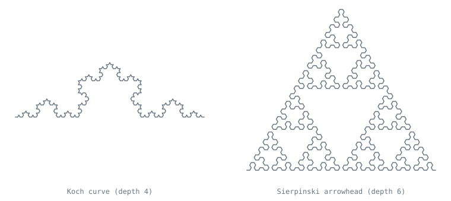
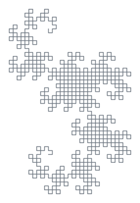
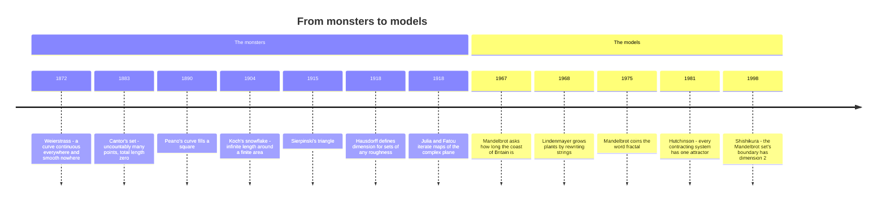

[← Stop 12 — The Tower](12-tower.md) · [Route map](index.md) · [Stop 14 — The Souvenir Shop →](14-souvenir-shop.md)

# Stop 13 — The Hall of Mirrors

> Recursion you can see: fractals are the fixed points of "do this smaller, several times," and their dimension is a fraction.

## Overview

Recursion has been algebraic (Euclid), analytic (convergents), and logical
(Ackermann). In the hall of mirrors it becomes **geometric**. A fractal is the
picture of a recursive definition — a shape built by the rule "replace me with
several smaller copies of myself" — and it turns out to be a *fixed point* in
exactly the sense of `φ = 1 + 1/φ` (Stop 4) and the periodic surds (Stop 6). The
mirrors reflect the whole tour back at itself.

### Self-similarity and dimension

The defining feature is **self-similarity**: zoom into a fractal and you see a
copy of the whole. Quantify this with the **similarity dimension**. If a shape
is made of `N` copies of itself each scaled down by a factor `r < 1`, its
dimension is

```
d = ln N / ln(1/r).
```

For an ordinary line, halving it gives `N = 2` copies at `r = 1/2`, so
`d = ln 2 / ln 2 = 1` — a line is one-dimensional, as it should be. A filled
square gives `N = 4`, `r = 1/2`, `d = ln 4 / ln 2 = 2`. The surprise is what
happens between the integers:

- **Cantor set** — remove the middle third, repeat: `N = 2` copies at `r = 1/3`,
  so `d = ln 2 / ln 3 ≈ 0.6309`. More than a point, less than a line.
- **Koch curve** — replace each segment with four at a third the length:
  `N = 4`, `r = 1/3`, `d = ln 4 / ln 3 ≈ 1.2619`. A curve of *infinite length*
  bounding a finite area.
- **Sierpiński triangle** — three half-size copies: `N = 3`, `r = 1/2`,
  `d = ln 3 / ln 2 ≈ 1.5850`. More than a curve, less than a region.

These non-integer dimensions are the signature of a fractal: the object is
genuinely "rougher" than a smooth curve but "thinner" than a solid, and the
fraction `d` measures exactly where it sits.



### Space-filling curves

Push the branching further and a curve can fill an entire region — dimension
exactly `2`. The **dragon curve** and the **Hilbert curve** are the tour's
examples. The dragon (fold a strip of paper in half repeatedly and unfold each
crease to a right angle) tiles the plane; the Hilbert curve visits every point
of a square in the limit, which is why it is used to lay out data so that nearby
points in one dimension stay nearby in two (database indexing, image dithering).
Both have similarity dimension `2` — a one-dimensional path that is, in the
limit, two-dimensional. Peano's discovery of such curves in 1890 was a genuine
shock to the intuition that a line and a plane are different sizes.



### Hutchinson: a fractal is a fixed point

Why does the recursion converge to a definite shape at all? **John Hutchinson
(1981)** gave the clean answer. An **iterated function system (IFS)** is a
finite set of contracting maps `f₁, …, fₖ` (each shrinking distances). Define an
operator on shapes: `F(S) = f₁(S) ∪ … ∪ fₖ(S)` — "replace `S` by the union of
its shrunk copies." Then:

> Every contracting IFS has a **unique** non-empty compact set `A` with
> `F(A) = A`. Starting from *any* shape and applying `F` repeatedly converges to
> this `A`.

`A` is the **attractor**, and it *is* the fractal. A fractal is literally a
fixed point `F(A) = A` of the "make smaller copies" operator — the geometric
twin of `φ = 1 + 1/φ`. This is why you can start the dragon from a single line
segment or a scribble and still land on the same dragon: the fixed point does
not care where you begin. (The convergence is guaranteed by the Banach
fixed-point theorem, the same tool that underlies Newton's method and much of
analysis.)

### The bridge back to continued fractions

Here is the connection that makes this stop belong on a continued-fraction tour.
A **purely periodic continued fraction** `x = [(a₁, …, aₖ)]` satisfies
`x = M(x)` where `M` is the **Möbius transformation** built from the period's
convergents — a homographic map of exactly the kind Gosper's machine used at
Stop 11. In other words, a quadratic surd is a **fixed point of a Möbius map**,
just as a fractal is a fixed point of an IFS. The reduced surds of Galois
(Stop 6) are the "self-similar points" of the continued-fraction world: the
numbers whose expansion looks the same after you strip off a period, exactly as
the Koch curve looks the same after you zoom in by three. The hall of mirrors and
the loop road are the same phenomenon in two different spaces — geometry and
arithmetic — both governed by the single principle that a contraction has one
fixed point.

## Worked examples

Generate the dragon curve to depth 10. The `tourbus` fractal engine emits an SVG
(drawn in the web widget); the demo reports its size, which grows with the
recursion depth as the curve accumulates its `2¹⁰` segments:

```
$ python -m tourbus demo dragon --depth 10
dragon(depth=10) -> 8155 bytes of SVG
  (open site/index.html for the drawn version)
```

The other curves are generated the same way. The Koch curve and Hilbert curve
each expand by their own branching factor as depth increases — Koch quadrupling
its segment count per level, Hilbert quadrupling its cells:

```
$ python -m tourbus demo koch --depth 4
koch(depth=4) -> 3421 bytes of SVG
  (open site/index.html for the drawn version)
```

```
$ python -m tourbus demo hilbert --depth 5
hilbert(depth=5) -> 8763 bytes of SVG
  (open site/index.html for the drawn version)
```

```
$ python -m tourbus demo sierpinski --depth 6
sierpinski_arrowhead(depth=6) -> 9753 bytes of SVG
  (open site/index.html for the drawn version)
```

Each SVG is the *n*-th application of the IFS operator `F` to a starting shape —
a finite snapshot of the infinite fixed point `A`. Increase `--depth` and you
step closer to the attractor; the byte counts climb because each level multiplies
the number of segments by the branching factor `N`. Open the web widget to watch
these draw themselves stroke by recursive stroke.

## Then, now, next

### Then — monsters first, models later



Every exhibit in this hall is older than its label. Weierstrass's nowhere-smooth
curve, Cantor's set, Peano's square-filling curve, Koch's snowflake, and
Sierpiński's triangle were built between 1872 and 1915 as counterexamples —
"monsters" meant to break the era's intuitions about curves and lengths — and
Felix Hausdorff's 1918 definition of fractional dimension was a tool for
measuring them. Around the same time Gaston Julia and Pierre Fatou studied what
happens when a rational map of the complex plane is iterated, and found the
boundaries now called Julia sets; without computers they could not see them.
The dragon was folded by the NASA physicists Heighway, Banks, and Harter in the
1960s and spread by Martin Gardner's 1967 column. Then Benoit Mandelbrot, at
IBM, asked in 1967 how long the coast of Britain is (it depends on your ruler),
coined *fractal* in 1975, and argued that the monsters were the rule, not the
exception: coastlines, lungs, clouds, and markets. The gallery had been open
for ninety years before anyone hung a sign.

### Now — fractals at work

- **Indexing the planet.** Space-filling curves turn two-dimensional data
  into a one-dimensional order that keeps neighbours together. Google's S2
  geometry library numbers cells on the Earth's surface along Hilbert curves on
  the six faces of a cube; the related Z-order (Morton) curve lays out keys in
  databases and textures in GPU memory.
- **Antennas.** A self-similar antenna resonates at several scales at once.
  Nathan Cohen built the first fractal antenna in 1988 and published the idea
  in 1995; compact multi-band fractal antennas have since been used inside
  mobile phones.
- **Growing worlds.** Lindenmayer's L-systems (the rewriting rules behind this
  stop's curves) and iterated function systems generate plants, terrain, and
  clouds in films and games, and fractal image compression (Arnaud Jacquin,
  1992) was a lively research field of the 1990s.
- **Measuring the rough.** Box-counting dimension is a standard measurement
  for rough surfaces, porous materials, and branching structures from
  river networks to blood vessels.

### Next — continued fractions inside the fractals

The deepest open questions of complex dynamics are continued-fraction
questions in disguise.

- **Siegel disks and Brjuno numbers.** Iterate `z ↦ e^{2πiα}z + z²` and a
  disk of calm, rigid rotation — a *Siegel disk* — surrounds `0` exactly when
  `α` is a *Brjuno number*: the sum `Σ log(qₙ₊₁)/qₙ` over its convergent
  denominators converges. Alexander Brjuno proved the condition sufficient
  (1971) and Jean-Christophe Yoccoz proved it exactly right for this family
  (1988), work cited in his 1994 Fields Medal. The golden mean, with the
  slowest-growing denominators of all, gives the most famous Siegel disk; for
  higher-degree maps, whether Brjuno's condition is still the right one is open.
- **Is the Mandelbrot set locally connected?** The *MLC conjecture* would
  imply that the Mandelbrot set's picture is essentially complete. It remains
  open; Mikhail Lyubich, Dzmitry Dudko, and others have proved it at more and
  more kinds of parameters, several of them described by the continued
  fractions of rotation numbers.
- **Fractals made of continued fractions.** The numbers whose partial
  quotients are all `1` or `2` form a Cantor set of dimension about `0.5313`.
  How the dimension grows as more digits are allowed is exactly what the
  attack on Zaremba's conjecture ([Stop 15](15-terminus.md#zaremba-s-conjecture))
  needs; the hall of mirrors and the terminus meet here.

## Exercises

1. **(★)** Compute the similarity dimension of the Sierpiński carpet (a square
   cut into a 3×3 grid with the centre removed, repeated).
   <details><summary>Hint</summary>`N = 8` copies at `r = 1/3`, so
   `d = ln 8 / ln 3 ≈ 1.8928`.</details>

2. **(★)** Explain why the Koch curve has infinite length but bounds a finite
   area.
   <details><summary>Hint</summary>Each step multiplies length by `4/3 > 1`
   (diverges) while the enclosed area is a convergent geometric series.</details>

3. **(★★)** The dragon and Hilbert curves both have dimension `2`. Verify this
   for the Hilbert curve from its `N` and `r`.
   <details><summary>Hint</summary>`N = 4` copies at `r = 1/2`, so
   `d = ln 4 / ln 2 = 2`.</details>

4. **(★★)** State the IFS (the list of contracting maps) whose attractor is the
   Cantor set, and confirm it has two maps each contracting by `1/3`.
   <details><summary>Hint</summary>`f₁(x) = x/3` and `f₂(x) = x/3 + 2/3`; their
   union operator fixes the Cantor set.</details>

5. **(★★★)** For the purely periodic surd `√2 − 1 = [(2)]`, find the Möbius map
   `M` with `M(x) = x` and verify the surd is its attracting fixed point.
   <details><summary>Hint</summary>One period gives `x = 1/(2 + x)`, i.e.
   `M(x) = 1/(2+x)`; solve `x² + 2x − 1 = 0` to get `x = √2 − 1`.</details>

## See it move

Open the **Hall of Mirrors** widget:
[`site/index.html#stop-13-mirrors`](../site/index.html#stop-13-mirrors). Drag the
depth slider and watch the dragon, Koch, Sierpiński, and Hilbert curves converge
on their fixed-point attractors one recursive level at a time.

**Try it live:** the Fractal Lab preset to [the dragon at depth 10](../site/index.html#w8?f=dragon&d=10).

## Further reading

- K. Falconer, *Fractal Geometry: Mathematical Foundations and Applications* —
  the standard text, including similarity dimension and IFS. See Appendix C.
- J. Hutchinson, "Fractals and Self Similarity," *Indiana Univ. Math. J.* (1981)
  — the fixed-point theorem for IFS.
- M. Barnsley, *Fractals Everywhere*, for the IFS / attractor viewpoint.
- C. Series, "The Modular Surface and Continued Fractions," for the Möbius /
  surd connection; Appendix C.
- B. Mandelbrot, *The Fractal Geometry of Nature* (1982) — the manifesto, with
  the monsters and the coastlines side by side.
- P. Prusinkiewicz & A. Lindenmayer, *The Algorithmic Beauty of Plants* (1990) —
  L-systems, free online from the authors' lab.
- J.-C. Yoccoz, "Théorème de Siegel, nombres de Bruno et polynômes
  quadratiques," *Astérisque* 231 (1995) — where continued fractions decide the
  shape of a Julia set.

[← Stop 12 — The Tower](12-tower.md) · [Route map](index.md) · [Stop 14 — The Souvenir Shop →](14-souvenir-shop.md)
