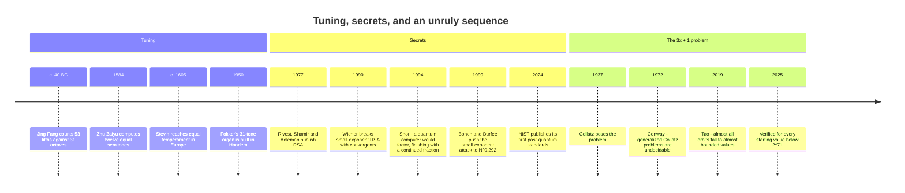

[← Stop 13 — The Hall of Mirrors](13-hall-of-mirrors.md) · [Route map](index.md) · [Stop 15 — Terminus →](15-terminus.md)

# Stop 14 — The Souvenir Shop

> Three things to take home: why the piano is tuned the way it is, how a careless RSA key falls in seconds, and a five-line function nobody can prove halts.

## Overview

The last working stop is a shop of applications — three souvenirs showing the
continued fraction and the recursion at work far from pure number theory. One
tunes a musical scale, one breaks a cipher, and one is a problem so simple a
child can state it and no mathematician can solve it. Each is a convergent, an
approximation, or an orbit — the tour's ideas, out in the world.

### Souvenir 1: why twelve notes?

A musical fifth — the most consonant interval after the octave — is the
frequency ratio `3/2`. An octave is a doubling, ratio `2`. To build a keyboard we
want to stack fifths and land back on an octave, i.e. we want integers `m, n`
with `(3/2)ᵐ ≈ 2ⁿ`. Taking logs, this is asking for a good rational
approximation to

```
log₂(3/2) = 0.5849625007…
```

The convergents of this number are exactly the historically important scales.
`7/12` says: twelve equal steps per octave, with the fifth at seven of them —
**12-tone equal temperament**, the tuning of the modern piano. The `12` in "the
chromatic scale has twelve notes" is a continued-fraction convergent. The fifth
it produces is off from the pure `3/2` by only `−1.955` cents (hundredths of a
semitone), imperceptibly flat — the compromise that lets you play in every key on
one set of strings. The next convergents, `24/41` and `31/53`, give
microtonal scales (41-TET, 53-TET) that are *more* accurate still and are used in
some experimental and historical instruments.

The convergents were tuning instruments long before anyone wrote them down as
convergents. Zhu Zaiyu computed the twelve exactly equal semitones — twelfth
roots of 2, extracted on an abacus to many digits — in Ming-dynasty China
(1584), and Simon Stevin reached the same tuning in Europe around 1605, in a
manuscript not printed until 1884; and the finer 53-note convergent was
anticipated by Jing Fang in the first century BC, who counted 53 fifths against
31 octaves, then rediscovered by Nicholas Mercator in the seventeenth century.
The piano obeys `7/12`; the theory arrived two millennia after the practice.

### Souvenir 2: breaking RSA with a continued fraction

RSA encryption uses a public modulus `N = pq` and a public exponent `e`, with a
secret exponent `d` satisfying `e·d ≡ 1 (mod φ(N))`, so that `e·d = 1 + kφ(N)`
for some integer `k`. Choosing a *small* `d` speeds up decryption — a tempting
shortcut. **Michael Wiener showed in 1990** that it is a fatal one:

> If the private exponent satisfies `d < N^{1/4}/3`, then RSA is broken. The
> fraction `k/d` appears among the **convergents of `e/N`**, so an attacker who
> knows only the public key `(e, N)` can read off `d` in seconds.

The mechanism is pure Stop 5. Because `e·d = 1 + kφ(N)` and `φ(N) ≈ N`, the
public fraction `e/N` is *extremely close* to the secret fraction `k/d` — close
enough (when `d` is small) to satisfy **Legendre's criterion** `|e/N − k/d| <
1/(2d²)`. Legendre's criterion then *guarantees* `k/d` is a convergent of `e/N`.
The attacker expands `e/N` as a continued fraction, tries each convergent's
denominator as a candidate `d`, and checks it — one of them is the key. The
secret exponent, chosen too small, betrays itself through the same
best-approximation theory that gave us `355/113`. Appendix A works through why
the bound is exactly `N^{1/4}`.

### Souvenir 3: the Collatz conjecture

Finally, the shop's cheapest and most maddening souvenir. Define, for a positive
integer `n`, the **Collatz map**:

```
n → n/2       if n is even,
n → 3n + 1    if n is odd.
```

Iterate. The conjecture — stated by Lothar Collatz around 1937 and still open —
is that **every** starting `n` eventually reaches `1` (after which it cycles
`1 → 4 → 2 → 1`). The orbit of `27` is famous: it climbs to a peak of `9232`
before finally crashing to `1` after `111` steps, a wildly erratic flight from a
tiny start. The conjecture has been verified by computer for every `n` below
`2⁷¹ ≈ 2.4 × 10²¹` (David Bařina, 2025) — and yet no proof exists. Paul Erdős
said of it, "Mathematics is not yet ready for such problems." It is a recursion whose *termination* — the
one property Euclid's algorithm wore on its sleeve at Stop 1 — is, for Collatz,
an utter mystery. The tour began with a recursion we could prove always halts; it
ends its working stops with one we cannot.

## Worked examples

The `temperament` demo lists the convergents of `log₂(3/2)` with the size of the
resulting fifth's error in cents. Read down to `7/12` and you have found the
piano:

```
$ python -m tourbus demo temperament
Equal temperament from convergents of log2(3/2):
 convergent  notes/octave  fifth error (cents)
 ----------  ------------  -------------------
 1/2                    2             -101.955
 3/5                    5              +18.045
 7/12                  12               -1.955
 24/41                 41               +0.484
 31/53                 53               -0.068
```

`2` notes per octave is useless, `5` (the pentatonic scale) is crude at `+18`
cents, but `12` brings the error down to a nearly inaudible `−1.955` cents — the
sweet spot of accuracy versus playability that the world settled on. The finer
scales `41` and `53` are more accurate but need far more keys.

Now break a weak RSA key. The `wiener` demo builds a 128-bit modulus with a
deliberately small `d`, then recovers `d` from the public `(e, N)` alone by
walking the convergents of `e/N`:

```
$ python -m tourbus demo wiener --bits 128
vulnerable RSA key (128-bit):
  n = 122250945719100867655670202480874160429
  e = 29964784625008676707046981096637415439
  recovered d = 257044079 (true d = 257044079)
  attack succeeded
```

The recovered `d` matches the true secret exactly — extracted from public data
in the time it takes to expand one continued fraction, because the key's owner
chose `d` below Wiener's `N^{1/4}/3` threshold.

Finally, the Collatz flight of `27` — a small number that soars before it falls:

```
$ python -m tourbus demo collatz 27
Collatz flight of 27:
  111 steps, peak 9232
```

One hundred and eleven steps and a peak of `9232`, from a start of `27`, with no
theorem to say why it ever comes down at all.

## Then, now, next

### Then — three souvenirs, three histories



Each souvenir has a long pedigree. Equal temperament was computed in Ming
China and in Holland within a generation, but Western keyboards took two more
centuries to adopt it; Bach's *Well-Tempered Clavier* (1722) was written for
"well-tempered" tunings that most historians believe were unequal, not the
equal temperament of modern pianos. RSA appeared
in 1977; Wiener's 1990 attack, Coppersmith's lattice methods, and Boneh and
Durfee's 1999 extension to `d < N^0.292` taught cryptographers exactly how small
a secret exponent may *not* be. The `3x + 1` problem circulated by word of mouth
from the 1930s, and in 1972 John Conway proved that a natural generalisation of
it is *undecidable*: no algorithm can predict the fate of every orbit of every
Collatz-like map. The special case on this page might be decidable — nobody
knows.

### Now — the continued fraction inside a quantum computer

The most striking modern use of this stop's mathematics is in **Shor's
algorithm** (1994), the quantum algorithm that would break RSA outright. A
quantum computer cannot print the period `r` of `aˣ mod N` directly; it measures
an integer `y` for which `y/2ᵐ` is extremely close to some fraction `s/r`.
Recovering `r` is then a purely classical problem — and it is Legendre's
criterion from [Stop 5](05-scenic-overlook.md): the measured fraction lies
within `1/(2r²)` of `s/r`, so `s/r` *must* be one of its convergents.

For a toy case, factor `N = 21` with `a = 2`, measuring with nine qubits
(`2⁹ = 512`). Suppose the machine reports `y = 427`. Expand `427/512`:

```
$ python -m tourbus demo cf 427/512
continued fraction of 427/512:
  [0; 1, 5, 42, 2]

 n  a_n  p/q             value      error
 -  ---  -------  ------------  ---------
 0    0  0/1      0.0000000000  +8.34e-01
 1    1  1/1      1.0000000000  -1.66e-01
 2    5  5/6      0.8333333333  +6.51e-04
 3   42  211/253  0.8339920949  -7.72e-06
 4    2  427/512  0.8339843750  +0.00e+00
```

The convergent `5/6` is the one with a denominator below `21`, so the candidate
period is `r = 6` — and indeed `2⁶ = 64 ≡ 1 (mod 21)`. Then
`gcd(2³ − 1, 21) = 7` and `gcd(2³ + 1, 21) = 3`: the factors, found by a
continued fraction at the end of a quantum computation.

- **Defences in the standards.** The U.S. signature standard (FIPS 186-4 and
  186-5) now *requires* RSA private exponents larger than `2^(nlen/2)` — roughly
  `√N` — which rules out both Wiener's attack and Boneh–Durfee's. Wiener's
  attack survives as a classic audit check and a staple of security
  competitions.
- **Beyond RSA.** Because Shor's algorithm would break RSA and elliptic-curve
  cryptography alike, NIST published its first post-quantum standards in August
  2024: ML-KEM for key exchange and ML-DSA and SLH-DSA for signatures. The
  lattice problems underneath ML-KEM and ML-DSA are attacked with the
  "Euclid in many dimensions" of [Stop 1](01-depot.md#then-now-next).
- **Tunings.** Twelve-tone equal temperament is the global default, but the
  other convergents are alive: Adriaan Fokker's 31-tone organ (1950) still
  plays in Amsterdam, Turkish makam theory divides the whole tone into nine
  commas of a 53-tone octave, and the MIDI Tuning Standard lets electronic
  instruments play any temperament you can compute.

### Next — how big a quantum computer, and will 3x + 1 ever fall?

- **The quantum clock.** Estimates of the quantum resources needed to factor a
  2048-bit RSA modulus have fallen steeply — from around twenty million noisy
  qubits in 2019 to under a million in a 2025 estimate by Craig Gidney. No
  machine is close yet, but the migration to post-quantum cryptography has
  begun, because data encrypted today can be recorded and decrypted later.
- **Collatz.** Terence Tao proved in 2019 that almost every Collatz orbit
  eventually drops below any function tending to infinity — the strongest
  result so far — yet the full conjecture remains, in Erdős's words, beyond the
  mathematics we have. Collatz-like maps have even turned up inside the busy
  beaver problem of [Stop 12](12-tower.md#then-now-next): some six-state
  machines halt only if a `3x + 1`-style sequence misbehaves.

## Exercises

1. **(★)** From the `temperament` table, which scale first brings the fifth's
   error under 1 cent? How many notes per octave does it need?
   <details><summary>Hint</summary>`24/41` gives `+0.484` cents — the 41-note
   scale.</details>

2. **(★)** Run `demo collatz 97` and compare its peak to `27`'s. Do different
   starts share a peak?
   <details><summary>Hint</summary>`97` also peaks at `9232`, because its orbit
   merges into `27`'s — many trajectories funnel through the same high point.</details>

3. **(★★)** Explain, using Legendre's criterion (Stop 5), why Wiener's attack
   requires `d` to be *small*.
   <details><summary>Hint</summary>Only when `d` is small enough is
   `|e/N − k/d| < 1/(2d²)`, the bound that forces `k/d` to be a convergent.</details>

4. **(★★)** The pure fifth is `3/2 = 701.955` cents; a stack of twelve fifths is
   `12 × 701.955` cents. By how much does it overshoot seven octaves (the
   "Pythagorean comma")?
   <details><summary>Hint</summary>`12 × 701.955 − 7 × 1200 = 23.46` cents —
   which spread over twelve fifths is the `1.955`-cent flattening of each.</details>

5. **(★★★)** Show that the Collatz map cannot have a cycle other than
   `1 → 4 → 2 → 1` among numbers below the verified bound, and explain why this
   does *not* prove the conjecture.
   <details><summary>Hint</summary>Verification checks each starting value
   reaches 1, ruling out small cycles; but "no counterexample below `2⁷¹`" says
   nothing about arbitrarily large `n`.</details>

## See it move

Three widgets stock the Souvenir Shop in the
[live exposition](../site/index.html#stop-14-souvenir). The **Temperament
Studio** (W10) compares tunings and lets you *hear* the difference between a
pure fifth and a tempered one. The **Wiener Attack Stepper** (W11) generates a
deliberately weak RSA key and walks the convergents of `e/N` until the secret
exponent falls out. The **Collatz Orbit Plotter** (W12) races flights of your
choosing — `27`'s 111-step climb to `9232` among them.

**Try it live:** [just intonation versus equal temperament](../site/index.html#w10?t=just), or watch [a 128-bit weak key break itself](../site/index.html#w11?b=128&auto=1).

## Further reading

- M. Wiener, "Cryptanalysis of Short RSA Secret Exponents," *IEEE Trans.
  Information Theory* (1990) — the original attack. See Appendix C.
- J. C. Lagarias, ed., *The Ultimate Challenge: The 3x+1 Problem* (2010) — the
  definitive Collatz survey; Appendix C.
- D. Benson, *Music: A Mathematical Offering*, for temperament and the
  continued-fraction derivation of 12-TET.
- Appendix A of this tour for the derivation of Wiener's `N^{1/4}` bound.
- P. W. Shor, "Polynomial-time algorithms for prime factorization and discrete
  logarithms on a quantum computer," *SIAM Journal on Computing* 26 (1997) — the
  continued fraction at the end of the quantum algorithm.
- D. Boneh & G. Durfee, "Cryptanalysis of RSA with private key d less than
  N^0.292," *IEEE Transactions on Information Theory* 46 (2000).
- T. Tao, "Almost all orbits of the Collatz map attain almost bounded values,"
  *Forum of Mathematics, Pi* 10 (2022).

[← Stop 13 — The Hall of Mirrors](13-hall-of-mirrors.md) · [Route map](index.md) · [Stop 15 — Terminus →](15-terminus.md)
