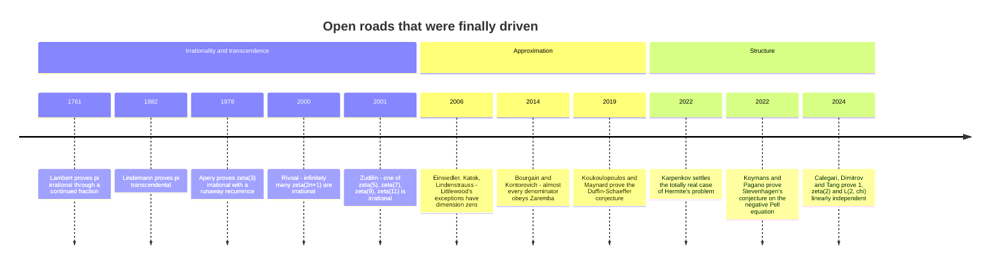

[← Stop 14 — The Souvenir Shop](14-souvenir-shop.md) · [Route map](index.md) · [Appendix A — Proofs →](appendix-a-proofs.md)

# Stop 15 — Terminus

> The end of the line is where the map runs out: the questions about continued fractions that no one can yet answer.

## Overview

The bus comes to rest at Terminus, and the honest thing to show you here is not
another theorem but the edge of the map — the places where the road we have been
driving simply stops, and open water begins. Continued fractions are among the
oldest objects in mathematics, and some of the most natural questions about them
remain unsolved after three centuries. This closing stop is a short catalogue of
those questions, each one a place where the tour could, in principle, continue if
only someone found the way.

### Is π "normal" in its continued fraction?

At Stop 9 we saw that `π = [3; 7, 15, 1, 292, …]` has no discernible pattern, and
at Stop 10 that a *typical* number's partial quotients obey the Gauss–Kuzmin
statistics with geometric mean tending to Khinchin's constant `K₀`. Does `π`
behave typically? Two precise questions are **open**:

- **Are the partial quotients of `π` bounded?** No one knows. Hundreds of
  billions of terms have been computed — the giant `878,783,625` turns up past
  the eleven-millionth term, and far larger ones deeper still — but whether
  arbitrarily large terms keep appearing forever is unproven. It is not even
  known whether `π` has *infinitely many* partial quotients equal to `1`.
- **Do `π`'s partial quotients obey Gauss–Kuzmin, with geometric mean `K₀`?**
  Numerically, yes to high precision — but there is no proof. `π` might be one of
  the measure-zero exceptions, like `e`. We cannot rule it out.

These are humbling. We know `π` to hundreds of trillions of digits and can
compute its continued fraction as far as we like, yet cannot prove the most basic
statistical facts about the sequence we are staring at.

### Is Khinchin's constant irrational?

Khinchin's constant `K₀ = 2.6854520010…` is the universal geometric mean of
almost every number's partial quotients (Stop 10). It has been computed to a
million digits (Carles Simó, 2016). And yet **it is not known whether `K₀` is
rational or irrational**, let alone whether it is transcendental. A constant
that governs the behaviour of *almost all real numbers* has a nature we cannot
pin down. The same holds for **Lévy's constant** `e^{π²/(12 ln 2)}`.

### Is the Euler–Mascheroni constant γ irrational?

The constant `γ = 0.5772156649…`, the limit of `1 + 1/2 + … + 1/n − ln n`,
appears throughout analysis and number theory. Its continued fraction has been
computed to more than sixteen billion terms (2021). And still, **it is unknown
whether `γ` is irrational** — the single most embarrassing open problem in the
subject, because irrationality is exactly the property continued fractions are
*built* to detect (Stop 2: irrational ⇔ infinite expansion). If `γ` were a
fraction `p/q`, its denominator would need more than 244,000 digits — a bound
proved from its continued fraction in 1998, and dwarfed by what today's
computations imply — but "very probably infinite" is not a proof.

### Zaremba's conjecture

Not every question here is about a single constant. **Zaremba's conjecture
(1972)** asks: is there a constant `A` such that every positive integer `q` is
the denominator of some fraction `p/q` whose continued fraction has all partial
quotients at most `A`? (Zaremba proposed `A = 5`.) This is a question about which
*denominators* admit "well-behaved" continued fractions, with real consequences
for pseudo-random number generation and numerical integration. Bourgain and
Kontorovich proved in 2014 that *almost all* `q` work with `A = 50`, and
ShinnYih Huang brought that down to Zaremba's own `A = 5` in 2015 — a
spectacular near-miss — but the full conjecture, for *every* `q`, remains open.

### The Erdős–Straus conjecture

Not every open question about unfolding a number is about *continued* fractions.
The greedy Egyptian-fraction expansion of the Branch Line
([Appendix I, stop B3](appendix-i-branches.md#b3-egyptian-fractions-the-greedy-scribe))
always terminates, but the shortest such expansions hide a famous unknown:
**Erdős and Straus conjectured (1948)** that for every integer `n ≥ 2` the
fraction `4/n` can be written as a sum of exactly three unit fractions,
`4/n = 1/x + 1/y + 1/z`. A solution has been found for every `n` up to `10¹⁷`
(Salez, 2014) — `python -m tourbus demo egyptian` builds them live — yet no
proof exists that one always does. It is the same theme as the rest of this
stop: a notation so simple that Egyptian scribes computed with it nearly four
thousand years ago, guarding a question no one can answer.

### The Littlewood conjecture

The deepest is **Littlewood's conjecture (c. 1930)**: for *every* pair of real
numbers `α, β`,

```
lim inf_{n→∞}  n · ‖nα‖ · ‖nβ‖ = 0,
```

where `‖x‖` is the distance from `x` to the nearest integer. It says two numbers
cannot *both* resist rational approximation too stubbornly at the same
denominators — a two-dimensional cousin of Hurwitz's theorem (Stop 4).
Einsiedler, Katok, and Lindenstrauss proved in 2006, using deep ergodic theory
of the kind glimpsed at Stop 10, that the set of exceptions (if any) has
dimension zero — but whether the set is actually *empty*, and the conjecture
true, is unknown.

### Where the road goes

Every stop on this tour touched one of these frontiers. The depot's Euclidean
descent (Stop 1) becomes the ergodic Gauss map (Stop 10) whose invariant
constant `K₀` we cannot classify. The golden ratio's extremal irrationality
(Stop 4) becomes Littlewood's multidimensional question. The pattern in `e`
(Stop 9) throws the patternlessness of `π` into relief, and that patternlessness
is itself the open problem. The tour is a loop road of its own: the elementary
beginning and the unsolved end are the same questions asked at different depths.

## Worked examples

There is nothing new to compute at Terminus — only something to sit with. Run the
Collatz flight of `27` one more time, and read it now as a parable for the whole
tour: a recursion with the simplest possible rule, whose behaviour we can watch
in complete detail and still cannot explain.

```
$ python -m tourbus demo collatz 27
Collatz flight of 27:
  111 steps, peak 9232
```

We can compute the orbit exactly. We can compute a billion orbits exactly. What
we cannot do is *prove* the one thing we most want to know — that it always comes
home. That gap, between what a recursion *does* and what we can *prove* it does,
is the country beyond Terminus. The bus stops here; the mathematics does not.

## Then, now, next

### Then — doors that opened

The map's edge moves. Every problem below was, for a generation, as hopeless as
the ones above — and each fell to an idea nobody had when it was posed.



The pattern is instructive. Apéry's proof that `ζ(3)` is irrational (1978) came
from a continued fraction and a recurrence so improbable that his 1978 lecture
was met with disbelief, and colleagues checked its identities by computer before
the proof was accepted — the Cross-Domain Line replays it ([Appendix F](appendix-f-cross-domain.md#the-frontier-ap-ry-s-3)).
The Littlewood and Zaremba results imported heavy machinery from ergodic theory
and from expander graphs and "thin groups"; the Duffin–Schaeffer proof came from
combinatorics and graph theory. The next door will likely open from an equally
unexpected direction.

### Now — the working frontier

- **Ergodic theory and homogeneous dynamics** — the descendants of the Gauss
  map of [Stop 10](10-casino.md) — are the main tools for Littlewood's
  conjecture and its relatives.
- **Thin groups and expansion** power the attack on Zaremba's conjecture: the
  matrices of [Stop 3](03-engine-room.md#the-engine-as-a-product-of-matrices)
  with bounded partial quotients generate a sparse "thin" subgroup of
  `SL(2, ℤ)`, and its expansion properties are what Bourgain and Kontorovich
  exploited.
- **Arithmetic holonomy bounds** (Calegari, Dimitrov, and Tang, 2024) are a new
  way to prove that numbers are irrational, extending the Apéry-style
  recurrences of the Cross-Domain Line.
- **Computation at scale** keeps testing every conjecture here: hundreds of
  trillions of digits of `π`, hundreds of billions of its partial quotients,
  billions of terms of `γ`, Erdős–Straus to `10¹⁷`.

### Next — how the next doors might open

- **Machine-checked mathematics.** Proof assistants such as Lean and Coq now
  hold large libraries of formal number theory, and a growing share of new
  results arrive with machine-checked proofs.
- **Machine-found conjectures.** Programs like the Ramanujan Machine (2021)
  propose continued fractions for constants faster than people can prove them,
  and AI systems reached medal-level performance at the International
  Mathematical Olympiad in 2024–25, some producing proofs a computer can
  verify. Whether such tools can crack a problem like the irrationality of `γ`
  is one of the genuinely open questions of the next decade.
- **The old questions stand.** Is `γ` irrational? Is `K₀`? Are `π`'s partial
  quotients bounded? Is every Collatz orbit finite? None of these needs more
  than this tour to *state*. That is the invitation of the Terminus.

## Exercises

1. **(★)** Look up the largest known partial quotient of `π` among the first
   million terms. Does its existence prove the partial quotients are unbounded?
   <details><summary>Hint</summary>No — a single large term, however large, says
   nothing about whether they grow *without bound*. Unboundedness is a statement
   about the whole infinite tail.</details>

2. **(★)** State, in one sentence each, why proving `γ` irrational would be a
   natural use of continued fractions.
   <details><summary>Hint</summary>A number is irrational exactly when its
   simple continued fraction is infinite; a proof might exhibit or bound that
   expansion.</details>

3. **(★★)** Zaremba's conjecture with `A = 5` claims every `q` has a partner `p`
   with all partial quotients `≤ 5`. Find such a `p/q` for `q = 7` and `q = 12`.
   <details><summary>Hint</summary>`3/7 = [0; 2, 3]` (quotients ≤ 3);
   `7/12 = [0; 1, 1, 2, 2]` (quotients ≤ 2).</details>

4. **(★★)** Explain how Littlewood's conjecture generalises the one-dimensional
   fact that `‖nα‖` can be made small (Dirichlet's theorem) to two numbers at
   once.
   <details><summary>Hint</summary>Dirichlet gives `n·‖nα‖ < 1` infinitely
   often for one `α`; Littlewood asks the *product* of two such quantities to be
   driven to zero simultaneously.</details>

5. **(★★★)** Pick any open problem above and write a paragraph on which stop of
   this tour it most directly extends, and what a solution might look like.
   <details><summary>Hint</summary>There is no single answer — this is an
   invitation to synthesise the tour. The Khinchin, Gauss–Kuzmin, and Littlewood
   problems all extend Stop 10; the `π` and `γ` questions extend Stops 2 and 9.</details>

## See it move

The Terminus section of the [live exposition](../site/index.html#stop-15-terminus)
lists the open questions this route walked past, each with a link to the widget
where you can watch it happen: the **Khinchin Lab** for the statistics of `π`
and `K₀`, the **Gauss-Map Cobweb** for the dealer itself, and the **Collatz
Orbit Plotter** for the recursion nobody can prove halts.

## Further reading

- The full reading list of the tour is in
  [Appendix C — References](appendix-c-references.md).
- J. Borwein, A. van der Poorten, et al., *Neverending Fractions* (2014) — a
  modern tour of exactly these open questions; Appendix C.
- J. C. Lagarias, "Euler's constant: Euler's work and modern developments,"
  *Bulletin of the AMS* 50 (2013) — everything known (and not) about `γ`.
- A. van der Poorten, "A proof that Euler missed: Apéry's proof of the
  irrationality of ζ(3)," *Mathematical Intelligencer* 1 (1979) — the story of
  a door opening.
- S. Huang, "An improvement to Zaremba's conjecture," *Geometric and
  Functional Analysis* 25 (2015); Bourgain & Kontorovich, *Annals* (2014).
- On Littlewood: Einsiedler, Katok & Lindenstrauss, *Annals of Mathematics*
  (2006); Appendix C.

Thank you for riding the Recursive Continuance Tour Bus. The route map is always
at [index.md](index.md); the engine is always a single `python -m tourbus` away.

[← Stop 14 — The Souvenir Shop](14-souvenir-shop.md) · [Route map](index.md) · [Appendix A — Proofs →](appendix-a-proofs.md)
