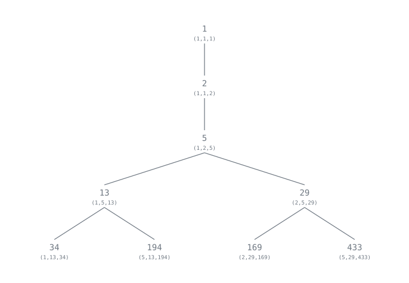
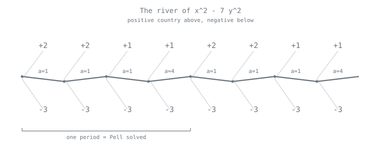
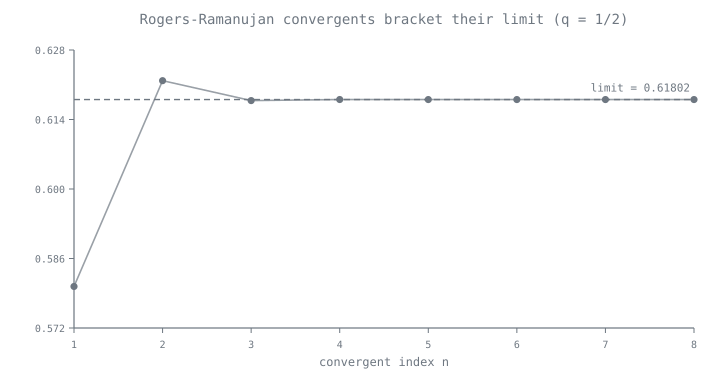

[← Route map](index.md) · [Stop 15 — Terminus](15-terminus.md)

# Appendix D — The Express Line: Fringe Avenues

Past the end of the main route lie nine deeper, stranger stops. Each still
computes live and exactly (or rigorously) on the same engine. Ride them all with

```
python -m tourbus frontier
```

or one at a time with `python -m tourbus frontier N`, or reach the individual
demonstrations through `python -m tourbus demo <name>`.

---

## E1 — The Markov Spectrum: the numbers after the golden ratio

The Golden Milestone (Stop 4) crowned φ the hardest number to approximate, with
Hurwitz's constant √5. What is *second*-hardest? The answer is a discrete ladder
— the **Lagrange spectrum** below 3 — governed by the **Markov equation**

```
x² + y² + z² = 3·x·y·z.
```

Its positive integer solutions, the **Markov triples**, grow from `(1, 1, 1)` by
*Vieta jumping*: fix two coordinates and the third satisfies a quadratic with a
second integer root. The largest entries are the **Markov numbers** 1, 2, 5, 13,
29, 34, 89, …; each `m` gives a **Lagrange number** `L_m = √(9m² − 4)/m`, and
these are exactly the spectrum below 3, accumulating at 3.



The miracle that ties it back to continued fractions: `L_m` is the **Markov
value** of a periodic CF word in {1, 2} — the largest, over all cyclic positions,
of the forward continued fraction plus the backward one. φ = `[1;(1)]` sits at √5;
the silver ratio `1 + √2 = [2;(2)]` at √8; the word `[2,2,1,1]` at √221/5.

```
$ python -m tourbus demo markov
The Markov / Lagrange spectrum below 3:
 Markov m  L_m                    value
 --------  ------------------  --------
        1  sqrt(5)             2.236068
        2  2*sqrt(2)           2.828427
        5  1/5*sqrt(221)       2.973214
       13  1/13*sqrt(1517)     2.996053
       29  1/29*sqrt(7565)     2.999207
       34  10/17*sqrt(26)      2.999423
       89  1/89*sqrt(71285)    2.999916
      169  1/169*sqrt(257045)  2.999977
      194  2/97*sqrt(21170)    2.999982
```

Above **Freiman's constant** (≈ 4.5278) the spectrum stops being discrete and
becomes a solid ray `[F, ∞)`; the structure in between is a Cantor-like set still
under active study.

**Then & now.** Andrey Markov found this ladder in 1879–80, and Frobenius
asked in 1913 whether each Markov number sits atop exactly one triple — the
*uniqueness conjecture*, still open after more than a century (Martin Aigner's
2013 book is devoted to it). The triples have since resurfaced far from
approximation theory, indexing exceptional vector bundles on the projective
plane and turning up in the combinatorics of cluster algebras, while Gregory
Freiman located in 1975 exactly where the spectrum becomes a solid ray.

**Exercises.** (★) Verify a Markov triple satisfies the equation. (★★) Show the
silver ratio `1 + √2` achieves √8 by computing `q²·|x − p/q|` along its
convergents. (★★★) Prove Vieta jumping never leaves the positive integers.

---

## E2 — Continuants: the polynomial behind every convergent

The convergent numerators and denominators are not merely numbers; they are
values of one polynomial family, the **continuants** `K(a₁, …, aₙ)`, defined by
the *same* three-term recurrence and satisfying `pₙ = K(a₀, …, aₙ)`,
`qₙ = K(a₁, …, aₙ)`. Two gems:

- **Palindrome:** `K(a₁, …, aₙ) = K(aₙ, …, a₁)` — reversing the partial quotients
  leaves the value unchanged.
- **Euler's rule:** the continuant equals the sum, over every way of striking out
  disjoint *adjacent* pairs, of the product of what remains. So `K(1, 1, …, 1)`
  (n ones) counts domino-and-square tilings and equals the Fibonacci number
  `F_{n+1}`.

```
$ python -m tourbus demo continuant 1 2 3 4 5
Continuant K(1, 2, 3, 4, 5):
  recurrence = 225
  Euler rule = 225
  reversed   = K(5, 4, 3, 2, 1) = 225 (equal)
```

**Then & now.** Euler studied these polynomials in 1764 as a device for
continued fractions. Today every tridiagonal determinant is a continuant, so the
recurrence above runs inside eigenvalue solvers for tridiagonal matrices — the
Sturm-sequence counting of [Appendix F](appendix-f-cross-domain.md) — and in the
three-term recurrences that define the classical orthogonal polynomials.

**Exercises.** (★) Compute `K(a, b, c)` by hand and match `abc + a + c`. (★★)
Prove the palindrome identity by induction. (★★★) Show `K(1,…,1)` (n ones) is
`F_{n+1}`.

---

## E3 — Algebraic irrationals: cube roots and an open problem

Quadratic irrationals have periodic continued fractions (Lagrange, Stop 6). Cube
roots do **not** — and, remarkably, *nobody knows whether their partial quotients
are bounded*. Numerically they behave like a "random" real: geometric mean near
Khinchin's constant, with occasional enormous terms.

```
$ python -m tourbus demo cbrt 2
Continued fraction of 2^(1/3):
  [1, 3, 1, 5, 1, 1, 4, 1, 1, 8, 1, 14, 1, 10, 2, 1] ...
  max term 534, geometric mean 2.763 (Khinchin-typical; boundedness OPEN)
```

The **plastic number** ρ (real root of `x³ = x + 1`, the cubic cousin of φ) is a
famous specimen — its expansion produces a `141` at position 12, out of nowhere:

```
$ python -m tourbus demo plastic
The plastic number (x^3 = x + 1):
  [1, 3, 12, 1, 1, 3, 2, 3, 2, 4, 2, 141, 80, 2] ...
  note the 141 at position 12 -- out of nowhere.
```

Contrast with √2 = `[1; (2)]`, whose partial quotients are eternally bounded by 2.
Whether `2^(1/3)` has bounded partial quotients is open, a relative of the
Littlewood conjecture (Stop 15). These expansions are computed rigorously: a
high-precision decimal seed becomes an interval, and only certified terms are
emitted.

**Then & now.** Klaus Roth proved in 1955 (Fields Medal, 1958) that every
algebraic irrational has irrationality measure exactly `2`: no algebraic number
is approximable much better than a random one. But the finer question on this
stop — whether the partial quotients of `2^(1/3)` stay bounded — remains out of
reach, because Roth's theorem is *ineffective*: it cannot say how large the rare
good approximations are. Lang and Trotter (1972) computed cube-root expansions
and found them statistically indistinguishable from random numbers; nothing
since has broken the deadlock.

**Exercises.** (★) Confirm the plastic number is a root of `x³ − x − 1`. (★★)
Compare the geometric mean of the first 40 partial quotients of `2^(1/3)` and of
`√2`. (★★★) Read about the Littlewood conjecture and its link to bounded partial
quotients.

---

## E4 — Continued-fraction variants: nearest-integer and "minus"

The floor is not the only way to unfold a number.

- The **nearest-integer continued fraction (NICF)** rounds to the *closest*
  integer at each step, allowing negative partial quotients with `|aᵢ| ≥ 2`. It
  converges faster than the regular expansion.
- The **minus (Hirzebruch–Jung) continued fraction** writes
  `a₀ − 1/(a₁ − 1/(a₂ − …))` with every `aᵢ ≥ 2`. It is the language algebraic
  geometers use to resolve cyclic quotient singularities: the `aᵢ` are the
  self-intersection numbers of the exceptional curves.

```
$ python -m tourbus demo nicf 87/32
Three continued fractions of 87/32:
  regular:         [2, 1, 2, 1, 1, 4]
  nearest-integer: [3, -4, 2, 4]
  minus (a>=2):    [3, 4, 3, 2, 2, 2]
```

Notice the NICF is shorter (fewer terms for the same number) and carries a
negative quotient where the regular expansion had a run of 1s.

**Then & now.** Nearest-integer expansions go back to Minnigerode (1873) and
Hurwitz (1889). The minus expansion is the tool with which Jung (1908) and
Hirzebruch (1953) resolved surface singularities, each coefficient a
self-intersection number, and it remains standard in toric geometry. The
variants keep multiplying: Rosen's continued fractions for Hecke groups (1954)
and Nakada's α-continued fractions (1981) form whole families whose entropy was
mapped in detail in the 2000s and 2010s.

**Exercises.** (★) Fold each expansion back to `87/32`. (★★) Find a fraction whose
NICF is strictly shorter than its regular CF. (★★★) Look up how the minus-CF of
`n/q` gives the resolution of the `1/n(1, q)` cyclic quotient singularity.

---

## E5 — The three-distance theorem

Scatter the points `0, α, 2α, …, (N−1)α` (mod 1) around a circle. However you
choose α and N, they cut the circle into arcs of **at most three distinct
lengths** — and when there are three, the largest is the sum of the other two.
Steinhaus conjectured it; it was proved in the 1950s.

The continued fraction of α is exactly what controls it: the gap lengths are the
quantities `‖qₖ·α‖` at the convergent denominators, so the point set's
"resolution" jumps precisely at the convergents. Rational approximation and
equidistribution turn out to be one subject.

```
$ python -m tourbus demo three-distance 8/13 12
Three-distance theorem for a=8/13, N=12:
  2 distinct gap lengths: 1/13, 2/13
  largest = sum of the others: True
```

**Then & now.** Hugo Steinhaus posed the question; Vera T. Sós, János Surányi,
and Stanisław Świerczkowski proved it independently in 1957–58. It is why
golden-ratio hashing and the golden angle of sunflowers spread points so evenly
([Stop 4](04-golden.md#then-now-next)). In higher dimensions "three" fails, and
the right generalisations — gap statistics read off flows on the space of
lattices (Marklof and Strömbergsson, 2017) — are an active research area.

**Exercises.** (★) Verify the three-gap property for α = 1/φ ≈ Fibonacci ratios.
(★★) Show the gap lengths total 1. (★★★) Relate the three lengths to `‖qₖα‖` for
consecutive convergent denominators.

---

## E6 — The Gauss–Kuzmin–Wirsing constant, from scratch

How fast does the Gauss–Kuzmin distribution (Stop 10) set in? The rate is the
**second eigenvalue** of the Gauss map's *transfer operator*

```
(L f)(x) = Σ_{n≥1}  1/(n+x)² · f(1/(n+x)).
```

Its largest eigenvalue is exactly 1 (with the Gauss density as eigenfunction);
the second is the **Gauss–Kuzmin–Wirsing constant** λ ≈ −0.30366300289…, and the
error in the Gauss–Kuzmin theorem decays like `|λ|ⁿ`. Wirsing computed it in 1974;
no closed form is known.

We recover it with no special functions: discretize `L` as a matrix on a grid,
then power-iterate from a **mean-zero** start (because `L` preserves the integral,
the eigenvalue-1 component of a mean-zero function is zero, so the iteration
lands on the second eigenvalue).

```
$ python -m tourbus demo gkw
Gauss-Kuzmin-Wirsing constant (from the transfer operator):
  computed  lambda = -0.3036601
  Wirsing's value  = -0.3036630 (error 2.9e-06)
```

**Then & now.** Eduard Wirsing found `λ` in 1974; Babenko (1978) and Mayer
(1991) set the transfer operator in a wider theory that ties it to the Selberg
zeta function of the modular surface, and `λ` is now known to hundreds of
digits. No closed form has ever been found. Because the same operator governs
the average-case speed of Euclid's algorithm ([Stop 10](10-casino.md#then-now-next)),
this constant turns up in the analysis of gcd algorithms.

**Exercises.** (★) Confirm the leading eigenvalue is 1 to three digits. (★★) Show
`∫₀¹ (Lf) dx = ∫₀¹ f dx` (the reason 1 is an eigenvalue). (★★★) Improve the
estimate by refining the grid, and watch the error shrink.

---

## E7 — Physics: colliding blocks count π

The last express stop is a bridge from arithmetic to the physical world. Put a
small block between a wall and a much heavier one, send the heavy block in, and
count **every** perfectly elastic collision — block-on-block and block-on-wall
alike. **Galperin's theorem (2003)**: if the mass ratio is `100ⁿ`, the total
number of collisions is the integer formed by the **first n+1 digits of π**.
Equal masses collide exactly `3` times; a ratio of `100` gives `31`; a ratio of
`10000` gives `314`.

Why on earth π? Rescale the coordinates by the square roots of the masses and
the two-block system becomes a single billiard ball bouncing inside a **wedge**
of angle `θ = arctan(√(m/M))`; each collision is one bounce, and unfolding the
wedge by reflections straightens the trajectory into a line, which can cross the
mirrored walls `⌈π/θ⌉ − 1` times (that is `⌊π/θ⌋` whenever `π/θ` is not an
integer). For `m/M = 100⁻ⁿ` the angle is `arctan(10⁻ⁿ) ≈ 10⁻ⁿ`, so the count
reads off `⌊π·10ⁿ⌋` — the digits of π. The collision count is a **rotation
number**, the very quantity continued fractions were built to measure (Stop 8),
and π appears because it is the half-turn.

```
$ python -m tourbus demo blocks
Galperin's colliding blocks: physics counts the digits of pi
 mass ratio  collisions (sim)  digits of pi
 ----------  ----------------  ------------
 100^0                      3             3
 100^1                     31            31
 100^2                    314           314
 100^3                   3141          3141
 100^4                  31415         31415
 100^5                 314159        314159
  two elastic blocks, count every collision -> the digits of pi.
```

The `collisions` column is an event-driven simulation of the mechanics; the
`digits of pi` column is Galperin's closed form `⌊π·10ⁿ⌋`, computed in high
precision without simulating a single collision. They agree row for row — and
the count is robust, because with integer masses and rational initial data every
velocity stays rational forever. Ride the stop with `python -m tourbus frontier
7`; Appendix E (§6) places the experiment in the wider web of ideas. **Try it
live:** watch [the mass-ratio 100² run](../site/index.html#w13?n=2) count out
`314` collisions.

**Then & now.** Gregory Galperin published the result in 2003; in 2019 a
3Blue1Brown video made it famous; and in 2020 the physicist Adam Brown showed
that the colliding blocks are mathematically the same as **Grover's quantum
search algorithm** — each collision a step of the search, with the same
rotation (and the same `π`) counting both.

**Exercises.** (★) Trace the three equal-mass collisions by hand — equal elastic
masses simply exchange velocities. (★★) Show that for `m = M` the wedge angle is
`θ = π/4`, so the bounce count `⌈π/θ⌉ − 1` is exactly `3`. (★★★) The formulas
`⌈π/arctan(10⁻ⁿ)⌉ − 1` and `⌊π·10ⁿ⌋` agree for every `n` ever checked; show that
a disagreement would require a long run of `9`s in the digits of π just after
position `n`.

---

## E8 — The River: Conway's topograph

John Conway drew binary quadratic forms not as formulas but as a **landscape**.
Take the form `x² − d·y²` and evaluate it on primitive integer vectors; arrange
those values on the infinite trivalent tree of *superbases*, and the numbers
grow outward by one arithmetic rule (across every edge, the value opposite a
region is `2·(sum of its two neighbours) − (the value across the edge)`). The
result — Conway's **topograph** — organizes the whole theory of the form into a
picture you can walk.

Running through the landscape of an indefinite form like `x² − d·y²` is a unique
periodic path with **positive country on one bank and negative on the other**:
the **river**. And the river *is* the periodic continued fraction of `√d` from
[Stop 6](06-loop-road.md). Each step along it is a partial quotient; each place
the river touches a region of value `+1` — a **well** — is a solution of Pell's
equation ([Stop 7](07-cattle-crossing.md)), read straight off the map with no
fractions in sight. The **climbing lemma** guarantees that once you leave the
river the values only grow, so the river is the single valley of an otherwise
rising terrain.



```
$ python -m tourbus demo topograph 7
Conway's topograph: the river of x^2 - 7 y^2:
        +2      +1
  o~a=1~o~a=1~o~a=1~o~a=4~o
    -3      -3
  river period [1, 1, 1, 4] = continued fraction period of sqrt(7)
  the river's Q=1 well gives Pell: 8^2 - 7*3^2 = 1
```

The river's partial quotients `[1, 1, 1, 4]` are exactly the period of `√7`, and
its `Q = 1` well hands back the fundamental Pell solution `(8, 3)`. The same
tree-walk — replace one value by a linear function of the other two — is the
Vieta jumping that grows the Markov triples of [stop E1](#e1-the-markov-spectrum-the-numbers-after-the-golden-ratio):
the topograph and the Markov tree are cousins on different forms. Ride the stop
with `python -m tourbus frontier 8`.

**Then & now.** Conway introduced the topograph in *The Sensual (Quadratic)
Form* (1997), building on Gauss's reduction theory of 1801. It has become a
favourite of teachers: Allen Hatcher's *Topology of Numbers* (2022) builds a
whole course on it. The trivalent tree it lives on is the dual of the Farey
tessellation of the hyperbolic plane — the geometry behind the loops of
[Stop 6](06-loop-road.md#then-now-next) and the fractions of
[Stop 8](08-family-tree.md#then-now-next).

**Exercises.** (★) Verify the climbing lemma at one node of the figure — pick a
region off the river and check its value exceeds both neighbours toward the
bank. (★★) Read the Pell solution `(8, 3)` for `d = 7` off the river and confirm
`8² − 7·3² = 1`. (★★★) Prove the river is periodic: the reduced forms along it
are finite in number, so the path must close.

---

## E9 — Ramanujan's Continued Fraction

The last express stop belongs to **Srinivasa Ramanujan**. In his first letter to
G. H. Hardy in 1913 he wrote down, without proof, the **Rogers–Ramanujan
continued fraction**

```
              q^(1/5)
R(q) = ---------------------------
         1 +      q
             -----------------
             1 +     q²
                 -------------
                 1 +    q³
                     ---------
                     1 +  ...
```

a *`q`-continued fraction* — its partial numerators are the powers `q, q², q³, …`
rather than the constant `1` of a simple continued fraction. For any rational
`q` the convergents are exact rationals, and successive ones bracket the limit
from alternating sides, the same enclosure property every continued fraction
has.



Then the miracle. At `q = e^{−2π}` the entire infinite fraction collapses to a
closed form built out of nothing but the golden ratio of [Stop 4](04-golden.md):

```
R(e^{−2π}) = √((5 + √5) / 2) − φ = 0.28407904384…
```

Hardy called the identities in that letter ones that "must be true, because, if
they were not true, no one would have had the imagination to invent them." The
tour sums the fraction numerically and compares it to the surd — they agree to
machine precision.

```
$ python -m tourbus demo ramanujan
Ramanujan's Rogers-Ramanujan continued fraction:
  R(1/2)/q^(1/5) convergents: ['2/3', '5/7', '22/31', '93/131', '766/1079', '6221/8763']
  R(e^-2pi) from the fraction = 0.2840790438
             sqrt((5+sqrt5)/2) - phi = 0.2840790438  (agree 2e-16)
  nested radical sqrt(1+2sqrt(1+3sqrt(...))) -> 3.0000000 (= 3)
```

The same stop runs a second Ramanujan signature: the **nested radical** `3 = √(1
+ 2√(1 + 3√(1 + 4√(…))))`, a puzzle he posed to the *Journal of the Indian
Mathematical Society* in 1911 that went unanswered in print. Its general form,
`x + 1 = √(1 + x√(1 + (x+1)√(…)))`, converges to `x + 1` for every `x`. Ride the
stop with `python -m tourbus frontier 9`; his history is told at
[Appendix H](appendix-h-history.md#interlude-spectra-and-measure-1873-1936).

**Then & now.** Rogers found the identities in 1894, Ramanujan rediscovered
them and the fraction around 1913, and sixty years later they reappeared in
physics: Rodney Baxter's 1980 exact solution of the *hard-hexagon model* of
statistical mechanics rests on the Rogers–Ramanujan identities, which also
count states in conformal field theory. In 2021 the Ramanujan Machine turned
the hunt for formulas like the one on this stop into an algorithm
([Stop 9](09-celebrity.md#then-now-next)).

**Exercises.** (★) Compute the first four convergents of `R(1/2)` by hand and
confirm they bracket the limit. (★★) Evaluate the nested radical to depth 4 and
watch it approach `3`. (★★★) Ramanujan's identity `R(e^{−2π}) = √((5+√5)/2) − φ`
is a *specific* value of a *general* fraction; explain why a numerical match to
16 digits is strong evidence but not a proof, and what a proof would require.

---

[← Route map](index.md) · [Stop 15 — Terminus](15-terminus.md)
