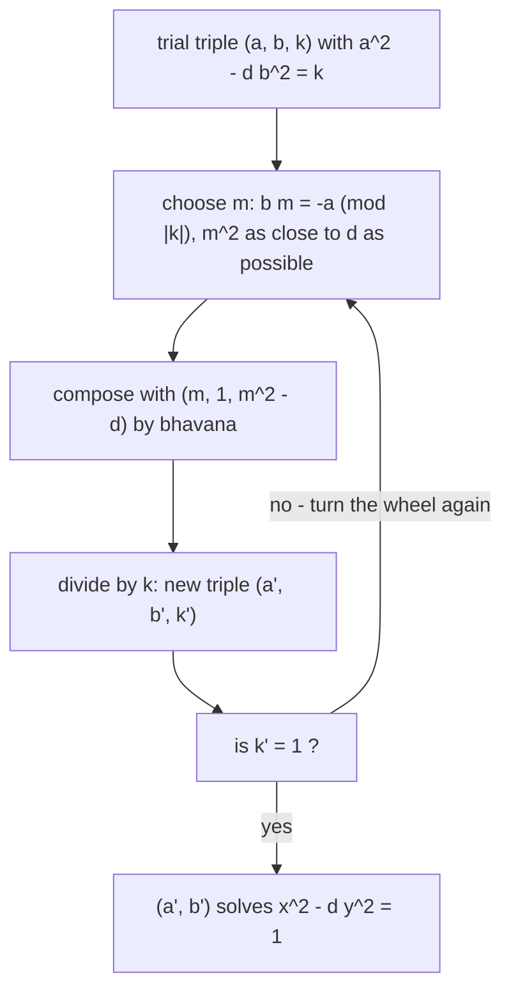

[← Route map](index.md) · [Stop 1 — The Depot](01-depot.md)

# Appendix H — The Heritage Line: A History in Convergents

> Every stop on this route was once the edge of the known world. Tonight the
> bus runs the same road again — backward through twenty-three centuries — and
> the passengers are the people who paved it.

The tour teaches the mathematics; this line drives the same road *in time*. Nine
heritage stops run from a measuring ritual in the *Elements* to a photocopied
memo from 1972, and every claim along the way is computed live on the same
engine as the rest of the tour. Ride them all with

```
python -m tourbus heritage
```

or one at a time with `python -m tourbus heritage N`.

---

## The route through time

Twenty-six dates, five eras, one recurrence. The nine heritage stops below stop
at the moments where the story turns.

```mermaid
timeline
    title Twenty-three centuries of continued fractions
    section Antiquity and India
        c. 300 BC : Euclid's Elements — the gcd ladder (VII.1-2) and the never-ending measuring test for incommensurables (X.2)
        499 : Aryabhata's kuttaka pulverizes linear indeterminate equations
        628 : Brahmagupta's bhavana composes solutions of x^2 - d y^2 = k
        1150 : Bhaskara II's chakravala dispatches d = 61
    section The Italian prelude
        1572 : Bombelli approximates sqrt(13) with an iterated fraction
        1613 : Cataldi gives the fraction its first notation, on sqrt(18)
        1655 : Brouncker finds 4/pi and Wallis records it in Arithmetica Infinitorum
        1695 : Wallis names the continued fraction
        1703 : Huygens' planetarium gears, chosen by convergents, appear in print
    section The classical century
        1737 : Euler founds the theory and unfolds e
        1761 : Lambert proves pi irrational through tan x
        1770 : Lagrange proves the periodicity of quadratic irrationals
    section The arithmetic and metric era
        1812 : Gauss states the invariant measure in a letter to Laplace
        1829 : Galois, at seventeen, characterizes the purely periodic expansions
        1844 : Lame counts Euclid's steps — the first complexity theorem : Liouville constructs the first transcendental number
        1858-1861 : Stern the mathematician and Brocot the clockmaker grow the tree of fractions
        1879 : Markov charts the spectrum beyond the golden ratio
        1891 : Hurwitz sharpens approximation to within 1 over sqrt(5) q^2
        1913 : Perron's treatise appears and Ramanujan's letters reach Hardy
        1935 : Khinchin finds the constant hiding in almost every expansion
    section The computational era
        1970 : Morrison and Brillhart factor F7 with continued fractions
        1972 : Gosper streams exact continued-fraction arithmetic in HAKMEM item 101
        1979 : Apery proves zeta(3) irrational with a runaway continued fraction
        1990 : Wiener breaks short-exponent RSA with convergents and Vuillemin formalizes exact real arithmetic
        2003 : Galperin's colliding blocks count the digits of pi
```



---

## H1 — c. 300 BC: The Ladder of Euclid

The oldest machine on the tour is also one of the oldest machines in
mathematics. Propositions 1 and 2 of *Elements* Book VII find a greatest
common measure by **anthyphairesis** — "reciprocal subtraction": measure the
smaller magnitude against the larger, keep what is left over, swap, repeat. It
is Stop 1's algorithm in its original packaging, stated as geometry because
"number" still meant a multitude of units.

The astonishing part is Book X, Proposition 2 — the converse nobody expects
from 300 BC. If the measuring *never ends*, the two magnitudes share no common
measure. That is the continued-fraction irrationality test, owned by the
Greeks two millennia before "irrational number" was a phrase: run the ladder
on the side and diagonal of a square and it visibly never terminates.
[Stop 1](01-depot.md) runs the ladder as an algorithm; this stop runs it as an
artifact.

```
$ python -m tourbus heritage 1 --no-color
━━━━━━━━━━━━━━━━━━━━━━━━━━━━━━━━━━━━━━━━━━━━━━━━━━━━━━━━━━━━━━━━━━━━━━━━━━━━━━━━
 THE HERITAGE LINE  🚌
 a history in convergents
━━━━━━━━━━━━━━━━━━━━━━━━━━━━━━━━━━━━━━━━━━━━━━━━━━━━━━━━━━━━━━━━━━━━━━━━━━━━━━━━

────────────────────────────────────────────────────────────────────────────────
 THE LADDER OF EUCLID   HERITAGE 1 / 9
────────────────────────────────────────────────────────────────────────────────

 Anthyphairesis: the continued fraction, three centuries before Christ and two
 millennia before its name.

 Two lengths measured against each other until nothing remains -- the tour's
 oldest engine, in its original packaging.

 Elements VII, Propositions 1 and 2 find a greatest common measure by mutual
 measuring -- anthyphairesis. Book X, Proposition 2 states the converse nobody
 expects from 300 BC: if the measuring never ends, the two magnitudes share no
 common measure. The Greeks owned the continued-fraction irrationality test two
 millennia before 'irrational number' was a phrase. Stop 1 runs this as an
 algorithm; this stop runs it as an artifact.

 Live: Elements VII, Props. 1-2 -- 1071 measured against 462
   1071 = 2 x 462 + 147
   462 = 3 x 147 + 21
   147 = 7 x 21 + 0
 Live: keep the quotients and Euclid has already invented the continued fraction
   quotients [2, 3, 7]  ->  1071/462 = [2; 3, 7]
 Live: Elements X.2 -- a measuring that never ends
   sqrt(2) = [1; 2, 2, 2, 2, 2, 2, 2, 2, 2, 2, 2, ...]
   by X.2 the side and diagonal of a square share no common measure.

 ⁂ souvenir: Euclid never wrote 'irrational' -- he wrote 'the measuring never
             ends.' Same theorem, twenty-three centuries between wordings.


 End of the Heritage Line.
```

**Exercises.** (★) Run Euclid on `(89, 55)` and explain the all-ones
quotients. (★★) Prove X.2 in modern dress: a number has a terminating
continued fraction if and only if it is rational. (★★★) Show that Euclid on
consecutive Fibonacci numbers takes the most steps for its size — Lamé's
theorem ([Stop 1](01-depot.md)), read backward from the ladder.

---

## H2 — 628–1150: The Cyclic Method

While Europe was not yet asking the question, India answered it twice.
Āryabhaṭa's *kuṭṭaka* — the "pulverizer" of 499 — ran Euclid's quotients
backward to crack linear indeterminate equations, the Bézout step of Stop 1 a
thousand years early. Brahmagupta (628) went much further: his **bhāvanā**
composition law takes two near-solutions of `x² − d·y² = k` and composes them
into a better one, dispatching `d = 92` a millennium before Europe noticed the
problem.

The **chakravala** — the "cyclic" method; it appears earlier in Jayadeva, and
reaches full form with Bhāskara II around 1150 — turns composition into an
algorithm: compose the current triple with a well-chosen auxiliary, scale
down, and keep turning the wheel until `k` lands on `1`. Bhāskara's showcase
was exactly `d = 61` — the case Fermat, unknowingly, posed to the English as a
challenge in 1657, five hundred years late.

No continued fraction appears anywhere in the method. And yet it arrives at
precisely the convergents [Stop 7](07-cattle-crossing.md) reads off the period
of `√61` — two roads up the same mountain, surveyed five centuries apart. One
turn of the wheel looks like this:



```
$ python -m tourbus heritage 2 --no-color
━━━━━━━━━━━━━━━━━━━━━━━━━━━━━━━━━━━━━━━━━━━━━━━━━━━━━━━━━━━━━━━━━━━━━━━━━━━━━━━━
 THE HERITAGE LINE  🚌
 a history in convergents
━━━━━━━━━━━━━━━━━━━━━━━━━━━━━━━━━━━━━━━━━━━━━━━━━━━━━━━━━━━━━━━━━━━━━━━━━━━━━━━━

────────────────────────────────────────────────────────────────────────────────
 THE CYCLIC METHOD   HERITAGE 2 / 9
────────────────────────────────────────────────────────────────────────────────

 Fermat's challenge, solved in Sanskrit verse five hundred years early.

 Fermat's hardest challenge had been answered in Sanskrit verse five hundred
 years before he posed it.

 Brahmagupta's bhavana (628 CE) composes two near-solutions of x^2 - d y^2 = k
 into a better one; the chakravala -- Jayadeva, then Bhaskara II, around 1150
 -- turns composition into a wheel that drives k to 1. Bhaskara's showcase was
 exactly d = 61, the case Fermat, unknowingly, posed to the English in 1657. No
 continued fraction appears anywhere in the method, and yet it lands on the
 same convergents Stop 7 computes.

 Live: Brahmagupta's own case, d = 92 (628 CE)
 turn     a    b   k   m
 ----  ----  ---  --  --
    0    10    1   8   -
    1    19    2  -7   6
    2    48    5   4   8
    3   211   22  -7   8
    4   470   49   8   6
    5  1151  120   1  10
   check: 1151^2 - 92 x 120^2 = 1
 Live: the wheel turns for d = 61
 turn           a          b   k  m
 ----  ----------  ---------  --  -
    0           8          1   3  -
    1          39          5  -4  7
    2         164         21  -5  9
    3         453         58   5  6
    4        1523        195   4  9
    5        5639        722  -3  7
    6       29718       3805  -1  8
    7      469849      60158  -3  8
    8     2319527     296985   4  7
    9     9747957    1248098   5  9
   10    26924344    3447309  -5  6
   11    90520989   11590025  -4  9
   12   335159612   42912791   3  7
   13  1766319049  226153980   1  8
 Live: the loop road agrees
   pell.fundamental_solution(61) = (1766319049, 226153980)
   sqrt(61) = [7; 1, 4, 3, 1, 2, 2, 1, 3, 4, 1, 14, ...]  period length 11
   odd period -> x^2 - 61 y^2 = -1 first, at (29718, 3805) -- the wheel's own k = -1 station.

 ⁂ souvenir: The chakravala reaches x = 1766319049 in a handful of turns, no
             continued fraction in sight -- two roads up the same mountain.


 End of the Heritage Line.
```

**Exercises.** (★) Verify Brahmagupta's `(1151, 120)` for `d = 92` by hand.
(★★) Take one chakravala turn from `(8, 1, 3)` for `d = 61`: choose `m` with
`m ≡ 1 (mod 3)` and `m²` nearest `61`, and compute the next triple. (★★★)
Prove the bhāvanā identity: from `a² − d·b² = k` and `c² − d·e² = l`, the pair
`(ac + d·be, ae + bc)` satisfies `x² − d·y² = k·l`.

---

## H3 — 1572–1655: First Fractions in Print

Rafael Bombelli's *L'Algebra* (1572) approximates `√13` by feeding a fraction
into itself — `3 + 4/(6 + 4/(6 + …))` — the continued fraction's first
appearance in European print, still nameless. Pietro Cataldi (1613) does the
same for `√18`, unfolding it step by step, and invents a notation for the
dangling "and so on": the object now has a symbol, if not yet a name.

Then 1655: William Brouncker, first president of the Royal Society, produces
`4/π = 1 + 1²/(2 + 3²/(2 + 5²/(2 + …)))` — the first continued fraction for `π` —
and John Wallis records it in *Arithmetica Infinitorum*. Wallis later
christens the whole species in his *Opera Mathematica* (1695), the book that
put the name "continued fraction" — and the rule for building convergents — in
print. Order beneath chaos, the theme [Stop 9](09-celebrity.md) states, began
here; Stop 9 already prints Brouncker's formula, so the new thing at this stop
is watching it computed, and how slowly its beauty converges.

```
$ python -m tourbus heritage 3 --no-color
━━━━━━━━━━━━━━━━━━━━━━━━━━━━━━━━━━━━━━━━━━━━━━━━━━━━━━━━━━━━━━━━━━━━━━━━━━━━━━━━
 THE HERITAGE LINE  🚌
 a history in convergents
━━━━━━━━━━━━━━━━━━━━━━━━━━━━━━━━━━━━━━━━━━━━━━━━━━━━━━━━━━━━━━━━━━━━━━━━━━━━━━━━

────────────────────────────────────────────────────────────────────────────────
 FIRST FRACTIONS IN PRINT   HERITAGE 3 / 9
────────────────────────────────────────────────────────────────────────────────

 Bombelli, Cataldi, Brouncker: a notation, a name, and pi's first continued
 fraction.

 Pi's first continued fraction never ends -- found in 1655, before the thing it
 is made of had a name.

 Bombelli (1572) approximates sqrt(13) by feeding a fraction into itself;
 Cataldi (1613) does sqrt(18) and invents a notation for the dangling 'and so
 on'; Brouncker (1655) produces the first continued fraction for pi, recorded
 by Wallis -- who later christens the object 'continued fraction'. Order
 beneath chaos, the theme Stop 9 states, began here.

 Live: Bombelli's sqrt(13), 1572
   3 + 4/(6 + 4/(6 + ...))  ->  3, 11/3, 18/5, 119/33, 393/109, 649/180, ...
   last = 3.6055556   sqrt(13) = 3.6055513
 Live: Cataldi's sqrt(18), 1613
   4 + 2/(8 + 2/(8 + ...))  ->  4, 17/4, 140/33, 577/136, 4756/1121, ...
   last = 4.2426405   sqrt(18) = 4.2426407
 Live: Brouncker's 4/pi, 1655 -- beautiful, and beautifully slow
   4/pi = 1 + 1^2/(2 + 3^2/(2 + 5^2/(2 + ...)))
 n  convergent of 4/pi  4/convergent
 -  ------------------  ------------
 0  1                       4.000000
 1  3/2                     2.666667
 2  15/13                   3.466667
 3  105/76                  2.895238
 4  315/263                 3.339683
 5  3465/2578               2.976046
 6  45045/36979             3.283738
 7  45045/33976             3.017072
   eight of Brouncker's terms give pi ~ 3.017072; four simple terms give 355/113 = 3.1415929.

 ⁂ souvenir: Brouncker's fraction is lawful and strolls; the simple fraction of
             pi looks lawless and sprints. Beauty and speed are different
             virtues.


 End of the Heritage Line.
```

**Exercises.** (★) Evaluate three convergents of Cataldi's `√18` fraction and
compare with `4.2426…`. (★★) Show Brouncker's convergents alternate around
`4/π`. (★★★) Derive Bombelli's rule: from `(3 + x)² = 13`, show
`x = 4/(6 + x)` and hence the repeating `(6, 4)` block.

---

## H4 — 1682: The Planetarium

Christiaan Huygens, designing a clockwork solar system, needed Saturn's year
measured in Earth's: `77708431/2640858`, by his planetary tables. A pair of
gears realizes only a rational ratio whose teeth counts a craftsman can
actually cut — best rational approximation with a bounded denominator, the
exact problem of [Stop 5](05-scenic-overlook.md), posed on a workbench a
century before Legendre proved the criterion.

The machine itself was designed around 1680–82; the book describing it, the
*Descriptio automati planetarii*, was published posthumously in 1703. It lays
out convergent-truncation as an explicit design rule: unfold the target ratio
into its continued fraction, cut the gears of the largest convergent the
workshop can handle, and accept an error you can compute in advance. It is the
first engineering application of the theory — 206 brass teeth driving 7,
standing in for Saturn.

```
$ python -m tourbus heritage 4 --no-color
━━━━━━━━━━━━━━━━━━━━━━━━━━━━━━━━━━━━━━━━━━━━━━━━━━━━━━━━━━━━━━━━━━━━━━━━━━━━━━━━
 THE HERITAGE LINE  🚌
 a history in convergents
━━━━━━━━━━━━━━━━━━━━━━━━━━━━━━━━━━━━━━━━━━━━━━━━━━━━━━━━━━━━━━━━━━━━━━━━━━━━━━━━

────────────────────────────────────────────────────────────────────────────────
 THE PLANETARIUM   HERITAGE 4 / 9
────────────────────────────────────────────────────────────────────────────────

 Huygens cuts Saturn's orbit into 206 brass teeth.

 You cannot cut a gear with 77 million teeth; Huygens' convergent needed only
 206.

 Christiaan Huygens, designing a clockwork solar system, needs Saturn's year
 over Earth's: 77708431/2640858. A gear pair realizes only a rational ratio
 with cuttable teeth counts -- best rational approximation with a bounded
 denominator, the exact problem of Stop 5. His posthumous Descriptio automati
 planetarii (1703) lays out convergent-truncation as the design rule: the first
 engineering application of the theory, a century before Legendre proved the
 criterion.

 Live: Saturn's year over Earth's, unfolded
   77708431/2640858 = [29; 2, 2, 1, 5, 1, 4, 1, ...]
 Live: the convergent ladder, and the wheel he cut
 n  p/q           value     error
 -  --------  ---------  --------
 0  29/1      29.000000  -4.3e-01
 1  59/2      29.500000  +7.5e-02
 2  147/5     29.400000  -2.5e-02
 3  206/7     29.428571  +3.1e-03
 4  1177/40   29.425000  -4.5e-04
 5  1383/47   29.425532  +8.3e-05
 6  6709/228  29.425439  -9.9e-06
 7  8092/275  29.425455  +6.1e-06
   huygens_gear() = (206, 7): a 206-tooth wheel driving a 7-tooth pinion,
   off by one part in 9,422.
 Live: the same rule under a modern tooth budget
   gear_ratio(355/113) = (179, 57): pi as a gear, 179/57 = 3.140351 -- an echo of Stop 5.

 ⁂ souvenir: One part in nine thousand, from two wheels a clockmaker could
             actually cut -- the first machine ever built out of a convergent.


 End of the Heritage Line.
```

**Exercises.** (★) Expand `77708431/2640858` three terms by hand. (★★) Explain
why `gear_ratio` may scale a convergent `h/k` by an integer `m` without losing
accuracy. (★★★) Using the calendar fraction of
[Stop 5](05-scenic-overlook.md), find the best gear pair with both teeth
counts `≤ 100` and compare it to the leap-year rule.

---

## Interlude — The Classical Century (1737–1770)

Everything before Euler is prehistory; everything after him is theory. His *De
fractionibus continuis dissertatio* (presented 1737, published 1744) is the
founding paper: it unfolds `e` into `[2; 1, 2, 1, 1, 4, …]`, proves that the
terminating expansions are exactly the rationals, and turns a century of
scattered tricks into a systematic calculus. The celebrity expansions of
[Stop 9](09-celebrity.md) are all, at bottom, Euler's.

The same calculus became this tour's engine. The recurrence that builds
convergents — in print since Wallis, systematic since Euler — is the machine
the whole route runs on, and the road from Euler's desk leads straight to
Lagrange, his successor in Berlin, and to the century's last great theorem
about the shape of an expansion: the loop road of [Stop 6](06-loop-road.md).

---

## H5 — 1761: Lambert Puts π on Trial

Johann Heinrich Lambert's memoir, presented to the Berlin Academy in 1761 (and
published in 1768), expands `tan x` as a continued fraction and then
cross-examines it. For a rational `x ≠ 0` the expansion can neither terminate
nor settle into anything rational — an infinite descent lurks in its tails —
so `tan x` is irrational for every rational `x ≠ 0`. But `tan(π/4) = 1` is as
rational as numbers get. Therefore `π/4`, and `π` itself, is not: the first
proof that `π` is irrational, one hundred and twenty-one years before transcendence.

[Stop 9](09-celebrity.md) states Lambert's tangent formula among the celebrity
expansions. Here the fraction runs live at `x = 1`, and beside it runs the
certified simple continued fraction of `tan(1)` — where the pattern that
carries the proof, the odd numbers marching upward forever, appears on screen.

```
$ python -m tourbus heritage 5 --no-color
━━━━━━━━━━━━━━━━━━━━━━━━━━━━━━━━━━━━━━━━━━━━━━━━━━━━━━━━━━━━━━━━━━━━━━━━━━━━━━━━
 THE HERITAGE LINE  🚌
 a history in convergents
━━━━━━━━━━━━━━━━━━━━━━━━━━━━━━━━━━━━━━━━━━━━━━━━━━━━━━━━━━━━━━━━━━━━━━━━━━━━━━━━

────────────────────────────────────────────────────────────────────────────────
 LAMBERT'S TRIAL OF PI   HERITAGE 5 / 9
────────────────────────────────────────────────────────────────────────────────

 The tangent testifies, and pi is proved irrational.

 The first man to prove pi irrational did it by cross-examining the tangent
 function.

 Lambert's memoir (presented to the Berlin Academy in 1761) expands tan x as a
 continued fraction; for rational x != 0 the expansion cannot terminate or
 repeat rationally, so tan x is irrational. But tan(pi/4) = 1 is rational --
 therefore pi/4, and pi, is not. Stop 9 states the formula; here the fraction
 runs live, and the pattern that carries the proof appears on screen.

 Live: Lambert's fraction at x = 1
   tan 1 = 1/(1 - 1/(3 - 1/(5 - 1/(7 - ...))))
   convergents 1, 3/2, 14/9, 95/61, 841/540, ...  ->  1.557407
 Live: the certified simple continued fraction of tan(1)
   tan(1) = [1; 1, 1, 3, 1, 5, 1, 7, 1, 9, ...]
   the odd numbers stand up in court.

 ⁂ souvenir: tan(1) = [1; 1, 1, 3, 1, 5, 1, 7, ...] -- a rational tangent would
             have to end; this one visibly never will.


 End of the Heritage Line.
```

**Exercises.** (★) Evaluate the first three convergents of Lambert's `tan(1)`
fraction. (★★) Sketch the descent: why does a rational `x` force a
contradiction in Lambert's fraction? (★★★) Compare with Euler: how does the
unbounded pattern of `e = [2; 1, 2, 1, 1, 4, …]` ([Stop 9](09-celebrity.md))
already prove `e` irrational, and why does `π` need the tangent detour?

---

## Interlude — Measure and Complexity (1770–1844)

Lagrange (1770) proves what the worked examples had long whispered: the
quadratic irrationals are exactly the eventually periodic expansions
([Stop 6](06-loop-road.md)). Legendre (1798) gives the closeness criterion
that certifies a fraction as a convergent ([Stop 5](05-scenic-overlook.md)).
Gauss, in a letter to Laplace dated 30 January 1812, states the invariant
measure of the continued-fraction map without proof — and leaves the question
of the error term open for a century ([Stop 10](10-casino.md)). Galois (1829),
seventeen years old, publishes his first paper: the purely periodic expansions
are exactly the reduced surds ([Stop 6](06-loop-road.md)). Lamé (1844) counts
Euclid's steps and finds Fibonacci in the worst case — often called the first
theorem of computational complexity ([Stop 1](01-depot.md)). That same year, on
the far side of approximation theory, Joseph Liouville turned the machinery
inside out: rather than bound how well an algebraic number can be approximated,
he built a number approximated so well that it could not be algebraic at all.

---

## H6 — 1844: The Skyscraper of Liouville

[Stop 4](04-golden.md) measures how *badly* a number can be approximated: the
golden ratio is the worst-approximable number there is, pinned against the
Hurwitz bound `1/(√5·q²)`, and every algebraic irrational obeys a bound of
the same shape — you cannot beat `c/q²` by more than a constant. In 1844 Joseph
Liouville read that theorem backward. If being algebraic *forbids* very close
rational approximation, then a number that *is* approximated absurdly well
cannot be algebraic. He did not go looking for such a number; he built one, on
purpose, and so exhibited the first quantity ever proved transcendental — three
decades before Hermite reached `e` and Lindemann reached `π`.

The construction is a skyscraper of zeros. Liouville's constant
`L = Σ 10^(−n!) = 0.110001000000000000000001…` puts a `1` at each factorial
position — 1, 2, 6, 24, 120, … — and fills the widening gaps with runs of `0`.
Truncate the sum at any term and you get a rational that agrees with `L` up to
the *next* factorial gap, a gap so vast that the truncation approximates `L`
far more closely than any `c/q²` law would permit. Fed through the
continued-fraction machine the pathology becomes visible directly: an
ordinary-looking expansion suddenly throws up a twelve-digit partial quotient,
the fingerprint of a rational clinging far too tightly to be lawful.

The exponent Liouville used was not the last word. Thue, Siegel, and finally
Klaus Roth (1955) sharpened the bound until it was best possible: every
algebraic irrational has irrationality measure exactly `2`, no more
approximable than a number drawn at random, and Roth's proof of it took a
Fields Medal. Liouville's numbers sit at the opposite pole, with infinite
irrationality measure — the transcendental extreme of the same approximation
spectrum the tour reckons with at its terminus ([Stop 15](15-terminus.md)).

```
$ python -m tourbus heritage 6 --no-color
━━━━━━━━━━━━━━━━━━━━━━━━━━━━━━━━━━━━━━━━━━━━━━━━━━━━━━━━━━━━━━━━━━━━━━━━━━━━━━━━
 THE HERITAGE LINE  🚌
 a history in convergents
━━━━━━━━━━━━━━━━━━━━━━━━━━━━━━━━━━━━━━━━━━━━━━━━━━━━━━━━━━━━━━━━━━━━━━━━━━━━━━━━

────────────────────────────────────────────────────────────────────────────────
 THE SKYSCRAPER OF LIOUVILLE   HERITAGE 6 / 9
────────────────────────────────────────────────────────────────────────────────

 A number built to be approximated: the first proven transcendental.

 In 1844 Liouville built a number on purpose to be transcendental -- the first
 ever proved so, thirty years before anyone showed e or pi were.

 The idea is Stop 4 turned upside down. An algebraic irrational cannot be
 approximated by rationals much better than 1/q^2 (Liouville's inequality;
 Hurwitz's sqrt(5) is the sharp golden case). So a number that IS approximated
 far too well cannot be algebraic. Liouville's constant L = sum 10^(-n!) =
 0.11000100000000000000000100... places its 1s at the factorial positions, and
 each long run of 0s is a rational that hugs L absurdly tightly. In the
 continued fraction that shows up as partial quotients that explode.

 Live: the constant, truncated to its first four factorial terms
   L ~ 0.110001000000000000000001...
       (exact; the 1s sit at positions 1, 2, 6, 24 = 1!, 2!, 3!, 4!; rigorous tail < 2e-120)
 Live: the certified continued fraction -- and its explosions
   [0, 9, 11, 99, 1, 10, 9, 999999999999, 1, 8, 10, 1, 99, 11]
   a[7] = 999999999999 -- a partial quotient with twelve digits, the signature of a rational hugging L far too tightly to be algebraic.
 Live: Liouville's inequality holds for the algebraic sqrt(2)
   |sqrt(2) - p/q| > c/q^2 on its own convergents: all True

 ⁂ souvenir: Approximate a number too well and you prove it transcendental. Roth
             (1955) later showed the algebraics allow no exponent past 2 at all
             -- a Fields Medal for one sharp inequality.


 End of the Heritage Line.
```

**Exercises.** (★) Truncate `L = Σ 10^(−n!)` after four terms and write it as a
single reduced fraction `p/q`; confirm the denominator is `10^24`. (★★) Show
that a continued fraction with unbounded partial quotients has irrationality
measure greater than `2`, by approximating with the convergent that precedes
each large term. (★★★) Prove Liouville's inequality — if `α` is an algebraic
irrational of degree `d` there is a `c > 0` with `|α − p/q| > c/q^d` for every
rational `p/q` — and use it to conclude that `L` is transcendental.

---

## H7 — 1858–1861: The Tree in the Workshop

The tree of every fraction was discovered twice, three years apart, by two men
who never met and wanted opposite things from it. Moritz Stern, a
mathematician, published it in 1858 as pure structure. Achille Brocot, a
Parisian clockmaker, arrived at the same tree in 1861 for an entirely concrete
reason: he needed gear ratios he could actually cut, and a systematic way to
find the closest one.

Both were describing the mediant construction of [Stop 8](08-family-tree.md).
Between two neighbouring fractions `p/q` and `r/s` sits their mediant
`(p+r)/(q+s)`; begin from `0/1` and `1/0`, iterate, and every fraction in
lowest terms appears exactly once, each reachable by a unique string of
left-and-right turns down the tree. Stern read this as a theorem — every
rational, generated once, in order. Brocot read it as a lookup table: to match
a stubborn target ratio with cuttable teeth counts, walk the tree until the
denominators run past what the workshop can hold, and read off the last
fraction that fit.

That is Huygens' planetarium problem from H4, turned from a one-off computation
into a table any workshop could keep on the bench — best rational approximation
under a bounded denominator, standardised for the trade. The Stern–Brocot tree
and the Farey sequences are two views of one object, and
[Stop 8](08-family-tree.md) rides the whole of it; this stop is where it first
climbed down off the blackboard and onto the workbench.

```
$ python -m tourbus heritage 7 --no-color
━━━━━━━━━━━━━━━━━━━━━━━━━━━━━━━━━━━━━━━━━━━━━━━━━━━━━━━━━━━━━━━━━━━━━━━━━━━━━━━━
 THE HERITAGE LINE  🚌
 a history in convergents
━━━━━━━━━━━━━━━━━━━━━━━━━━━━━━━━━━━━━━━━━━━━━━━━━━━━━━━━━━━━━━━━━━━━━━━━━━━━━━━━

────────────────────────────────────────────────────────────────────────────────
 THE TREE IN THE WORKSHOP   HERITAGE 7 / 9
────────────────────────────────────────────────────────────────────────────────

 Stern's blackboard and Brocot's gears grow the same tree of fractions.

 Two men, a blackboard and a workbench, grew the same tree of all fractions
 three years apart -- and one of them was a clockmaker picking gear trains.

 Moritz Stern (1858), a mathematician, and Achille Brocot (1861), a Parisian
 clockmaker, independently described the mediant tree of Stop 8: between p/q
 and r/s sits (p+r)/(q+s), and iterating reaches every rational in lowest terms
 exactly once. Brocot did not want a theorem; he wanted gear ratios he could
 cut, and his published table let a workshop read off the nearest achievable
 ratio -- Huygens' problem at H4, now a lookup table.

 Live: the tree locates 355/113 by a path of mediants
   355/113 -> address RRRLLLLLLLRRRRRRRRRRRRRRR
   round-trips to 355/113 (pi's gear, to a part in 10^7)
 Live: Brocot's workshop lookup -- best gear ratio near 7/2 under 30 teeth
   target 7/2: closest cuttable ratio 7/2 (error 0)
 Live: mediants build the Farey sequence, order 6
   0, 1/6, 1/5, 1/4, 1/3, 2/5, 1/2, 3/5, 2/3, 3/4, 4/5, 5/6, 1

 ⁂ souvenir: The tree of every fraction was discovered twice in three years --
             once for its theorems, once to cut brass. Same tree; Stop 8 rides
             it whole.


 End of the Heritage Line.
```

**Exercises.** (★) Starting from `0/1` and `1/0`, take mediants by hand until
`3/5` appears, and write down its left-right address. (★★) Show that two
fractions `p/q` and `r/s` are Stern–Brocot neighbours exactly when
`|ps − qr| = 1`, and that their mediant is then already in lowest terms.
(★★★) With a workshop limited to 30 teeth, walk the tree to the closest gear
ratio for `π` and compare it with Huygens' convergent from H4.

---

## H8 — 1970: The Factoring Machine

Fermat believed every number of the form `2^(2^n) + 1` was prime. Euler
demolished the claim in 1732 by splitting the fifth of them, but the seventh —
`F7 = 2^128 + 1 = 340282366920938463463374607431768211457`, thirty-nine
digits — held out against hand computation for another two centuries. In 1970
Michael Morrison and John Brillhart cracked it on an IBM 360, and the tool that
did the work was a continued fraction.

Their method, CFRAC, reads the residues that drop out of the convergents of
`√(kN)`. Each convergent leaves a remainder of size about `√N` rather than `N`,
and small numbers factor completely over a small fixed base of primes far more
often than large ones do. Gather enough of these smooth residues, multiply a
chosen subset so that every prime occurs to an even power, and you have
manufactured a congruence of squares `X² ≡ Y² (mod N)`; then `gcd(X − Y, N)` is
very often a genuine factor. Under that machine F7 came apart into
`59649589127497217 × 5704689200685129054721`.

CFRAC is the ancestor of the quadratic sieve and the number field sieve, the
algorithms that still hold the factoring records and that fix the key sizes RSA
is chosen to outlast. There is a closing symmetry to it: the very convergents
Morrison and Brillhart aimed at the integers are the ones Wiener would later
aim at RSA itself ([Stop 14](14-souvenir-shop.md)), recovering a short private
exponent from nothing but the continued fraction of a public ratio.

```
$ python -m tourbus heritage 8 --no-color
━━━━━━━━━━━━━━━━━━━━━━━━━━━━━━━━━━━━━━━━━━━━━━━━━━━━━━━━━━━━━━━━━━━━━━━━━━━━━━━━
 THE HERITAGE LINE  🚌
 a history in convergents
━━━━━━━━━━━━━━━━━━━━━━━━━━━━━━━━━━━━━━━━━━━━━━━━━━━━━━━━━━━━━━━━━━━━━━━━━━━━━━━━

────────────────────────────────────────────────────────────────────────────────
 THE FACTORING MACHINE   HERITAGE 8 / 9
────────────────────────────────────────────────────────────────────────────────

 CFRAC cracks F7: convergents turned against the integers.

 In 1970 a continued fraction did what no one had managed by hand: it cracked
 the seventh Fermat number, and taught modern cryptanalysis how to factor.

 Fermat guessed every 2^(2^n)+1 was prime; Euler killed F5 in 1732. F7 = 2^128
 + 1 held out until Morrison and Brillhart ran CFRAC on an IBM 360 in 1970. The
 trick: the convergents of sqrt(N) leave small residues Q, so small they often
 factor over a tiny prime base; combine enough of them and you build X^2 = Y^2
 (mod N), and gcd(X-Y, N) splits N. The same convergents Wiener (Stop 14) later
 turned against RSA.

 Live: CFRAC factors 13290059 from the convergents of its square root
   smoothness base (primes where N is a QR): [-1, 2, 5, 13, 31, 41, 43, 53]...
   built 11 smooth relations A^2 = Q (mod N)
   congruence of squares -> gcd splits N: 13290059 = 3119 x 4261
 Live: the very number it was built for, F7 = 2^128 + 1
   F7 = 340282366920938463463374607431768211457
      = 59649589127497217 x 5704689200685129054721
   verified: True

 ⁂ souvenir: The quadratic sieve and the number field sieve are CFRAC's
             children; the continued fraction of sqrt(N) is where modern
             factoring began.


 End of the Heritage Line.
```

**Exercises.** (★) Verify the split: multiply
`59649589127497217 × 5704689200685129054721` and confirm it equals
`2^128 + 1`. (★★) For `N = 13290059`, compute the first several convergents of
`√N` and find one whose residue `p² − N·q²` factors over the small primes
`{−1, 2, 5, 13}`. (★★★) Given a congruence of squares `X² ≡ Y² (mod N)` with
`X ≢ ±Y`, show that `gcd(X − Y, N)` is a nontrivial factor, and explain why a
random such congruence fails to split `N` about half the time.

---

## Interlude — Spectra and Measure (1873–1936)

Hermite (1873) proves `e` transcendental, and approximation theory graduates
from irrationality proofs to something stronger ([Stop 9](09-celebrity.md)) —
the door Liouville forced now opens for the classical constants. Markov (1879)
charts the spectrum of badly approximable numbers beyond the golden ratio
([Appendix D, stop E1](appendix-d-frontier.md)). Hurwitz (1891) sharpens the
approximation bound to `1/(√5·q²)` and shows `φ` makes it exact
([Stop 4](04-golden.md)). Minkowski (1904) builds the ?-function that
straightens the tree of fractions onto the binary numbers
([Stop 8](08-family-tree.md)). Perron (1913) collects the whole subject into
the treatise that is still the reference for generalized continued fractions
([Stop 9](09-celebrity.md)).

The same year, from Madras, **Srinivasa Ramanujan** posts the first of his
letters to G. H. Hardy in Cambridge. Among more than a hundred unproved
formulas are continued fractions Hardy said "defeated me completely; I had
never seen anything in the least like them before" — chief among them the
**Rogers–Ramanujan continued fraction** and its value at `q = e^{-2π}`, an
infinite `q`-fraction that collapses to a surd built entirely from the golden
ratio, `√((5 + √5)/2) − φ`. Hardy judged they "must be true, because, if they
were not true, no one would have had the imagination to invent them." Ramanujan
had already, at sixteen, unfolded nested radicals like `3 = √(1 + 2√(1 + 3√(1 +
4√(…))))` and posed them, unanswered, to the *Journal of the Indian
Mathematical Society* (1911). The tour computes both live at
[Appendix D, stop E9](appendix-d-frontier.md#e9-ramanujan-s-continued-fraction),
where the golden identity agrees with the fraction to machine precision; his
`1/π` series and mock theta functions run past the edge of this route.

Khinchin (1935) finds the constant hiding in
almost every expansion, and Lévy (1936) pins down how fast the denominators
grow: the metric theory arrives ([Stop 10](10-casino.md)).

---

## H9 — 1972: Item 101

HAKMEM — MIT AI Memo 239, February 1972 — is a stapled grab-bag of hacks from
the MIT AI Lab: number theory next to circuit lore next to screen-drawing
tricks. Item 101 is Gosper's continued-fraction arithmetic — how to add,
multiply, and compose continued fractions term by term, as streams, without
ever passing through decimals. It was never a journal paper. It circulated
hand to hand for decades, hacker folklore with theorems inside, until
Vuillemin's 1990 paper gave it formal foundations as exact real arithmetic.

The arc of the heritage line closes here. Euclid's loop discards quotients;
Gosper's loop streams them; twenty-three centuries separate two versions of
the same recurrence. [Stop 11](11-assembly-line.md) teaches the machine gear
by gear — this stop places it in time and runs three demos Stop 11 doesn't.

```
$ python -m tourbus heritage 9 --no-color
━━━━━━━━━━━━━━━━━━━━━━━━━━━━━━━━━━━━━━━━━━━━━━━━━━━━━━━━━━━━━━━━━━━━━━━━━━━━━━━━
 THE HERITAGE LINE  🚌
 a history in convergents
━━━━━━━━━━━━━━━━━━━━━━━━━━━━━━━━━━━━━━━━━━━━━━━━━━━━━━━━━━━━━━━━━━━━━━━━━━━━━━━━

────────────────────────────────────────────────────────────────────────────────
 ITEM 101   HERITAGE 9 / 9
────────────────────────────────────────────────────────────────────────────────

 Gosper's memo teaches arithmetic to stream forever.

 A photocopied memo from 1972 teaches arithmetic to run forever -- and the
 heritage line arrives back at the depot.

 HAKMEM, MIT AI Memo 239 (February 1972), is a grab-bag of hacks from the AI
 Lab; item 101 is Gosper's continued-fraction arithmetic. Never a journal
 paper, it passed hand to hand for decades until Vuillemin (1990) gave it
 formal foundations. The arc closes: Euclid's loop discards quotients, Gosper's
 loop streams them. Stop 11 teaches the machine; this stop places it in time
 and runs three demos Stop 11 doesn't.

 Live: the machine turns sqrt(5) into the golden ratio
   sqrt(5)/2 + 1/2 = [1; 1, 1, 1, 1, 1, 1, 1, 1, 1, 1, 1, ...] = phi
 Live: e upside down, without ever computing e
   1/e = [0; 2, 1, 2, 1, 1, 4, 1, 1, 6, 1, 1, ...]
 Live: phi + phi rediscovers the loop road
   phi + phi = [3; 4, 4, 4, 4, 4, 4, 4, 4, 4, ...] = 1 + sqrt(5)

 ⁂ souvenir: From a subtraction loop in the Elements to a stream machine in a
             memo -- one recurrence, twenty-three centuries of mileage.


 End of the Heritage Line.
```

The rest of the modern era is scattered along routes you have already ridden:
Wirsing (1974) measures how fast Gauss's 1812 guess sets in
([Appendix D, stop E6](appendix-d-frontier.md)); Apéry (1979) proves `ζ(3)`
irrational with a runaway continued fraction
([Appendix F](appendix-f-cross-domain.md)); Wiener (1990) breaks
short-exponent RSA with convergents ([Stop 14](14-souvenir-shop.md)); Galperin
(2003) counts the digits of `π` in colliding blocks
([Appendix D, stop E7](appendix-d-frontier.md)); and in 2015 Friedmann and
Hagen find Wallis's 1655 product hiding in the hydrogen atom
([Appendix E](appendix-e-web-of-ideas.md), §6). The heritage line is still
under construction.

**Exercises.** (★) Check `(1 + √5)/2` by hand from `[2; 4, 4]`: apply the
affine map `x ↦ (x + 1)/2` to the first convergents of `√5`. (★★) Write the
homographic state for `1/x` and explain why `reciprocal` needs no ingest
look-ahead. (★★★) Prove `2φ = 1 + √5` has continued fraction `[3; (4)]`.

---

## Further reading

- C. Brezinski, *History of Continued Fractions and Padé Approximants* (1991)
  — the standard modern history of the subject.
- A. Weil, *Number Theory: An Approach Through History from Hammurapi to
  Legendre* (1984) — Fermat, Pell, and the Indian school in context.
- K. Plofker, *Mathematics in India* (2009) — kuṭṭaka and chakravala from the
  primary sources.
- D. Fowler, *The Mathematics of Plato's Academy* (2nd ed., 1999) — the
  anthyphairesis reading of Greek ratio theory, presented there as a scholarly
  reconstruction rather than settled fact.
- J. Liouville, *Sur des classes très étendues de quantités dont la valeur
  n'est ni algébrique ni même réductible à des irrationnelles algébriques*
  (1844) — the memoir that constructs the first transcendental numbers.
- M. A. Morrison and J. Brillhart, *A method of factoring and the
  factorization of F7*, Mathematics of Computation 29 (1975) — CFRAC and the
  fall of the seventh Fermat number.

The primary sources themselves are collected in
[Appendix C — References](appendix-c-references.md) under *Historical primary
sources*.

[← Route map](index.md) · [Stop 1 — The Depot](01-depot.md)
