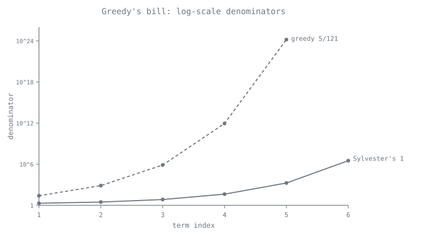
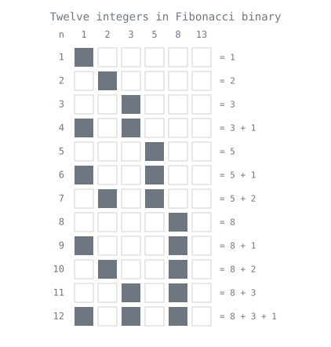
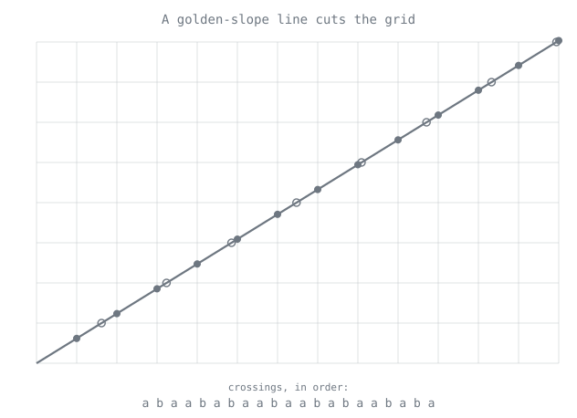

[← Route map](index.md) · [Stop 2 — The Unfolding Road](02-unfolding-road.md)

# Appendix I — The Branch Line: Other Ways to Unfold a Number

The regular continued fraction of Stop 2 is a single machine with three moves:
take the floor, subtract it, take the reciprocal, repeat. Every partial quotient
is one turn of that crank, and the whole tour so far has ridden the numbers it
produces. But the floor is a *choice*, not a law. Replace it with a ceiling, an
alternating sign, a greedy grab at the largest unit fraction, or a walk across a
grid, and the *same* real number unfolds into a *different* sequence of integers
— each with its own arithmetic, its own metric theory, and its own uses.

This is the Branch Line: six stops where one swapped part sends a number down
another track. Some machines terminate exactly where the regular expansion does;
some stay periodic where it would end; some pay for their simplicity with
denominators that double their digit-count at every step. Each still computes
live and exactly on the same engine. Ride them all with

```
python -m tourbus branch
```

or one at a time with `python -m tourbus branch N`, or reach any single
demonstration through `python -m tourbus demo <name>`. To watch several machines
grind the same number side by side, open the live [Expansion
Bazaar](../site/index.html#w15?x=355/113).

---

## B1 — Engel Expansions: the ascending staircase

Every `x` in `(0, 1]` has a unique **Engel expansion**

```
x = 1/a₁ + 1/(a₁a₂) + 1/(a₁a₂a₃) + …
```

with integers `1 ≤ a₁ ≤ a₂ ≤ a₃ ≤ …` climbing an ascending staircase. The machine
is the ceiling-and-affine cousin of Stop 2's floor-and-reciprocate: set
`a = ⌈1/x⌉`, record it, replace `x` by `a·x − 1`, and repeat until you reach `0`.
Where the regular expansion takes a floor and inverts, the Engel machine takes a
ceiling and applies an affine map. The same crank runs on any positive `x` — for
`x > 1` it simply emits `1`s until the map has pulled the value below `1`. And,
echoing [Stop 2](02-unfolding-road.md), the process halts in finitely many steps
exactly when `x` is rational.

By hand, take `x = 3/7`. Then `⌈7/3⌉ = 3`, and `3·(3/7) − 1 = 2/7`; next
`⌈7/2⌉ = 4`, and `4·(2/7) − 1 = 1/7`; finally `⌈7/1⌉ = 7`, and `7·(1/7) − 1 = 0`.
The digits `3 ≤ 4 ≤ 7` are non-decreasing as promised, and

```
3/7 = 1/3 + 1/(3·4) + 1/(3·4·7) = 1/3 + 1/12 + 1/84.
```

The showpiece belongs to the tour's most famous guest. The Engel digits of `e`
are `1, 1, 2, 3, 4, 5, 6, …`, because the factorial series
`e = Σ 1/k! = 1/1 + 1/(1·1) + 1/(1·1·2) + 1/(1·1·2·3) + …` is *already* an Engel
expansion, read off with `aₖ = k`. So the celebrity of [Stop 9](09-celebrity.md)
carries two lawful expansions at once: the erratic regular continued fraction
`[2; 1, 2, 1, 1, 4, 1, 1, 6, …]` and this serene arithmetic staircase.

```
$ python -m tourbus demo engel 3/7
Engel expansion of 3/7:
  digits [3, 4, 7]  (nondecreasing)
  3/7 = 1/3 + 1/12 + 1/84
```

**Then & now.** The expansion is named for Friedrich Engel, who studied it in
1913. Its metric theory was settled by Erdős, Rényi, and Szüsz in 1958: for
almost every `x` the digits grow geometrically, with `aₙ^(1/n) → e` — the
constant that owns the expansion's showpiece turning up again in its statistics.

**Exercises.** (★) Engel-expand `5/8` by hand and check the digits do not
decrease. (★★) Prove the expansion terminates if and only if `x` is rational.
(★★★) Show that the Engel digits of `e − 1` are `1, 2, 3, …`, straight from the
factorial series.

---

## B2 — Lüroth and Pierce: the honest casino

In 1883 Jacob Lüroth built the branch's tidiest machine. The **Lüroth expansion**

```
x = 1/a₁ + 1/(a₁(a₁−1)·a₂) + 1/(a₁(a₁−1)·a₂(a₂−1)·a₃) + …
```

has a property no other stop can match: its digits are **independent and
identically distributed**, with

```
P(digit = k) = 1/(k(k−1)),   k = 2, 3, 4, …
```

This is the honest casino. The Gauss–Kuzmin digits of [Stop 10](10-casino.md)
obey a fixed law too, but they are *correlated* — knowing one digit tilts the
odds on the next. Lüroth's digits are genuinely memoryless, a fair wheel where
every spin is independent of the last. The price of that honesty shows in the
rationals: a rational's Lüroth expansion is **eventually periodic** rather than
finite — `7/10`, for instance, cycles forever. (A few rationals, like the `5/17`
in the transcript below, land on a terminating special case; `7/10`'s tail
genuinely repeats.)

Pierce's machine is the **alternating Engel** — the same ascending idea with the
signs flipped,

```
x = 1/a₁ − 1/(a₁a₂) + 1/(a₁a₂a₃) − …,
```

and here the digits are **strictly increasing**, `a₁ < a₂ < a₃ < …`, and finite
for every rational: Pierce keeps Engel's clean termination while the alternating
sign accelerates the sum. Its most beautiful specimen is `1/φ`, whose Pierce
digits are `[1, 2, 4, 17, 19, 5777, 5779, …]`. These are *not* the Lucas numbers,
but they hug them: `4 = L₃`; `17` and `19` straddle `L₆ = 18`; `5777` and `5779`
straddle `L₁₈ = 5778`. The indices leap `3, 6, 18, …`, and the digits — chasing
them — explode **doubly exponentially**, outrunning any continued fraction on the
tour.

```
$ python -m tourbus demo pierce
Pierce and Luroth expansions of 5/17:
  Pierce (alternating, increasing): [3, 8, 17] -> 5/17
  Luroth (preperiod [4, 2, 17], period []) -> 5/17
  Pierce of 1/phi = [1, 2, 4, 17, 19, 5777, 5779] (pairs straddling Lucas numbers)
```

**Then & now.** Jacob Lüroth introduced his series in 1883, and T. A. Pierce
his alternating one in 1929, as a tool for approximating roots of equations.
Today the Lüroth map — the Gauss map with its curved branches straightened into
lines — is a standard test bed of ergodic theory, where results about digits,
entropy, and fractal dimension are often proved first before being transferred
to continued fractions.

**Exercises.** (★) Fold the Lüroth string `[4, 2, 17]` back to `5/17` term by
term. (★★) Verify `P(digit = k) = 1/(k(k−1))` from the lengths of the Lüroth
digit intervals. (★★★) Prove that Pierce digits are strictly increasing.

---

## B3 — Egyptian Fractions: the greedy scribe

Four thousand years before Lüroth, the scribes of the Rhind papyrus wrote every
fraction as a sum of distinct **unit fractions** `1/n`. The **Fibonacci–Sylvester
greedy algorithm** mechanizes their craft: to expand `p/q`, subtract the
*largest* unit fraction that still fits, then repeat on what remains. It always
terminates for a rational, because each greedy step strictly *decreases the
numerator* of the remainder — and a descending chain of positive integers cannot
run forever.

But termination is not economy. The scribe pays for his greed in the size of his
denominators, which roughly **square** at every step — doubly-exponential growth.
The purest example is Sylvester's sequence `2, 3, 7, 43, 1807, 3263443, …`, in
which each term is the product of all the previous ones plus one, and

```
1 = 1/2 + 1/3 + 1/7 + 1/43 + 1/1807 + …
```

The classic cautionary tale is `5/121`: greedy drives its fourth denominator to
twelve digits and its fifth past twenty-four, even though the compact
`5/121 = 1/33 + 1/121 + 1/363` sits right there, unused.



The Egyptian branch also guards one of the tour's cleanest open problems. The
**Erdős–Straus conjecture** (1948) asks whether `4/n = 1/x + 1/y + 1/z` in
positive integers for *every* `n ≥ 2`. It has been checked to enormous bounds and
reduced, by congruences, to a handful of stubborn residue classes — but no proof
exists. It rides again at the [Terminus](15-terminus.md), among the questions
continued fractions can pose but not yet answer.

```
$ python -m tourbus demo egyptian
Fibonacci-Sylvester greedy Egyptian fraction of 5/121:
  5/121 = 1/25 + 1/757 + 1/763309 + 1/873960180913 + 1/1527612795642093418846225
  denominator digit-counts [2, 3, 6, 12, 25] -- greedy can explode.
  Erdos-Straus 4/5 = 1/2 + 1/4 + 1/20 (conjectured possible for every n; open since 1948)
```

**Then & now.** Unit fractions are the oldest arithmetic on this tour — the
Rhind papyrus dates from about 1650 BC — and still a live research area. The
Erdős–Straus conjecture has been checked for every `n` up to `10¹⁷` (Salez,
2014). In 2021 Thomas Bloom proved a 1980 conjecture of Erdős and Graham: any set
of whole numbers of positive upper density contains a finite subset whose
reciprocals add up to exactly `1` — and within months the proof had been
checked line by line in the Lean proof assistant.

**Exercises.** (★) Greedy-expand `4/17` and watch the numerators fall. (★★) Prove
the greedy algorithm terminates for every rational. (★★★) Verify the
Erdős–Straus conjecture for all `n ≤ 100` using the residue-class rules mod 4.

---

## B4 — Zeckendorf and the Golden Base

Turn the golden ratio from a number to be approximated into a *base* to count in,
and you reach **Zeckendorf's theorem**: every positive integer is a sum of
Fibonacci numbers, uniquely, provided no two *consecutive* Fibonacci numbers
appear. The greedy algorithm finds it — subtract the largest Fibonacci number
`≤ n` and repeat — and the no-two-adjacent rule is exactly what pins the
representation down to one. So

```
100 = 89 + 8 + 3,
```

and nothing else, using `89 = F₁₁`, `8 = F₆`, `3 = F₄`.



Write a `1` for each Fibonacci number used and a `0` for each skipped, and
Zeckendorf becomes **Fibonacci coding**: a positional code in which the string
`11` can never occur. Data-compression engineers exploit exactly this — a lone
`11` can mark the end of a codeword, because it appears nowhere *inside* one,
giving a self-synchronizing variable-length code. Push the idea to its limit and
you reach **Bergman's base-φ**, a positional numeration on the *irrational* base
`φ` whose carry rule is the golden identity itself, `φ² = φ + 1` — which is
nothing but the Fibonacci recurrence of [Stop 3](03-engine-room.md) wearing a
different hat. Here the golden ratio of [Stop 4](04-golden.md) is no longer a
milestone to be measured; it is the ruler.

```
$ python -m tourbus demo zeckendorf
Zeckendorf representation of 100:
  100 = 89 + 8 + 3  (non-consecutive Fibonacci)
  in base phi: 1001001010.0001001001  (no two consecutive 1s)
```

**Then & now.** The theorem was first published by Gerrit Lekkerkerker in
1952, twenty years before Édouard Zeckendorf's own paper (1972); George Bergman
invented base `φ` in 1957, at the age of twelve. Fibonacci coding (Apostolico and
Fraenkel, 1987) turns the representation into a universal, self-synchronising
code for integers of any size, and it is used in data compression.

**Exercises.** (★) Find the Zeckendorf representation of `2026`. (★★) Prove that
the greedy algorithm never selects two consecutive Fibonacci numbers. (★★★) Show
that every integer's base-φ representation terminates.

---

## B5 — Cutting Sequences: Ostrowski, Sturmian words, and the three distances

Draw a straight line of slope `1/φ` from the origin and walk it across the
integer grid. Each time it crosses a **vertical** grid line write `a`; each time
it crosses a **horizontal** one write `b`. The record of crossings is the
**Fibonacci word**

```
a b a a b a b a a b a a b …
```

the canonical **Sturmian sequence** — the most balanced infinite binary word
there is, aperiodic yet almost periodic, a continued fraction you can read off
like a ticker tape. (The engine prints it with `a` as `1` and `b` as `0`.)



The bookkeeping behind such sequences is **Ostrowski numeration**. Fix an
irrational `α` and take the convergent denominators `q₀, q₁, q₂, …` of its
continued fraction (Stop 3). Then *every* non-negative integer has a unique
representation against those `qₖ` as a mixed-radix "base" — the continued fraction
turned into a positional numeral system, with the partial quotients setting each
digit's range. Feed it `α = 1/φ`, whose convergent denominators are the Fibonacci
numbers, and Ostrowski numeration collapses exactly onto the Zeckendorf
representation of B4 — the two branches meet.

That single fact — the continued fraction *is* a number system — is the machinery
under two stops elsewhere on the network. It drives the [three-distance
theorem](appendix-d-frontier.md#e5-the-three-distance-theorem) of Appendix D,
where the gaps between `0, α, 2α, …` (mod 1) are the quantities `‖qₖ·α‖` read
straight off the Ostrowski digits; and it underlies the **Fibonacci
quasicrystal** of [Appendix F](appendix-f-cross-domain.md), whose diffraction
pattern is the golden cutting sequence made physical. A close cousin closes the
stop: the **Beatty sequence** `⌊k·φ⌋` and its partner `⌊k·φ²⌋` partition the
positive integers into two disjoint families that between them use every integer
exactly once — **Rayleigh's theorem**, the arithmetic shadow of a line that never
lands on a lattice point.

```
$ python -m tourbus demo ostrowski
Ostrowski numeration of 100 against 1/phi:
  digits [0, 0, 0, 1, 0, 1, 0, 0, 0, 0, 1] -> rebuilds 100
  Fibonacci word (golden cutting sequence): 1011010110110101101011011010
```

**Then & now.** Elwin Christoffel described these words in 1875, Marston Morse
and Gustav Hedlund named Sturmian sequences in 1940, and Alexander Ostrowski's
numeration dates from 1922. Today Sturmian words model one-dimensional
quasicrystals (the Fibonacci chain of [Appendix F](appendix-f-cross-domain.md)),
every straight line a computer rasterises is a Christoffel word, and in music
theory the step pattern of the diatonic scale is one too — the "maximally even"
scales are Sturmian.

**Exercises.** (★) Generate the first 13 letters of the Fibonacci word by hand
from a line of slope `1/φ`. (★★) Show the Fibonacci word is not eventually
periodic. (★★★) Relate the gap lengths of Appendix D's E5 to `‖qₖ·α‖` through the
Ostrowski digits.

---

## B6 — Lochs' Theorem: the exchange rate

The last branch stop sets an exchange rate between two currencies for the same
number: **decimal digits** and **continued-fraction terms**. Take the first `n`
decimals of a real number, ask how many correct continued-fraction terms `m` they
pin down, and let both grow. **Lochs' theorem (1964)** says that for almost every
`x`,

```
m/n → 6·ln2·ln10 / π² ≈ 0.9703.
```

One decimal digit buys about `0.97` of a continued-fraction term; inverted, one
continued-fraction term is worth about `1.0306` decimal digits. The continued
fraction is the *denser* currency — it packs marginally more information about a
number into each symbol than the decimal expansion does.

That constant is no coincidence. `6·ln2·ln10/π²` is `ln10` divided by
`π²/(6 ln2)`, and `π²/(6 ln2)` is precisely the **entropy of the Gauss map** — the
same quantity that fixes Lévy's constant at [Stop 10](10-casino.md). Lochs'
exchange rate and Lévy's growth rate for convergent denominators are two readings
of one dial: the average information the Gauss map destroys per step, the same
physics seen from two sides.

Read the theorem honestly: it holds for *almost every* number, not every one. A
finite decimal prefix of a *specific* number gives only a nearby empirical rate —
the transcript below measures `1.05` decimals per term on a sample of `π`, close
to but not equal to the almost-sure `1.0306`. And it says nothing at all about
any particular quadratic irrational, whose periodic continued fraction is a
measure-zero exception the average never sees.

```
$ python -m tourbus demo lochs
Lochs' theorem: the digit/term exchange rate on pi:
  this pi sample: 1.0500 decimals per continued-fraction term
  almost-sure limit 1/0.9703 = 1.0306 decimals per term (Lochs, 1964)
  the rate is 6 ln2 ln10 / pi^2 -- the entropy of the continued-fraction map.
```

**Then & now.** Gustav Lochs proved the theorem in 1964. It is at heart a
statement about *entropy*: the Gauss map's entropy `π²/(6 ln 2)` set against the
decimal shift's `ln 10`. The same ratio predicts how many continued-fraction
terms a record decimal computation will certify — about `0.97` per digit —
which is how computations of `π`'s continued fraction to hundreds of billions of
terms are planned.

**Exercises.** (★) Compute Lochs' constant from Lévy's constant and `ln10`.
(★★) Test the rate empirically on the first several decimals of `e`. (★★★)
Explain why Lochs' theorem holds almost everywhere yet says nothing about the
digits of any specific quadratic irrational.

---

[← Route map](index.md) · [Stop 2 — The Unfolding Road](02-unfolding-road.md)
