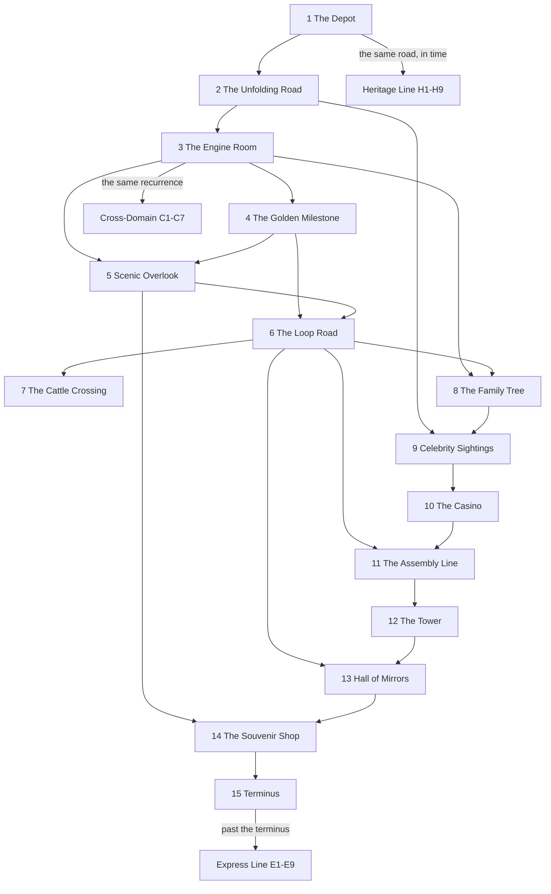

[← Route map](index.md) · [Appendix H — The Heritage Line](appendix-h-history.md)

# The Syllabus — Riding the Tour as a Course

The tour was built to be ridden, and it rides well on a schedule: fifteen stops,
fifteen weeks, one rigorous engine underneath. This page is the driver's copy —
which stops depend on which, what each week should leave behind, and where the
four enrichment lines (Express, Cross-Domain, Heritage, Branch) attach to the route.

## Who this is for

Instructors running a one-semester undergraduate seminar: a number-theory
elective, a discrete-mathematics capstone, or a math–CS bridge course. The
prerequisites are induction proofs and modular arithmetic; no analysis is
required until Stop 10, and there it is optional. Python is optional throughout
— every claim in every chapter is a runnable command, which makes the tour
usable as a lab course as well as a reading course.

## The prerequisite map

The spine is solid: 1 → 2 → 3, and everything else hangs off the engine built
at Stop 3. The four lines — Express, Cross-Domain, Heritage, and Branch —
attach as enrichment, not prerequisites: nothing on the main route ever depends
on them.

## Fifteen weeks

One core stop per week; the enrichment column follows the pairings of the
prerequisite map, and every entry in it is optional.

| Week | Core stop | Enrichment (optional) | Objective |
|---|---|---|---|
| 1 | Stop 1 | Heritage H1 | Execute Euclid's algorithm, extract Bézout coefficients, state Lamé's Fibonacci worst case. |
| 2 | Stop 2 | Express E4 | Convert rational ↔ finite CF and explain why termination characterizes the rationals. |
| 3 | Stop 3 | Express E2 | Compute convergents by the fundamental recurrence and bound errors by 1/(qₙqₙ₊₁). |
| 4 | Stop 4 | Express E1, E5 | Prove φ = [1;1,1,…], state Hurwitz's theorem, explain "most irrational". |
| 5 | Stop 5 | Heritage H4 | Solve bounded-denominator approximation problems: calendar, gears, 355/113. |
| 6 | Stop 6 | Express E3 | Use Lagrange's periodicity theorem; run the √d algorithm by hand. |
| 7 | Stop 7 | Heritage H2 | Read a Pell fundamental solution off the period of √d; explain the ±1 parity rule. |
| 8 | Stop 8 | (midterm week) | Locate any rational in the Stern–Brocot tree; relate paths to CF terms and mediants. |
| 9 | Stop 9 | Heritage H3, H5 | Contrast e's patterned CF with π's chaos; evaluate a generalized CF. |
| 10 | Stop 10 | Express E6 | Describe the Gauss map as a shift; state Gauss–Kuzmin; estimate Khinchin's constant. |
| 11 | Stop 11 | Heritage H9 | Trace Gosper's machine through ingest/emit steps; explain the √2·√2 stall. |
| 12 | Stop 12 | Cross-Domain sampler | Separate primitive from general recursion via Ackermann; β-reduce Y f once. |
| 13 | Stop 13 | Cross-Domain sampler | Compute similarity dimension; read fractals and periodic CFs as fixed points. |
| 14 | Stop 14 | Cross-Domain sampler | Apply convergents to temperament and Wiener's attack; state Collatz precisely. |
| 15 | Stop 15 | Express E7 + Appendix E | Map the open problems and where each sits on the route. |

## Learning objectives, stop by stop

By the end of each week a student should be able to:

- **Stop 1 — The Depot.** Execute Euclid's algorithm by hand, extract the Bézout
  coefficients from its quotients, and state Lamé's Fibonacci worst case.
- **Stop 2 — The Unfolding Road.** Convert a rational to and from its finite
  continued fraction and explain why termination characterizes the rationals.
- **Stop 3 — The Engine Room.** Compute convergents by the fundamental
  recurrence and bound the error by 1/(qₙqₙ₊₁).
- **Stop 4 — The Golden Milestone.** Prove φ = [1; 1, 1, …], state Hurwitz's
  theorem, and explain what "most irrational" means.
- **Stop 5 — Scenic Overlook.** Solve bounded-denominator approximation
  problems: the calendar, Huygens' gears, and 355/113.
- **Stop 6 — The Loop Road.** Use Lagrange's periodicity theorem and run the
  √d algorithm by hand.
- **Stop 7 — The Cattle Crossing.** Read a Pell fundamental solution off the
  period of √d and explain the ±1 parity rule.
- **Stop 8 — The Family Tree.** Locate any rational in the Stern–Brocot tree
  and relate left-right paths to CF terms and mediants.
- **Stop 9 — Celebrity Sightings.** Contrast e's patterned CF with π's chaos
  and evaluate a generalized continued fraction.
- **Stop 10 — The Casino.** Describe the Gauss map as a shift, state
  Gauss–Kuzmin, and estimate Khinchin's constant from a live orbit.
- **Stop 11 — The Assembly Line.** Trace Gosper's machine through ingest/emit
  steps and explain the √2·√2 stall.
- **Stop 12 — The Tower.** Separate primitive from general recursion via
  Ackermann and β-reduce Y f once.
- **Stop 13 — Hall of Mirrors.** Compute similarity dimension and read fractals
  and periodic CFs as fixed points.
- **Stop 14 — The Souvenir Shop.** Apply convergents to temperament and
  Wiener's attack, and state Collatz precisely.
- **Stop 15 — Terminus.** Map the open problems and say where each sits on the
  route.

## Then, now, next: ten minutes a week

Every chapter now closes with a **Then, now, next** section: a timeline of the
idea's history, where it is at work today, and the open questions it leads to.
They are written to seed a ten-minute discussion at the end of each class, and
the prompts below are one way to start it. None needs anything beyond the
chapter itself; several make good short essays.

| Week | Discussion prompt |
|---|---|
| 1 | Euclid's algorithm is 2,300 years old and runs inside every secure web connection. Why did it need a *constant-time* redesign in 2019, and what does "leaking the quotients" mean? |
| 2 | Why can a computer turn `0.30000000000000004` back into `3/10`? What would Hermite's problem ask of a "cubic" version of this stop? |
| 3 | The same recurrence evaluates statistics p-values and multiplies record-breaking computations of π. What does associativity of matrix multiplication buy? |
| 4 | Which golden-ratio claims survive measurement, and which do not? Why is the golden ratio useful in hashing? |
| 5 | Meton's 235/19 and the Gregorian 97/400: which is the better approximation, and why did the world choose the worse one? Should leap seconds end? |
| 6 | Gauss conjectured that infinitely many real quadratic fields have unique factorisation. What would a proof have to control about the loop road? |
| 7 | Pell's equation sits inside the proof that Hilbert's tenth problem is unsolvable. How can equations with enormous solutions encode computation? |
| 8 | The Riemann hypothesis is equivalent to a statement about Farey fractions. Paraphrase that statement in plain words. |
| 9 | We know `μ(e) = 2` exactly, but only `μ(π) ≤ 7.1032…`. What does the pattern in `e`'s continued fraction buy that `π`'s lacks? |
| 10 | Almost every number obeys Khinchin's law, yet no named constant is known to. How can a property be both overwhelmingly common and impossible to verify? |
| 11 | The Android calculator refuses to show digits it has not certified. What would it have to do with `√2 · √2`, and why can no calculator decide such questions in general? |
| 12 | Union–find runs in inverse-Ackermann time. Why does a function that grows absurdly fast produce an inverse that is effectively constant? |
| 13 | A Siegel disk exists exactly for Brjuno rotation numbers. What does the golden ratio's slow convergence have to do with calm in a chaotic picture? |
| 14 | Shor's algorithm ends with a continued fraction. Which stop's theorem guarantees it works, and why has NIST already standardised post-quantum replacements? |
| 15 | Pick a problem that fell (Apéry, Duffin–Schaeffer) and one still open (γ, Zaremba). What kind of new idea opened the first? |

## The other lines

**The Express Line (E1–E9)** is the honors track: nine deeper stops past the
terminus, each an extension of a main-route topic — now reaching Conway's
topograph (E8) and Ramanujan's continued fraction (E9). Most E-stops name their
parent stop in Appendix D, and the enrichment column above pairs the rest —
which makes them natural seminar talks: assign one per student and let the
prerequisite map say when each becomes reachable.

**The Cross-Domain Line (C1–C7)** is applications and project fodder — a
molecule's energy levels, the Hofstadter butterfly, ladder circuits, sunflowers.
All of it needs only Stop 3's recurrence, so it deploys best in weeks 12–14 or
as term projects running alongside the second half of the course.

**The Heritage Line (H1–H9)** is context reading, with no mathematical
prerequisites beyond its paired stop; the pairings are exactly the enrichment
column of the table above.

**The Branch Line (B1–B6)** is the "other expansions" seminar: the Engel and
Pierce series (pair with Stop 2), Egyptian fractions and the open Erdős–Straus
conjecture, Zeckendorf and base-φ (pair with Stop 4), Sturmian cutting sequences
(pair with the three-distance theorem, E5), and Lochs' exchange rate (pair with
Stop 10). Like the Express stops, each makes a self-contained talk. Every
enrichment stop on all four lines is a live CLI ride, so "assign" means "run and
write up."

[← Route map](index.md) · [Appendix H — The Heritage Line](appendix-h-history.md)
